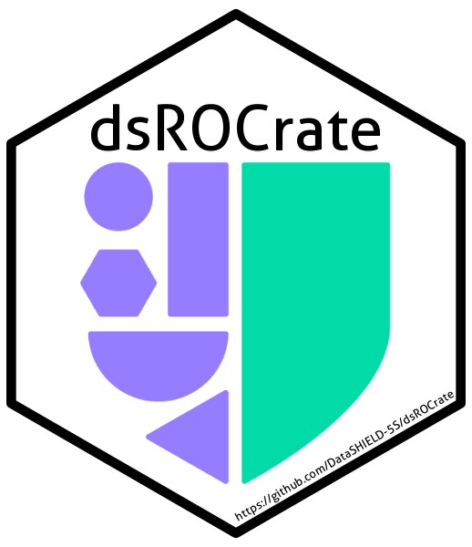
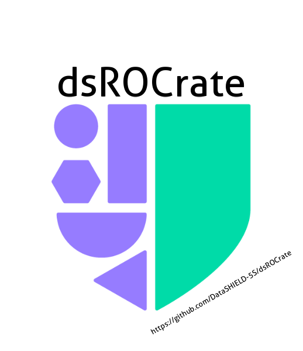
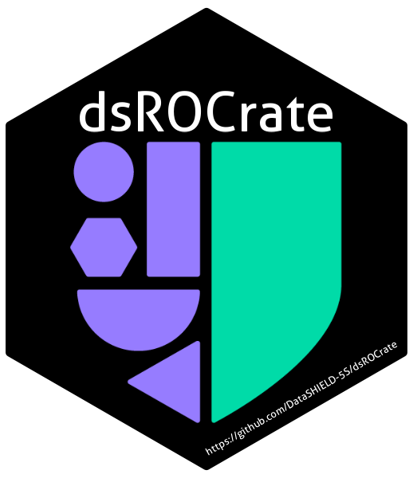

<!-- README.md is generated from README.Rmd. Please edit that file -->

# dsROCrate: ‘DataSHIELD’ RO-Crate Wrapper Functions 

<!-- badges: start -->

[](https://lifecycle.r-lib.org/articles/stages.html#experimental)
[](https://CRAN.R-project.org/package=dsROCrate)
[](https://app.codecov.io/gh/DataSHIELD-5S/dsROCrate)
<!-- badges: end -->

The goal of dsROCrate is to provide functions to wrap elements from a
‘DataSHIELD’ analysis into an RO-Crate.

## 1. Installation

You can install the development version of dsROCrate from
[GitHub](https://github.com/) with:

``` r
# install.packages("pak")
pak::pak("DataSHIELD-5S/dsROCrate")
```

## 2. Creating your first RO-Crate

In this example, we will be using OBiBa’s
[Opal](https://opaldoc.obiba.org/en/latest/index.html) as the *back-end*
for DataSHIELD.

### 2.1. Connect to an Opal Server

#### Setup

For instructions on how to set up a local server for DataSHIELD, see the
following vignette:

``` r
vignette("deploy-local-datashield-server-with-opal")
```

Here we will use OBiBa’s Opal demo server:
<https://opal-demo.obiba.org/> which can be accessed with the following
login credentials:

``` r
# define global variables
## Opal server access
USERNAME <- "administrator"
USERPASS <- "password"
SERVER <- "https://opal-demo.obiba.org"
## Credentials for `dsuser`
### NOTE: this is only used to simulate an analysis and generate logs
DSUSERPASS <- "P@ssw0rd"
```

Next, define global variables used in generating the RO-Crate, such as
project name, table references (within the project) and user
identifiers.

``` r
## Five safes variables
PEOPLE <- "dsuser"
PROJECT <- "CNSIM"
TABLES <- c("CNSIM1")
```

#### Open connection

Once the credentials and Five Safes variables are configured,we can
start a new session to the opal server with the following command:

``` r
# login to local server with `USERNAME` and `USERPASS`.
o <- opalr::opal.login(
  username = USERNAME,
  password = USERPASS,
  url = SERVER
)

print(o)
#> url: https://opal-demo.obiba.org 
#> name: opal-demo.obiba.org 
#> version: 5.3.3 
#> username: administrator
```

### 2.2. Create a basic RO-Crate

To create a basic RO-Crate, we will use the
[`{rocrateR}`](https://github.com/ResearchObject/ro-crate-r) package.
This package can be installed with the following command:

``` r
# install.packages("pak")
pak::pak("ResearchObject/ro-crate-r@dev")
```

Then, a basic RO-Crate can be created with the following command:

``` r
basic_rocrate <- rocrateR::rocrate_5s()
```

Note that this RO-Crate uses the
[5s-crate](https://trefx.uk/5s-crate/0.4/) profile.

``` r
print(basic_rocrate)
#> {
#>   "@context": "https://w3id.org/ro/crate/1.2/context",
#>   "@graph": [
#>     {
#>       "@id": "ro-crate-metadata.json",
#>       "@type": "CreativeWork",
#>       "about": {
#>         "@id": "./"
#>       },
#>       "conformsTo": {
#>         "@id": "https://w3id.org/ro/crate/1.2"
#>       }
#>     },
#>     {
#>       "@id": "./",
#>       "@type": "Dataset",
#>       "name": "",
#>       "description": "",
#>       "datePublished": "2025-12-01",
#>       "license": {
#>         "@id": "http://spdx.org/licenses/CC-BY-4.0"
#>       },
#>       "conformsTo": {
#>         "@id": "https://w3id.org/5s-crate/0.4"
#>       }
#>     },
#>     {
#>       "@id": "https://w3id.org/5s-crate/0.4",
#>       "@type": ["CreativeWork", "Profile"],
#>       "name": "Five Safes RO-Crate profile"
#>     }
#>   ]
#> }
```

### 2.3. Add *Five Safes* Elements

#### Safe Data

To add details for Safe Data, use the function `dsROCrate::safe_data()`.

``` r
basic_rocrate <- o |>
  dsROCrate::safe_data(rocrate = basic_rocrate,
                       project = PROJECT,
                       tables = TABLES)

print(basic_rocrate) # note that the output will be truncated
...
#>     {
#>       "@id": "#dataset:67adf2d8e106aca9b11de773758bd241",
#>       "@type": "Dataset",
#>       "name": "CNSIM1",
#>       "dateCreated": "2025-12-01T06:29:44.178Z",
#>       "dateModified": "2025-12-01T06:29:45.286Z",
#>       "path": "/datasource/CNSIM/table/CNSIM1"
#>     }
#>   ]
#> }
```

#### Safe Project

To add details for Safe Project, use the function
`dsROCrate::safe_project()`.

``` r
basic_rocrate <- o |>
  dsROCrate::safe_project(rocrate = basic_rocrate,
                          project = PROJECT)

print(basic_rocrate) # note that the output will be truncated
...
#>     {
#>       "@id": "#project:7ba189863f9f641196596cb28e04aa14",
#>       "@type": "Project",
#>       "name": "CNSIM",
#>       "dateCreated": "2025-12-01T06:29:42.906Z",
#>       "dateModified": "2025-12-01T06:29:47.610Z",
#>       "hasPart": [
#>         {
#>           "@id": "#dataset:67adf2d8e106aca9b11de773758bd241"
#>         }
#>       ]
#>     }
#>   ]
#> }
```

#### Safe People

To add details for Safe People, use the function
`dsROCrate::safe_people()`.

``` r
basic_rocrate <- o |>
  dsROCrate::safe_people(rocrate = basic_rocrate, user = PEOPLE)

print(basic_rocrate) # note that the output will be truncated
...
#>     {
#>       "@id": "#person:a0af2a94926db1b49ad7a812eef509d2",
#>       "@type": "Person",
#>       "name": "dsuser",
#>       "memberOf": [
#>         {
#>           "@id": "#project:7ba189863f9f641196596cb28e04aa14"
#>         }
#>       ]
#>     }
#>   ]
#> }
```

#### Safe Setting

To add details for Safe Setting, use the function
`dsROCrate::safe_setting()`.

**⚠️NOTE:** The `dsROCrate::safe_setting` function requires
administrator privileges, so here, we will have to log in with
administrator credentials (if you used a non-administrator account
previously).

``` r
# close previous connection
opalr::opal.logout(o)

# open new connection as administrator
o <- opalr::opal.login(
  username = "administrator",
  password = "password",
  url = SERVER
)
```

Then, we can proceed as per usual:

``` r
basic_rocrate <- o |>
  dsROCrate::safe_setting(rocrate = basic_rocrate)

print(basic_rocrate) # note that the output will be truncated
...
#>     {
#>       "@id": "_:localid:datashield.privacyLevel:5",
#>       "@type": "PropertyValue",
#>       "name": "datashield.privacyLevel",
#>       "value": "5"
#>     },
#>     {
#>       "@id": "_:localid:default.datashield.privacyControlLevel:banana",
#>       "@type": "PropertyValue",
#>       "name": "default.datashield.privacyControlLevel",
#>       "value": "banana"
#>     },
#>     {
#>       "@id": "_:localid:default.nfilter.glm:0.33",
#>       "@type": "PropertyValue",
#>       "name": "default.nfilter.glm",
#>       "value": "0.33"
#>     },
#>     {
#>       "@id": "_:localid:default.nfilter.kNN:3",
#>       "@type": "PropertyValue",
#>       "name": "default.nfilter.kNN",
#>       "value": "3"
#>     },
#>     {
#>       "@id": "_:localid:default.nfilter.levels.density:0.33",
#>       "@type": "PropertyValue",
#>       "name": "default.nfilter.levels.density",
#>       "value": "0.33"
#>     },
#>     {
#>       "@id": "_:localid:default.nfilter.levels.max:40",
#>       "@type": "PropertyValue",
#>       "name": "default.nfilter.levels.max",
#>       "value": "40"
#>     },
#>     {
#>       "@id": "_:localid:default.nfilter.noise:0.25",
#>       "@type": "PropertyValue",
#>       "name": "default.nfilter.noise",
#>       "value": "0.25"
#>     },
#>     {
#>       "@id": "_:localid:default.nfilter.string:80",
#>       "@type": "PropertyValue",
#>       "name": "default.nfilter.string",
#>       "value": "80"
#>     },
#>     {
#>       "@id": "_:localid:default.nfilter.stringShort:20",
#>       "@type": "PropertyValue",
#>       "name": "default.nfilter.stringShort",
#>       "value": "20"
#>     },
#>     {
#>       "@id": "_:localid:default.nfilter.subset:3",
#>       "@type": "PropertyValue",
#>       "name": "default.nfilter.subset",
#>       "value": "3"
#>     },
#>     {
#>       "@id": "_:localid:default.nfilter.tab:3",
#>       "@type": "PropertyValue",
#>       "name": "default.nfilter.tab",
#>       "value": "3"
#>     },
#>     {
#>       "@id": "cb5ccdc930d110416079c6d5cbb81ed8",
#>       "@type": "SoftwareApplication",
#>       "name": "dsBase",
#>       "version": "6.3.4",
#>       "description": "Base 'DataSHIELD' functions for the server side. 'DataSHIELD' is a software package which allows\n    you to do non-disclosive federated analysis on sensitive data. 'DataSHIELD' analytic functions have\n    been designed to only share non disclosive summary statistics, with built in automated output\n    checking based on statistical disclosure control. With data sites setting the threshold values for\n    the automated output checks. For more details, see 'citation(\"dsBase\")'."
#>     },
#>     {
#>       "@id": "457a08b576ab34be6f239dfed9fc8a2e",
#>       "@type": "SoftwareApplication",
#>       "name": "dsTidyverse",
#>       "version": "1.0.3",
#>       "description": "Implementation of selected 'Tidyverse' functions within 'DataSHIELD', an open-source federated analysis solution in R. Currently, DataSHIELD contains very limited tools for data manipulation, so the aim of this package is to improve the researcher experience by implementing essential functions for data manipulation, including subsetting, filtering, grouping, and renaming variables. This is the serverside package which should be installed on the server holding the data, and is used in conjuncture with the clientside package 'dsTidyverseClient' which is installed in the local R environment of the analyst. For more information, see <https://www.tidyverse.org/> and <https://datashield.org/>."
#>     },
#>     {
#>       "@id": "cb799d87d85ee53fa4b23de013c8c8ad",
#>       "@type": "SoftwareApplication",
#>       "name": "resourcer",
#>       "version": "1.4.0",
#>       "description": "A resource represents some data or a computation unit. It is \n    described by a URL and credentials. This package proposes a Resource model\n    with \"resolver\" and \"client\" classes to facilitate the access and the usage of the \n    resources."
#>     }
#>   ]
#> }
```

#### Safe Outputs

To add details for Safe Outputs, use the function
`dsROCrate::safe_output()`. Currently, only log files from the
operations executed by the user within a specific period. Set the period
using `logs_from` and `logs_to`.

**⚠️NOTE:** Similar to `dsROCrate::safe_setting`, the
`dsROCrate::safe_output` function requires of administrator rights, so
here, we will have to log in with administrator credentials:

``` r
# close previous connection
opalr::opal.logout(o)

# open new connection as administrator
o <- opalr::opal.login(
  username = "administrator",
  password = "password",
  url = SERVER
)
```

------------------------------------------------------------------------

##### DataSHIELD operations

**⚠️NOTE:** Before extracting logs, ensure there is recent activity on
the server for testing purposes. This can be done using the following
commands:

###### Setup

You will need the following packages:

``` r
pak::pak("DSI")
pak::pak("DSOpal")
pak::pak("dsBaseClient")
```

###### Open connection

``` r
# run some test commands with dsBaseClient
## needed to defined the OpalDriver class in the current environment
DSOpal::Opal()
#> An object of class "OpalDriver"
#> <S4 Type Object>
## create new login object, note that here we use the `dsuser`
builder <- DSI::newDSLoginBuilder()
builder$append(server = "study1",
               url = SERVER,
               user = "dsuser",
               password = DSUSERPASS,
               driver = "OpalDriver")
logindata <- builder$build()
conns <- DSI::datashield.login(logins = logindata)
#> 
#> Logging into the collaborating servers
```

###### Simulate some operations

``` r
## assign data
DSI::datashield.assign.table(conns["study1"], 
                             symbol = "dsROCrate_test",
                             table = paste0(PROJECT, ".", TABLES[1]),
                             errors.print = TRUE)

dsBaseClient::ds.ls(datasources = conns["study1"])
#> $study1
#> $study1$environment.searched
#> [1] "R_GlobalEnv"
#> 
#> $study1$objects.found
#> [1] "dsROCrate_test"
dsBaseClient::ds.summary("dsROCrate_test")
#> $study1
#> $study1$class
#> [1] "data.frame"
#> 
#> $study1$`number of rows`
#> [1] 2163
#> 
#> $study1$`number of columns`
#> [1] 11
#> 
#> $study1$`variables held`
#>  [1] "LAB_TSC"            "LAB_TRIG"           "LAB_HDL"           
#>  [4] "LAB_GLUC_ADJUSTED"  "PM_BMI_CONTINUOUS"  "DIS_CVA"           
#>  [7] "MEDI_LPD"           "DIS_DIAB"           "DIS_AMI"           
#> [10] "GENDER"             "PM_BMI_CATEGORICAL"
```

------------------------------------------------------------------------

Then, we can proceed as per usual:

``` r
basic_rocrate <- o |>
  dsROCrate::safe_output(rocrate = basic_rocrate,
                         logs_from = Sys.time() - 60, # capture the last minute
                         logs_to = Sys.time())
#> opening file input connection.
#>  Found 170 records... Imported 170 records. Simplifying...
#> closing file input connection.
#> Warning: A `path` wasn't provided! The logs will be included in the RO-Crate
#> object, under the `content` tag!
```

``` r
print(basic_rocrate) # note that the output will be truncated
...
#>     {
#>       "@id": "2025-12-01-dslogs-dsuser.log",
#>       "@type": "File",
#>       "dateModified": "2025-12-01 09:27:59",
#>       "name": "2025-12-01-dslogs-dsuser.log",
#>       "encodingFormat": "text/plain",
#>       "content": [
#>         ["[INFO][2025-12-01T09:27:22][OPEN]      created a datashield session 649bd0be-a202-478d-8f5c-9f0e3ec928e1", "[INFO][2025-12-01T09:27:22][ASSIGN]    created symbol 'dsROCrate_test' from: 'dsROCrate_test <- opal[CNSIM.CNSIM1]'", "[INFO][2025-12-01T09:27:23][PARSE]     parsed 'dsBase::lsDS(search.filter = NULL, 1L)'", "[INFO][2025-12-01T09:27:24][AGGREGATE] evaluated 'dsBase::lsDS(search.filter = NULL, 1L)'", "[INFO][2025-12-01T09:27:57][OPEN]      created a datashield session 15f9e990-6233-4c79-b8d1-07cf7d8b7dc4", "[INFO][2025-12-01T09:27:58][ASSIGN]    created symbol 'dsROCrate_test' from: 'dsROCrate_test <- opal[CNSIM.CNSIM1]'", "[INFO][2025-12-01T09:27:58][PARSE]     parsed 'dsBase::lsDS(search.filter = NULL, 1L)'", "[INFO][2025-12-01T09:27:59][AGGREGATE] evaluated 'dsBase::lsDS(search.filter = NULL, 1L)'", "[INFO][2025-12-01T09:27:59][PARSE]     parsed 'base::exists(\"dsROCrate_test\")'", "[INFO][2025-12-01T09:27:59][AGGREGATE] evaluated 'base::exists(\"dsROCrate_test\")'", "[INFO][2025-12-01T09:27:59][PARSE]     parsed 'dsBase::classDS(\"dsROCrate_test\")'", "[INFO][2025-12-01T09:27:59][AGGREGATE] evaluated 'dsBase::classDS(\"dsROCrate_test\")'", "[INFO][2025-12-01T09:27:59][PARSE]     parsed 'dsBase::isValidDS(dsROCrate_test)'", "[INFO][2025-12-01T09:27:59][AGGREGATE] evaluated 'dsBase::isValidDS(dsROCrate_test)'", "[INFO][2025-12-01T09:27:59][PARSE]     parsed 'dsBase::dimDS(\"dsROCrate_test\")'", "[INFO][2025-12-01T09:27:59][AGGREGATE] evaluated 'dsBase::dimDS(\"dsROCrate_test\")'", "[INFO][2025-12-01T09:27:59][PARSE]     parsed 'dsBase::colnamesDS(\"dsROCrate_test\")'", "[INFO][2025-12-01T09:27:59][AGGREGATE] evaluated 'dsBase::colnamesDS(\"dsROCrate_test\")'"]
#>       ]
#>     }
#>   ]
#> }
```

### 2.(n-1). Close connection

``` r
opalr::opal.logout(o)
```

### 2.n. Bag/Save RO-Crate

The resulting RO-Crate can be stored into an RO-Crate bag/archive with
the function `rocrateR::bag_rocrate`:

``` r
# create temp directory
dir.create("./rocrates", showWarnings = FALSE)
```

NOTE: In the above example, a `path` to store the logs wasn’t provided
when calling `dsROCrate::safe_output`, before creating an RO-Crate bag,
we should save the contents of this file first

``` r
logs_entity <- basic_rocrate |>
  rocrateR::get_entity(type = "File")
# write file using the path given by `@id`
writeLines(
  logs_entity[[1]]$content[[1]], 
  file.path("./rocrates", logs_entity[[1]]$`@id`)
)
# remove the section `content`
logs_entity[[1]]$content <- NULL
# update the RO-Crate
basic_rocrate <- basic_rocrate |>
  rocrateR::add_entity(logs_entity[[1]], overwrite = TRUE)
#> Warning in rocrateR::add_entity(basic_rocrate, logs_entity[[1]], overwrite =
#> TRUE): Overwritting the entity with @id = '2025-12-01-dslogs-dsuser.log'
```

``` r
# create RO-Crate bag
path_to_rocrate_bag <- basic_rocrate |>
  rocrateR::bag_rocrate(path = "./rocrates", overwrite = TRUE)
#> RO-Crate successfully 'bagged'!
#> For details, see: ./rocrates/rocrate-b5edca201f688980f3f5f6c36c01d4f7.zip
```

We can explore the contents with the following commands:

``` r
# extract files in temporary directory
path_to_rocrate_bag |>
  # extract contents inside ./rocrates/ROC
  rocrateR::unbag_rocrate(output = "./rocrates/ROC", quiet = TRUE) |>
  # create tree with the files
  fs::dir_tree()
#> ./rocrates/ROC/
#> ├── bagit.txt
#> ├── data
#> │   ├── 2025-12-01-dslogs-dsuser.log
#> │   └── ro-crate-metadata.json
#> ├── manifest-sha512.txt
#> └── tagmanifest-sha512.txt
```

### 2.(n+1). Clean working directory

``` r
unlink("./rocrates", recursive = TRUE, force = TRUE)
```

<br />

## 3. Auditing RO-Crates and servers

### Safe People

##### List accessible tables within a project for an user

``` r
safe_people_crate_v1 <- opalr::opal.login(
  username = USERNAME,
  password = USERPASS,
  url = SERVER
) |>
  dsROCrate::audit_safe_people(user = "dsuser", project = "CNSIM")

print(safe_people_crate_v1)
#> {
#>   "@context": "https://w3id.org/ro/crate/1.2/context",
#>   "@graph": [
#>     {
#>       "@id": "ro-crate-metadata.json",
#>       "@type": "CreativeWork",
#>       "about": {
#>         "@id": "./"
#>       },
#>       "conformsTo": {
#>         "@id": "https://w3id.org/ro/crate/1.2"
#>       }
#>     },
#>     {
#>       "@id": "./",
#>       "@type": "Dataset",
#>       "name": "",
#>       "description": "",
#>       "datePublished": "2025-12-01",
#>       "license": {
#>         "@id": "http://spdx.org/licenses/CC-BY-4.0"
#>       },
#>       "conformsTo": {
#>         "@id": "https://w3id.org/5s-crate/0.4"
#>       },
#>       "author": {
#>         "@id": "#person:a0af2a94926db1b49ad7a812eef509d2"
#>       }
#>     },
#>     {
#>       "@id": "https://w3id.org/5s-crate/0.4",
#>       "@type": ["CreativeWork", "Profile"],
#>       "name": "Five Safes RO-Crate profile"
#>     },
#>     {
#>       "@id": "#dataset:67adf2d8e106aca9b11de773758bd241",
#>       "@type": "Dataset",
#>       "name": "CNSIM1",
#>       "dateCreated": "2025-12-01T06:29:44.178Z",
#>       "dateModified": "2025-12-01T06:29:45.286Z",
#>       "path": "/datasource/CNSIM/table/CNSIM1"
#>     },
#>     {
#>       "@id": "#dataset:ffb1b1adcafc024743be1b0c252787c9",
#>       "@type": "Dataset",
#>       "name": "CNSIM2",
#>       "dateCreated": "2025-12-01T06:29:45.289Z",
#>       "dateModified": "2025-12-01T06:29:46.432Z",
#>       "path": "/datasource/CNSIM/table/CNSIM2"
#>     },
#>     {
#>       "@id": "#dataset:cc3061aef69ce457358815fb9d8c6492",
#>       "@type": "Dataset",
#>       "name": "CNSIM3",
#>       "dateCreated": "2025-12-01T06:29:46.442Z",
#>       "dateModified": "2025-12-01T06:29:47.610Z",
#>       "path": "/datasource/CNSIM/table/CNSIM3"
#>     },
#>     {
#>       "@id": "#project:7ba189863f9f641196596cb28e04aa14",
#>       "@type": "Project",
#>       "name": "CNSIM",
#>       "dateCreated": "2025-12-01T06:29:42.906Z",
#>       "dateModified": "2025-12-01T06:29:47.610Z",
#>       "hasPart": [
#>         {
#>           "@id": "#dataset:67adf2d8e106aca9b11de773758bd241"
#>         },
#>         {
#>           "@id": "#dataset:ffb1b1adcafc024743be1b0c252787c9"
#>         },
#>         {
#>           "@id": "#dataset:cc3061aef69ce457358815fb9d8c6492"
#>         }
#>       ]
#>     },
#>     {
#>       "@id": "#person:a0af2a94926db1b49ad7a812eef509d2",
#>       "@type": "Person",
#>       "name": "dsuser",
#>       "memberOf": [
#>         {
#>           "@id": "#project:7ba189863f9f641196596cb28e04aa14"
#>         }
#>       ]
#>     }
#>   ]
#> }
```

##### List all accessible projects & tables for an user

``` r
safe_people_crate_v2 <- opalr::opal.login(
  username = USERNAME,
  password = USERPASS,
  url = SERVER
) |>
  dsROCrate::audit_safe_people(user = "dsuser")

print(safe_people_crate_v2)
#> {
#>   "@context": "https://w3id.org/ro/crate/1.2/context",
#>   "@graph": [
#>     {
#>       "@id": "ro-crate-metadata.json",
#>       "@type": "CreativeWork",
#>       "about": {
#>         "@id": "./"
#>       },
#>       "conformsTo": {
#>         "@id": "https://w3id.org/ro/crate/1.2"
#>       }
#>     },
#>     {
#>       "@id": "./",
#>       "@type": "Dataset",
#>       "name": "",
#>       "description": "",
#>       "datePublished": "2025-12-01",
#>       "license": {
#>         "@id": "http://spdx.org/licenses/CC-BY-4.0"
#>       },
#>       "conformsTo": {
#>         "@id": "https://w3id.org/5s-crate/0.4"
#>       },
#>       "author": {
#>         "@id": "#person:a0af2a94926db1b49ad7a812eef509d2"
#>       }
#>     },
#>     {
#>       "@id": "https://w3id.org/5s-crate/0.4",
#>       "@type": ["CreativeWork", "Profile"],
#>       "name": "Five Safes RO-Crate profile"
#>     },
#>     {
#>       "@id": "#dataset:67adf2d8e106aca9b11de773758bd241",
#>       "@type": "Dataset",
#>       "name": "CNSIM1",
#>       "dateCreated": "2025-12-01T06:29:44.178Z",
#>       "dateModified": "2025-12-01T06:29:45.286Z",
#>       "path": "/datasource/CNSIM/table/CNSIM1"
#>     },
#>     {
#>       "@id": "#dataset:ffb1b1adcafc024743be1b0c252787c9",
#>       "@type": "Dataset",
#>       "name": "CNSIM2",
#>       "dateCreated": "2025-12-01T06:29:45.289Z",
#>       "dateModified": "2025-12-01T06:29:46.432Z",
#>       "path": "/datasource/CNSIM/table/CNSIM2"
#>     },
#>     {
#>       "@id": "#dataset:cc3061aef69ce457358815fb9d8c6492",
#>       "@type": "Dataset",
#>       "name": "CNSIM3",
#>       "dateCreated": "2025-12-01T06:29:46.442Z",
#>       "dateModified": "2025-12-01T06:29:47.610Z",
#>       "path": "/datasource/CNSIM/table/CNSIM3"
#>     },
#>     {
#>       "@id": "#project:7ba189863f9f641196596cb28e04aa14",
#>       "@type": "Project",
#>       "name": "CNSIM",
#>       "dateCreated": "2025-12-01T06:29:42.906Z",
#>       "dateModified": "2025-12-01T06:29:47.610Z",
#>       "hasPart": [
#>         {
#>           "@id": "#dataset:67adf2d8e106aca9b11de773758bd241"
#>         },
#>         {
#>           "@id": "#dataset:ffb1b1adcafc024743be1b0c252787c9"
#>         },
#>         {
#>           "@id": "#dataset:cc3061aef69ce457358815fb9d8c6492"
#>         }
#>       ]
#>     },
#>     {
#>       "@id": "#dataset:f4d064411abd484ace828bf96f134d2a",
#>       "@type": "Dataset",
#>       "name": "DASIM1",
#>       "dateCreated": "2025-12-01T06:29:51.856Z",
#>       "dateModified": "2025-12-01T06:29:53.138Z",
#>       "path": "/datasource/DASIM/table/DASIM1"
#>     },
#>     {
#>       "@id": "#dataset:126d39f1139f45aa21a034a766e259a7",
#>       "@type": "Dataset",
#>       "name": "DASIM2",
#>       "dateCreated": "2025-12-01T06:29:53.147Z",
#>       "dateModified": "2025-12-01T06:29:54.408Z",
#>       "path": "/datasource/DASIM/table/DASIM2"
#>     },
#>     {
#>       "@id": "#dataset:751c46cbe6f0a855a30ff7e4a277b9f7",
#>       "@type": "Dataset",
#>       "name": "DASIM3",
#>       "dateCreated": "2025-12-01T06:29:54.420Z",
#>       "dateModified": "2025-12-01T06:29:55.701Z",
#>       "path": "/datasource/DASIM/table/DASIM3"
#>     },
#>     {
#>       "@id": "#project:75ce8dd801d77084f51879380a79a63f",
#>       "@type": "Project",
#>       "name": "DASIM",
#>       "dateCreated": "2025-12-01T06:29:50.433Z",
#>       "dateModified": "2025-12-01T06:29:55.701Z",
#>       "hasPart": [
#>         {
#>           "@id": "#dataset:67adf2d8e106aca9b11de773758bd241"
#>         },
#>         {
#>           "@id": "#dataset:ffb1b1adcafc024743be1b0c252787c9"
#>         },
#>         {
#>           "@id": "#dataset:cc3061aef69ce457358815fb9d8c6492"
#>         },
#>         {
#>           "@id": "#dataset:f4d064411abd484ace828bf96f134d2a"
#>         },
#>         {
#>           "@id": "#dataset:126d39f1139f45aa21a034a766e259a7"
#>         },
#>         {
#>           "@id": "#dataset:751c46cbe6f0a855a30ff7e4a277b9f7"
#>         }
#>       ]
#>     },
#>     {
#>       "@id": "#dataset:54210c91d41fb827a4f59768990b4eff",
#>       "@type": "Dataset",
#>       "name": "DISCORDANT_STUDY1",
#>       "dateCreated": "2025-12-01T06:29:59.410Z",
#>       "dateModified": "2025-12-01T06:30:00.435Z",
#>       "path": "/datasource/DISCORDANT/table/DISCORDANT_STUDY1"
#>     },
#>     {
#>       "@id": "#dataset:00ff5ee78b73ea5b16e4b09443231024",
#>       "@type": "Dataset",
#>       "name": "DISCORDANT_STUDY2",
#>       "dateCreated": "2025-12-01T06:30:00.437Z",
#>       "dateModified": "2025-12-01T06:30:01.462Z",
#>       "path": "/datasource/DISCORDANT/table/DISCORDANT_STUDY2"
#>     },
#>     {
#>       "@id": "#dataset:91f71e9cebe49dbf2b03f4fd71e479a9",
#>       "@type": "Dataset",
#>       "name": "DISCORDANT_STUDY3",
#>       "dateCreated": "2025-12-01T06:30:01.464Z",
#>       "dateModified": "2025-12-01T06:30:02.486Z",
#>       "path": "/datasource/DISCORDANT/table/DISCORDANT_STUDY3"
#>     },
#>     {
#>       "@id": "#project:ed06bd2010a1cb3637c91ec7c49e50df",
#>       "@type": "Project",
#>       "name": "DISCORDANT",
#>       "dateCreated": "2025-12-01T06:29:58.082Z",
#>       "dateModified": "2025-12-01T06:30:02.486Z",
#>       "hasPart": [
#>         {
#>           "@id": "#dataset:67adf2d8e106aca9b11de773758bd241"
#>         },
#>         {
#>           "@id": "#dataset:ffb1b1adcafc024743be1b0c252787c9"
#>         },
#>         {
#>           "@id": "#dataset:cc3061aef69ce457358815fb9d8c6492"
#>         },
#>         {
#>           "@id": "#dataset:f4d064411abd484ace828bf96f134d2a"
#>         },
#>         {
#>           "@id": "#dataset:126d39f1139f45aa21a034a766e259a7"
#>         },
#>         {
#>           "@id": "#dataset:751c46cbe6f0a855a30ff7e4a277b9f7"
#>         },
#>         {
#>           "@id": "#dataset:54210c91d41fb827a4f59768990b4eff"
#>         },
#>         {
#>           "@id": "#dataset:00ff5ee78b73ea5b16e4b09443231024"
#>         },
#>         {
#>           "@id": "#dataset:91f71e9cebe49dbf2b03f4fd71e479a9"
#>         }
#>       ]
#>     },
#>     {
#>       "@id": "#dataset:c8548bc7ff500ba110dbe4ef793ac9c9",
#>       "@type": "Dataset",
#>       "name": "Cohort1_exposome",
#>       "dateCreated": "2025-12-01T06:30:37.883Z",
#>       "dateModified": "2025-12-01T06:30:41.006Z",
#>       "path": "/datasource/GREENSPACE/table/Cohort1_exposome"
#>     },
#>     {
#>       "@id": "#dataset:a4f3ce1dd96095f6b891be51e7f3a5c4",
#>       "@type": "Dataset",
#>       "name": "Cohort2_exposome",
#>       "dateCreated": "2025-12-01T06:30:37.865Z",
#>       "dateModified": "2025-12-01T06:30:38.953Z",
#>       "path": "/datasource/GREENSPACE/table/Cohort2_exposome"
#>     },
#>     {
#>       "@id": "#dataset:d49470a26aafea5e78b1962298dbabbc",
#>       "@type": "Dataset",
#>       "name": "Cohort3_exposome",
#>       "dateCreated": "2025-12-01T06:30:37.898Z",
#>       "dateModified": "2025-12-01T06:30:39.981Z",
#>       "path": "/datasource/GREENSPACE/table/Cohort3_exposome"
#>     },
#>     {
#>       "@id": "#project:9ddf75b5b495e34834a172290df35898",
#>       "@type": "Project",
#>       "name": "GREENSPACE",
#>       "dateCreated": "2025-12-01T06:30:36.827Z",
#>       "dateModified": "2025-12-01T06:30:41.006Z",
#>       "hasPart": [
#>         {
#>           "@id": "#dataset:67adf2d8e106aca9b11de773758bd241"
#>         },
#>         {
#>           "@id": "#dataset:ffb1b1adcafc024743be1b0c252787c9"
#>         },
#>         {
#>           "@id": "#dataset:cc3061aef69ce457358815fb9d8c6492"
#>         },
#>         {
#>           "@id": "#dataset:f4d064411abd484ace828bf96f134d2a"
#>         },
#>         {
#>           "@id": "#dataset:126d39f1139f45aa21a034a766e259a7"
#>         },
#>         {
#>           "@id": "#dataset:751c46cbe6f0a855a30ff7e4a277b9f7"
#>         },
#>         {
#>           "@id": "#dataset:54210c91d41fb827a4f59768990b4eff"
#>         },
#>         {
#>           "@id": "#dataset:00ff5ee78b73ea5b16e4b09443231024"
#>         },
#>         {
#>           "@id": "#dataset:91f71e9cebe49dbf2b03f4fd71e479a9"
#>         },
#>         {
#>           "@id": "#dataset:c8548bc7ff500ba110dbe4ef793ac9c9"
#>         },
#>         {
#>           "@id": "#dataset:a4f3ce1dd96095f6b891be51e7f3a5c4"
#>         },
#>         {
#>           "@id": "#dataset:d49470a26aafea5e78b1962298dbabbc"
#>         }
#>       ]
#>     },
#>     {
#>       "@id": "#dataset:b10c3ad2f75be5359fedf73de2961e80",
#>       "@type": "Dataset",
#>       "name": "ega_phenotypes",
#>       "dateCreated": "2025-12-01T06:30:48.788Z",
#>       "dateModified": "2025-12-01T06:30:53.440Z",
#>       "path": "/datasource/GWAS/table/ega_phenotypes"
#>     },
#>     {
#>       "@id": "#dataset:8e4101a333521d27864dea316d774b71",
#>       "@type": "Dataset",
#>       "name": "ega_phenotypes_1",
#>       "dateCreated": "2025-12-01T06:30:48.669Z",
#>       "dateModified": "2025-12-01T06:30:51.186Z",
#>       "path": "/datasource/GWAS/table/ega_phenotypes_1"
#>     },
#>     {
#>       "@id": "#dataset:dd6d971d67b5a64084f291867b39f734",
#>       "@type": "Dataset",
#>       "name": "ega_phenotypes_2",
#>       "dateCreated": "2025-12-01T06:30:48.616Z",
#>       "dateModified": "2025-12-01T06:30:50.087Z",
#>       "path": "/datasource/GWAS/table/ega_phenotypes_2"
#>     },
#>     {
#>       "@id": "#dataset:307b716f7b36475e2e22cad496b3d1d9",
#>       "@type": "Dataset",
#>       "name": "ega_phenotypes_3",
#>       "dateCreated": "2025-12-01T06:30:48.730Z",
#>       "dateModified": "2025-12-01T06:30:52.266Z",
#>       "path": "/datasource/GWAS/table/ega_phenotypes_3"
#>     },
#>     {
#>       "@id": "#project:fefb689567a71cf6410c2bbb54613ec2",
#>       "@type": "Project",
#>       "name": "GWAS",
#>       "dateCreated": "2025-12-01T06:30:47.552Z",
#>       "dateModified": "2025-12-01T06:30:53.440Z",
#>       "hasPart": [
#>         {
#>           "@id": "#dataset:67adf2d8e106aca9b11de773758bd241"
#>         },
#>         {
#>           "@id": "#dataset:ffb1b1adcafc024743be1b0c252787c9"
#>         },
#>         {
#>           "@id": "#dataset:cc3061aef69ce457358815fb9d8c6492"
#>         },
#>         {
#>           "@id": "#dataset:f4d064411abd484ace828bf96f134d2a"
#>         },
#>         {
#>           "@id": "#dataset:126d39f1139f45aa21a034a766e259a7"
#>         },
#>         {
#>           "@id": "#dataset:751c46cbe6f0a855a30ff7e4a277b9f7"
#>         },
#>         {
#>           "@id": "#dataset:54210c91d41fb827a4f59768990b4eff"
#>         },
#>         {
#>           "@id": "#dataset:00ff5ee78b73ea5b16e4b09443231024"
#>         },
#>         {
#>           "@id": "#dataset:91f71e9cebe49dbf2b03f4fd71e479a9"
#>         },
#>         {
#>           "@id": "#dataset:c8548bc7ff500ba110dbe4ef793ac9c9"
#>         },
#>         {
#>           "@id": "#dataset:a4f3ce1dd96095f6b891be51e7f3a5c4"
#>         },
#>         {
#>           "@id": "#dataset:d49470a26aafea5e78b1962298dbabbc"
#>         },
#>         {
#>           "@id": "#dataset:b10c3ad2f75be5359fedf73de2961e80"
#>         },
#>         {
#>           "@id": "#dataset:8e4101a333521d27864dea316d774b71"
#>         },
#>         {
#>           "@id": "#dataset:dd6d971d67b5a64084f291867b39f734"
#>         },
#>         {
#>           "@id": "#dataset:307b716f7b36475e2e22cad496b3d1d9"
#>         }
#>       ]
#>     },
#>     {
#>       "@id": "#dataset:21e85cf62e7fc94bbbe7e5f69c0c67dd",
#>       "@type": "Dataset",
#>       "name": "UPBdata1",
#>       "dateCreated": "2025-12-01T06:31:13.597Z",
#>       "dateModified": "2025-12-01T06:31:14.689Z",
#>       "path": "/datasource/MEDIATION/table/UPBdata1"
#>     },
#>     {
#>       "@id": "#dataset:702a18ca75a2e19bb7be97a6406ef18b",
#>       "@type": "Dataset",
#>       "name": "UPBdata2",
#>       "dateCreated": "2025-12-01T06:31:13.638Z",
#>       "dateModified": "2025-12-01T06:31:16.775Z",
#>       "path": "/datasource/MEDIATION/table/UPBdata2"
#>     },
#>     {
#>       "@id": "#dataset:e3d5f9227d1fd14a2865ef4bd220ed89",
#>       "@type": "Dataset",
#>       "name": "UPBdata3",
#>       "dateCreated": "2025-12-01T06:31:13.621Z",
#>       "dateModified": "2025-12-01T06:31:15.729Z",
#>       "path": "/datasource/MEDIATION/table/UPBdata3"
#>     },
#>     {
#>       "@id": "#project:834dd3aaa0edbddc6ae1d8b774f96584",
#>       "@type": "Project",
#>       "name": "MEDIATION",
#>       "dateCreated": "2025-12-01T06:31:12.562Z",
#>       "dateModified": "2025-12-01T06:31:16.775Z",
#>       "hasPart": [
#>         {
#>           "@id": "#dataset:67adf2d8e106aca9b11de773758bd241"
#>         },
#>         {
#>           "@id": "#dataset:ffb1b1adcafc024743be1b0c252787c9"
#>         },
#>         {
#>           "@id": "#dataset:cc3061aef69ce457358815fb9d8c6492"
#>         },
#>         {
#>           "@id": "#dataset:f4d064411abd484ace828bf96f134d2a"
#>         },
#>         {
#>           "@id": "#dataset:126d39f1139f45aa21a034a766e259a7"
#>         },
#>         {
#>           "@id": "#dataset:751c46cbe6f0a855a30ff7e4a277b9f7"
#>         },
#>         {
#>           "@id": "#dataset:54210c91d41fb827a4f59768990b4eff"
#>         },
#>         {
#>           "@id": "#dataset:00ff5ee78b73ea5b16e4b09443231024"
#>         },
#>         {
#>           "@id": "#dataset:91f71e9cebe49dbf2b03f4fd71e479a9"
#>         },
#>         {
#>           "@id": "#dataset:c8548bc7ff500ba110dbe4ef793ac9c9"
#>         },
#>         {
#>           "@id": "#dataset:a4f3ce1dd96095f6b891be51e7f3a5c4"
#>         },
#>         {
#>           "@id": "#dataset:d49470a26aafea5e78b1962298dbabbc"
#>         },
#>         {
#>           "@id": "#dataset:b10c3ad2f75be5359fedf73de2961e80"
#>         },
#>         {
#>           "@id": "#dataset:8e4101a333521d27864dea316d774b71"
#>         },
#>         {
#>           "@id": "#dataset:dd6d971d67b5a64084f291867b39f734"
#>         },
#>         {
#>           "@id": "#dataset:307b716f7b36475e2e22cad496b3d1d9"
#>         },
#>         {
#>           "@id": "#dataset:21e85cf62e7fc94bbbe7e5f69c0c67dd"
#>         },
#>         {
#>           "@id": "#dataset:702a18ca75a2e19bb7be97a6406ef18b"
#>         },
#>         {
#>           "@id": "#dataset:e3d5f9227d1fd14a2865ef4bd220ed89"
#>         }
#>       ]
#>     },
#>     {
#>       "@id": "#dataset:bb7b3635445edcfaf3b9dc68299d29da",
#>       "@type": "Dataset",
#>       "name": "EXPAND_WITH_MISSING1",
#>       "dateCreated": "2025-12-01T06:30:06.884Z",
#>       "dateModified": "2025-12-01T06:30:07.973Z",
#>       "path": "/datasource/SURVIVAL/table/EXPAND_WITH_MISSING1"
#>     },
#>     {
#>       "@id": "#dataset:a28ed89e0405e86b2164ff17ec305fa1",
#>       "@type": "Dataset",
#>       "name": "EXPAND_WITH_MISSING2",
#>       "dateCreated": "2025-12-01T06:30:07.983Z",
#>       "dateModified": "2025-12-01T06:30:09.054Z",
#>       "path": "/datasource/SURVIVAL/table/EXPAND_WITH_MISSING2"
#>     },
#>     {
#>       "@id": "#dataset:51c57ed988a9d0bf2ef0bf455bfc2aeb",
#>       "@type": "Dataset",
#>       "name": "EXPAND_WITH_MISSING3",
#>       "dateCreated": "2025-12-01T06:30:09.059Z",
#>       "dateModified": "2025-12-01T06:30:10.180Z",
#>       "path": "/datasource/SURVIVAL/table/EXPAND_WITH_MISSING3"
#>     },
#>     {
#>       "@id": "#project:95d623adf67cf98b01e50f9d3833c88d",
#>       "@type": "Project",
#>       "name": "SURVIVAL",
#>       "dateCreated": "2025-12-01T06:30:05.660Z",
#>       "dateModified": "2025-12-01T06:30:10.180Z",
#>       "hasPart": [
#>         {
#>           "@id": "#dataset:67adf2d8e106aca9b11de773758bd241"
#>         },
#>         {
#>           "@id": "#dataset:ffb1b1adcafc024743be1b0c252787c9"
#>         },
#>         {
#>           "@id": "#dataset:cc3061aef69ce457358815fb9d8c6492"
#>         },
#>         {
#>           "@id": "#dataset:f4d064411abd484ace828bf96f134d2a"
#>         },
#>         {
#>           "@id": "#dataset:126d39f1139f45aa21a034a766e259a7"
#>         },
#>         {
#>           "@id": "#dataset:751c46cbe6f0a855a30ff7e4a277b9f7"
#>         },
#>         {
#>           "@id": "#dataset:54210c91d41fb827a4f59768990b4eff"
#>         },
#>         {
#>           "@id": "#dataset:00ff5ee78b73ea5b16e4b09443231024"
#>         },
#>         {
#>           "@id": "#dataset:91f71e9cebe49dbf2b03f4fd71e479a9"
#>         },
#>         {
#>           "@id": "#dataset:c8548bc7ff500ba110dbe4ef793ac9c9"
#>         },
#>         {
#>           "@id": "#dataset:a4f3ce1dd96095f6b891be51e7f3a5c4"
#>         },
#>         {
#>           "@id": "#dataset:d49470a26aafea5e78b1962298dbabbc"
#>         },
#>         {
#>           "@id": "#dataset:b10c3ad2f75be5359fedf73de2961e80"
#>         },
#>         {
#>           "@id": "#dataset:8e4101a333521d27864dea316d774b71"
#>         },
#>         {
#>           "@id": "#dataset:dd6d971d67b5a64084f291867b39f734"
#>         },
#>         {
#>           "@id": "#dataset:307b716f7b36475e2e22cad496b3d1d9"
#>         },
#>         {
#>           "@id": "#dataset:21e85cf62e7fc94bbbe7e5f69c0c67dd"
#>         },
#>         {
#>           "@id": "#dataset:702a18ca75a2e19bb7be97a6406ef18b"
#>         },
#>         {
#>           "@id": "#dataset:e3d5f9227d1fd14a2865ef4bd220ed89"
#>         },
#>         {
#>           "@id": "#dataset:bb7b3635445edcfaf3b9dc68299d29da"
#>         },
#>         {
#>           "@id": "#dataset:a28ed89e0405e86b2164ff17ec305fa1"
#>         },
#>         {
#>           "@id": "#dataset:51c57ed988a9d0bf2ef0bf455bfc2aeb"
#>         }
#>       ]
#>     },
#>     {
#>       "@id": "#dataset:8283529a745f2ac75e7113cbb6224d9d",
#>       "@type": "Dataset",
#>       "name": "TESTING1",
#>       "dateCreated": "2025-12-01T06:30:14.234Z",
#>       "dateModified": "2025-12-01T06:30:15.271Z",
#>       "path": "/datasource/TESTING/table/TESTING1"
#>     },
#>     {
#>       "@id": "#dataset:af9ac7693eea4df57ab8184c79827c46",
#>       "@type": "Dataset",
#>       "name": "TESTING2",
#>       "dateCreated": "2025-12-01T06:30:15.274Z",
#>       "dateModified": "2025-12-01T06:30:16.307Z",
#>       "path": "/datasource/TESTING/table/TESTING2"
#>     },
#>     {
#>       "@id": "#dataset:b872c61650e3ef96cee6740df002de88",
#>       "@type": "Dataset",
#>       "name": "TESTING3",
#>       "dateCreated": "2025-12-01T06:30:16.310Z",
#>       "dateModified": "2025-12-01T06:30:17.341Z",
#>       "path": "/datasource/TESTING/table/TESTING3"
#>     },
#>     {
#>       "@id": "#project:de081b572c4403b6c1b1de3b54f53f50",
#>       "@type": "Project",
#>       "name": "TESTING",
#>       "dateCreated": "2025-12-01T06:30:13.080Z",
#>       "dateModified": "2025-12-01T06:30:17.341Z",
#>       "hasPart": [
#>         {
#>           "@id": "#dataset:67adf2d8e106aca9b11de773758bd241"
#>         },
#>         {
#>           "@id": "#dataset:ffb1b1adcafc024743be1b0c252787c9"
#>         },
#>         {
#>           "@id": "#dataset:cc3061aef69ce457358815fb9d8c6492"
#>         },
#>         {
#>           "@id": "#dataset:f4d064411abd484ace828bf96f134d2a"
#>         },
#>         {
#>           "@id": "#dataset:126d39f1139f45aa21a034a766e259a7"
#>         },
#>         {
#>           "@id": "#dataset:751c46cbe6f0a855a30ff7e4a277b9f7"
#>         },
#>         {
#>           "@id": "#dataset:54210c91d41fb827a4f59768990b4eff"
#>         },
#>         {
#>           "@id": "#dataset:00ff5ee78b73ea5b16e4b09443231024"
#>         },
#>         {
#>           "@id": "#dataset:91f71e9cebe49dbf2b03f4fd71e479a9"
#>         },
#>         {
#>           "@id": "#dataset:c8548bc7ff500ba110dbe4ef793ac9c9"
#>         },
#>         {
#>           "@id": "#dataset:a4f3ce1dd96095f6b891be51e7f3a5c4"
#>         },
#>         {
#>           "@id": "#dataset:d49470a26aafea5e78b1962298dbabbc"
#>         },
#>         {
#>           "@id": "#dataset:b10c3ad2f75be5359fedf73de2961e80"
#>         },
#>         {
#>           "@id": "#dataset:8e4101a333521d27864dea316d774b71"
#>         },
#>         {
#>           "@id": "#dataset:dd6d971d67b5a64084f291867b39f734"
#>         },
#>         {
#>           "@id": "#dataset:307b716f7b36475e2e22cad496b3d1d9"
#>         },
#>         {
#>           "@id": "#dataset:21e85cf62e7fc94bbbe7e5f69c0c67dd"
#>         },
#>         {
#>           "@id": "#dataset:702a18ca75a2e19bb7be97a6406ef18b"
#>         },
#>         {
#>           "@id": "#dataset:e3d5f9227d1fd14a2865ef4bd220ed89"
#>         },
#>         {
#>           "@id": "#dataset:bb7b3635445edcfaf3b9dc68299d29da"
#>         },
#>         {
#>           "@id": "#dataset:a28ed89e0405e86b2164ff17ec305fa1"
#>         },
#>         {
#>           "@id": "#dataset:51c57ed988a9d0bf2ef0bf455bfc2aeb"
#>         },
#>         {
#>           "@id": "#dataset:8283529a745f2ac75e7113cbb6224d9d"
#>         },
#>         {
#>           "@id": "#dataset:af9ac7693eea4df57ab8184c79827c46"
#>         },
#>         {
#>           "@id": "#dataset:b872c61650e3ef96cee6740df002de88"
#>         }
#>       ]
#>     },
#>     {
#>       "@id": "#dataset:ec2d084490ee102df7fb9b0aef8c4ba5",
#>       "@type": "Dataset",
#>       "name": "titanic_server_1",
#>       "dateCreated": "2025-12-01T06:31:05.823Z",
#>       "dateModified": "2025-12-01T06:31:07.924Z",
#>       "path": "/datasource/TITANIC_NEWCOMERS_WORKSHOP/table/titanic_server_1"
#>     },
#>     {
#>       "@id": "#dataset:d80f3b59f40f9805cf30c7b7576e02c7",
#>       "@type": "Dataset",
#>       "name": "titanic_server_2",
#>       "dateCreated": "2025-12-01T06:31:05.806Z",
#>       "dateModified": "2025-12-01T06:31:06.874Z",
#>       "path": "/datasource/TITANIC_NEWCOMERS_WORKSHOP/table/titanic_server_2"
#>     },
#>     {
#>       "@id": "#project:170350c2a28f551c6ab0cceea9b4dc59",
#>       "@type": "Project",
#>       "name": "TITANIC_NEWCOMERS_WORKSHOP",
#>       "dateCreated": "2025-12-01T06:31:04.774Z",
#>       "dateModified": "2025-12-01T06:31:07.924Z",
#>       "hasPart": [
#>         {
#>           "@id": "#dataset:67adf2d8e106aca9b11de773758bd241"
#>         },
#>         {
#>           "@id": "#dataset:ffb1b1adcafc024743be1b0c252787c9"
#>         },
#>         {
#>           "@id": "#dataset:cc3061aef69ce457358815fb9d8c6492"
#>         },
#>         {
#>           "@id": "#dataset:f4d064411abd484ace828bf96f134d2a"
#>         },
#>         {
#>           "@id": "#dataset:126d39f1139f45aa21a034a766e259a7"
#>         },
#>         {
#>           "@id": "#dataset:751c46cbe6f0a855a30ff7e4a277b9f7"
#>         },
#>         {
#>           "@id": "#dataset:54210c91d41fb827a4f59768990b4eff"
#>         },
#>         {
#>           "@id": "#dataset:00ff5ee78b73ea5b16e4b09443231024"
#>         },
#>         {
#>           "@id": "#dataset:91f71e9cebe49dbf2b03f4fd71e479a9"
#>         },
#>         {
#>           "@id": "#dataset:c8548bc7ff500ba110dbe4ef793ac9c9"
#>         },
#>         {
#>           "@id": "#dataset:a4f3ce1dd96095f6b891be51e7f3a5c4"
#>         },
#>         {
#>           "@id": "#dataset:d49470a26aafea5e78b1962298dbabbc"
#>         },
#>         {
#>           "@id": "#dataset:b10c3ad2f75be5359fedf73de2961e80"
#>         },
#>         {
#>           "@id": "#dataset:8e4101a333521d27864dea316d774b71"
#>         },
#>         {
#>           "@id": "#dataset:dd6d971d67b5a64084f291867b39f734"
#>         },
#>         {
#>           "@id": "#dataset:307b716f7b36475e2e22cad496b3d1d9"
#>         },
#>         {
#>           "@id": "#dataset:21e85cf62e7fc94bbbe7e5f69c0c67dd"
#>         },
#>         {
#>           "@id": "#dataset:702a18ca75a2e19bb7be97a6406ef18b"
#>         },
#>         {
#>           "@id": "#dataset:e3d5f9227d1fd14a2865ef4bd220ed89"
#>         },
#>         {
#>           "@id": "#dataset:bb7b3635445edcfaf3b9dc68299d29da"
#>         },
#>         {
#>           "@id": "#dataset:a28ed89e0405e86b2164ff17ec305fa1"
#>         },
#>         {
#>           "@id": "#dataset:51c57ed988a9d0bf2ef0bf455bfc2aeb"
#>         },
#>         {
#>           "@id": "#dataset:8283529a745f2ac75e7113cbb6224d9d"
#>         },
#>         {
#>           "@id": "#dataset:af9ac7693eea4df57ab8184c79827c46"
#>         },
#>         {
#>           "@id": "#dataset:b872c61650e3ef96cee6740df002de88"
#>         },
#>         {
#>           "@id": "#dataset:ec2d084490ee102df7fb9b0aef8c4ba5"
#>         },
#>         {
#>           "@id": "#dataset:d80f3b59f40f9805cf30c7b7576e02c7"
#>         }
#>       ]
#>     },
#>     {
#>       "@id": "#dataset:5ac85ba32a57883d9801fbd136ab4109",
#>       "@type": "Dataset",
#>       "name": "growth_1",
#>       "dateCreated": "2025-12-01T06:31:25.803Z",
#>       "dateModified": "2025-12-01T06:31:27.940Z",
#>       "path": "/datasource/depression/table/growth_1"
#>     },
#>     {
#>       "@id": "#dataset:7cfd8f3865d8743132c236c03133127d",
#>       "@type": "Dataset",
#>       "name": "growth_2",
#>       "dateCreated": "2025-12-01T06:31:25.784Z",
#>       "dateModified": "2025-12-01T06:31:26.863Z",
#>       "path": "/datasource/depression/table/growth_2"
#>     },
#>     {
#>       "@id": "#project:760afbd9700dfefeb93e4827c239fcd1",
#>       "@type": "Project",
#>       "name": "depression",
#>       "dateCreated": "2025-12-01T06:31:24.756Z",
#>       "dateModified": "2025-12-01T06:31:27.940Z",
#>       "hasPart": [
#>         {
#>           "@id": "#dataset:67adf2d8e106aca9b11de773758bd241"
#>         },
#>         {
#>           "@id": "#dataset:ffb1b1adcafc024743be1b0c252787c9"
#>         },
#>         {
#>           "@id": "#dataset:cc3061aef69ce457358815fb9d8c6492"
#>         },
#>         {
#>           "@id": "#dataset:f4d064411abd484ace828bf96f134d2a"
#>         },
#>         {
#>           "@id": "#dataset:126d39f1139f45aa21a034a766e259a7"
#>         },
#>         {
#>           "@id": "#dataset:751c46cbe6f0a855a30ff7e4a277b9f7"
#>         },
#>         {
#>           "@id": "#dataset:54210c91d41fb827a4f59768990b4eff"
#>         },
#>         {
#>           "@id": "#dataset:00ff5ee78b73ea5b16e4b09443231024"
#>         },
#>         {
#>           "@id": "#dataset:91f71e9cebe49dbf2b03f4fd71e479a9"
#>         },
#>         {
#>           "@id": "#dataset:c8548bc7ff500ba110dbe4ef793ac9c9"
#>         },
#>         {
#>           "@id": "#dataset:a4f3ce1dd96095f6b891be51e7f3a5c4"
#>         },
#>         {
#>           "@id": "#dataset:d49470a26aafea5e78b1962298dbabbc"
#>         },
#>         {
#>           "@id": "#dataset:b10c3ad2f75be5359fedf73de2961e80"
#>         },
#>         {
#>           "@id": "#dataset:8e4101a333521d27864dea316d774b71"
#>         },
#>         {
#>           "@id": "#dataset:dd6d971d67b5a64084f291867b39f734"
#>         },
#>         {
#>           "@id": "#dataset:307b716f7b36475e2e22cad496b3d1d9"
#>         },
#>         {
#>           "@id": "#dataset:21e85cf62e7fc94bbbe7e5f69c0c67dd"
#>         },
#>         {
#>           "@id": "#dataset:702a18ca75a2e19bb7be97a6406ef18b"
#>         },
#>         {
#>           "@id": "#dataset:e3d5f9227d1fd14a2865ef4bd220ed89"
#>         },
#>         {
#>           "@id": "#dataset:bb7b3635445edcfaf3b9dc68299d29da"
#>         },
#>         {
#>           "@id": "#dataset:a28ed89e0405e86b2164ff17ec305fa1"
#>         },
#>         {
#>           "@id": "#dataset:51c57ed988a9d0bf2ef0bf455bfc2aeb"
#>         },
#>         {
#>           "@id": "#dataset:8283529a745f2ac75e7113cbb6224d9d"
#>         },
#>         {
#>           "@id": "#dataset:af9ac7693eea4df57ab8184c79827c46"
#>         },
#>         {
#>           "@id": "#dataset:b872c61650e3ef96cee6740df002de88"
#>         },
#>         {
#>           "@id": "#dataset:ec2d084490ee102df7fb9b0aef8c4ba5"
#>         },
#>         {
#>           "@id": "#dataset:d80f3b59f40f9805cf30c7b7576e02c7"
#>         },
#>         {
#>           "@id": "#dataset:5ac85ba32a57883d9801fbd136ab4109"
#>         },
#>         {
#>           "@id": "#dataset:7cfd8f3865d8743132c236c03133127d"
#>         }
#>       ]
#>     },
#>     {
#>       "@id": "#dataset:ceb8ca0ea36c02a2e395982d9461d6ad",
#>       "@type": "Dataset",
#>       "name": "myKey",
#>       "dateCreated": "2025-12-01T06:31:34.052Z",
#>       "dateModified": "2025-12-01T06:31:35.892Z",
#>       "path": "/datasource/serverDataKey/table/myKey"
#>     },
#>     {
#>       "@id": "#project:3f9c1a0026c7f8b7140ba648fbf2002b",
#>       "@type": "Project",
#>       "name": "serverDataKey",
#>       "dateCreated": "2025-12-01T06:31:33.748Z",
#>       "dateModified": "2025-12-01T06:31:35.892Z",
#>       "hasPart": [
#>         {
#>           "@id": "#dataset:67adf2d8e106aca9b11de773758bd241"
#>         },
#>         {
#>           "@id": "#dataset:ffb1b1adcafc024743be1b0c252787c9"
#>         },
#>         {
#>           "@id": "#dataset:cc3061aef69ce457358815fb9d8c6492"
#>         },
#>         {
#>           "@id": "#dataset:f4d064411abd484ace828bf96f134d2a"
#>         },
#>         {
#>           "@id": "#dataset:126d39f1139f45aa21a034a766e259a7"
#>         },
#>         {
#>           "@id": "#dataset:751c46cbe6f0a855a30ff7e4a277b9f7"
#>         },
#>         {
#>           "@id": "#dataset:54210c91d41fb827a4f59768990b4eff"
#>         },
#>         {
#>           "@id": "#dataset:00ff5ee78b73ea5b16e4b09443231024"
#>         },
#>         {
#>           "@id": "#dataset:91f71e9cebe49dbf2b03f4fd71e479a9"
#>         },
#>         {
#>           "@id": "#dataset:c8548bc7ff500ba110dbe4ef793ac9c9"
#>         },
#>         {
#>           "@id": "#dataset:a4f3ce1dd96095f6b891be51e7f3a5c4"
#>         },
#>         {
#>           "@id": "#dataset:d49470a26aafea5e78b1962298dbabbc"
#>         },
#>         {
#>           "@id": "#dataset:b10c3ad2f75be5359fedf73de2961e80"
#>         },
#>         {
#>           "@id": "#dataset:8e4101a333521d27864dea316d774b71"
#>         },
#>         {
#>           "@id": "#dataset:dd6d971d67b5a64084f291867b39f734"
#>         },
#>         {
#>           "@id": "#dataset:307b716f7b36475e2e22cad496b3d1d9"
#>         },
#>         {
#>           "@id": "#dataset:21e85cf62e7fc94bbbe7e5f69c0c67dd"
#>         },
#>         {
#>           "@id": "#dataset:702a18ca75a2e19bb7be97a6406ef18b"
#>         },
#>         {
#>           "@id": "#dataset:e3d5f9227d1fd14a2865ef4bd220ed89"
#>         },
#>         {
#>           "@id": "#dataset:bb7b3635445edcfaf3b9dc68299d29da"
#>         },
#>         {
#>           "@id": "#dataset:a28ed89e0405e86b2164ff17ec305fa1"
#>         },
#>         {
#>           "@id": "#dataset:51c57ed988a9d0bf2ef0bf455bfc2aeb"
#>         },
#>         {
#>           "@id": "#dataset:8283529a745f2ac75e7113cbb6224d9d"
#>         },
#>         {
#>           "@id": "#dataset:af9ac7693eea4df57ab8184c79827c46"
#>         },
#>         {
#>           "@id": "#dataset:b872c61650e3ef96cee6740df002de88"
#>         },
#>         {
#>           "@id": "#dataset:ec2d084490ee102df7fb9b0aef8c4ba5"
#>         },
#>         {
#>           "@id": "#dataset:d80f3b59f40f9805cf30c7b7576e02c7"
#>         },
#>         {
#>           "@id": "#dataset:5ac85ba32a57883d9801fbd136ab4109"
#>         },
#>         {
#>           "@id": "#dataset:7cfd8f3865d8743132c236c03133127d"
#>         },
#>         {
#>           "@id": "#dataset:ceb8ca0ea36c02a2e395982d9461d6ad"
#>         }
#>       ]
#>     },
#>     {
#>       "@id": "#person:a0af2a94926db1b49ad7a812eef509d2",
#>       "@type": "Person",
#>       "name": "dsuser",
#>       "memberOf": [
#>         {
#>           "@id": "#project:7ba189863f9f641196596cb28e04aa14"
#>         },
#>         {
#>           "@id": "#project:75ce8dd801d77084f51879380a79a63f"
#>         },
#>         {
#>           "@id": "#project:ed06bd2010a1cb3637c91ec7c49e50df"
#>         },
#>         {
#>           "@id": "#project:9ddf75b5b495e34834a172290df35898"
#>         },
#>         {
#>           "@id": "#project:fefb689567a71cf6410c2bbb54613ec2"
#>         },
#>         {
#>           "@id": "#project:834dd3aaa0edbddc6ae1d8b774f96584"
#>         },
#>         {
#>           "@id": "#project:95d623adf67cf98b01e50f9d3833c88d"
#>         },
#>         {
#>           "@id": "#project:de081b572c4403b6c1b1de3b54f53f50"
#>         },
#>         {
#>           "@id": "#project:170350c2a28f551c6ab0cceea9b4dc59"
#>         },
#>         {
#>           "@id": "#project:760afbd9700dfefeb93e4827c239fcd1"
#>         },
#>         {
#>           "@id": "#project:3f9c1a0026c7f8b7140ba648fbf2002b"
#>         }
#>       ]
#>     }
#>   ]
#> }
```

### Safe Project

<br />

## n. Identity

You are welcome to use any of the following hex codes when referencing
`{dsROCrate}`:

[](man/figures/logo.png)
[](man/figures/logo_white.png)
[](man/figures/logo_black.png)
