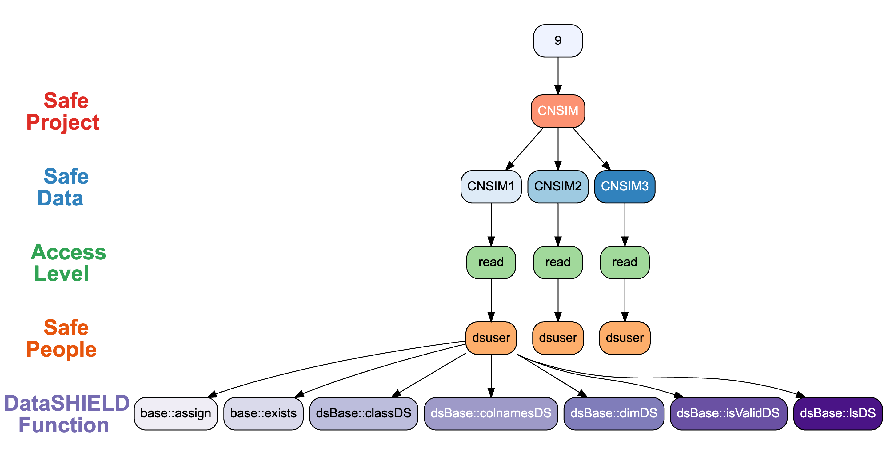
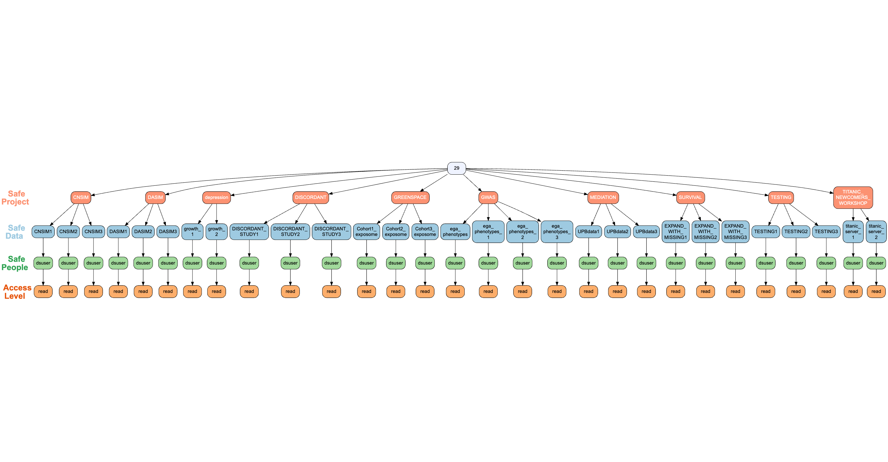
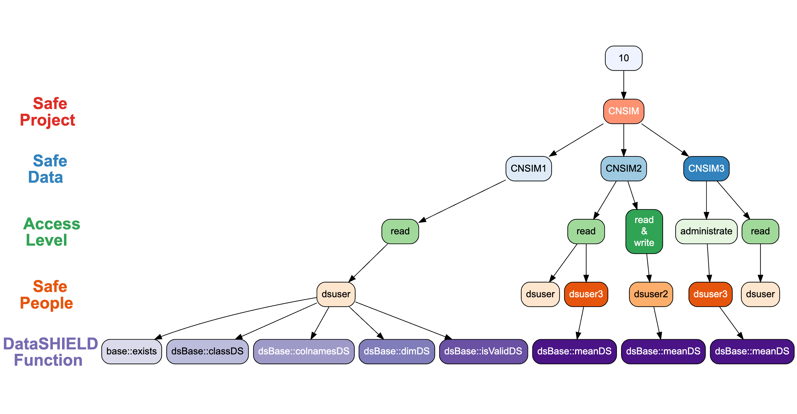

<!-- README.md is generated from README.Rmd. Please edit that file -->

# dsROCrate: ‘DataSHIELD’ RO-Crate Wrapper Functions 

<!-- badges: start -->

[](https://lifecycle.r-lib.org/articles/stages.html#experimental)
[](https://CRAN.R-project.org/package=dsROCrate)
[](https://app.codecov.io/gh/DataSHIELD-5S/dsROCrate)
<!-- badges: end -->

The goal of dsROCrate is to provide functions to wrap elements from a
‘DataSHIELD’ analysis into an RO-Crate.

## 1. Installation

You can install the development version of dsROCrate from
[GitHub](https://github.com/) with:

``` r
# install.packages("pak")
pak::pak("DataSHIELD-5S/dsROCrate")
```

## 2. Creating your first RO-Crate

In this example, we will be using OBiBa’s
[Opal](https://opaldoc.obiba.org/en/latest/index.html) as the *back-end*
for DataSHIELD.

### 2.1. Connect to an Opal Server

#### Setup

For instructions on how to set up a local server for DataSHIELD, see the
following vignette:

``` r
vignette("deploy-local-datashield-server-with-opal")
```

Here we will use OBiBa’s Opal demo server:
<https://opal-demo.obiba.org/> which can be accessed with the following
login credentials:

``` r
# define global variables
## Opal server access
USERNAME <- "administrator"
USERPASS <- "password"
SERVER <- "https://opal-demo.obiba.org"
## Credentials for `dsuser`
### NOTE: this is only used to simulate an analysis and generate logs
DSUSERPASS <- "P@ssw0rd"
```

Next, define global variables used in generating the RO-Crate, such as
project name, table references (within the project) and user
identifiers.

``` r
## Five safes variables
PEOPLE <- "dsuser"
PROJECT <- "CNSIM"
TABLES <- c("CNSIM1")
```

#### Open connection

Once the credentials and Five Safes variables are configured,we can
start a new session to the opal server with the following command:

``` r
# login to local server with `USERNAME` and `USERPASS`.
o <- opalr::opal.login(
  username = USERNAME,
  password = USERPASS,
  url = SERVER
)

print(o)
#> url: https://opal-demo.obiba.org 
#> name: opal-demo.obiba.org 
#> version: 5.4.0 
#> username: administrator
```

### 2.2. Create a basic RO-Crate

To create a basic RO-Crate, we will use the
[`{rocrateR}`](https://github.com/ResearchObject/ro-crate-r) package.
This package can be installed with the following command:

``` r
# install.packages("pak")
pak::pak("ResearchObject/ro-crate-r@dev")
```

Then, a basic RO-Crate can be created with the following command:

``` r
basic_rocrate <- rocrateR::rocrate_5s()
```

Note that this RO-Crate uses the
[5s-crate](https://trefx.uk/5s-crate/0.4/) profile.

``` r
print(basic_rocrate)
#> {
#>   "@context": "https://w3id.org/ro/crate/1.2/context",
#>   "@graph": [
#>     {
#>       "@id": "ro-crate-metadata.json",
#>       "@type": "CreativeWork",
#>       "about": {
#>         "@id": "./"
#>       },
#>       "conformsTo": {
#>         "@id": "https://w3id.org/ro/crate/1.2"
#>       }
#>     },
#>     {
#>       "@id": "./",
#>       "@type": "Dataset",
#>       "name": "",
#>       "description": "",
#>       "datePublished": "2025-12-12",
#>       "license": {
#>         "@id": "http://spdx.org/licenses/CC-BY-4.0"
#>       },
#>       "conformsTo": {
#>         "@id": "https://w3id.org/5s-crate/0.4"
#>       }
#>     },
#>     {
#>       "@id": "https://w3id.org/5s-crate/0.4",
#>       "@type": ["CreativeWork", "Profile"],
#>       "name": "Five Safes RO-Crate profile"
#>     }
#>   ]
#> }
```

### 2.3. Add *Five Safes* Elements

#### Safe Data

To add details for Safe Data, use the function `dsROCrate::safe_data()`.

``` r
basic_rocrate <- o |>
  dsROCrate::safe_data(rocrate = basic_rocrate,
                       project = PROJECT,
                       tables = TABLES)

print(basic_rocrate) # note that the output will be truncated
...
#>     {
#>       "@id": "#dataset:67adf2d8e106aca9b11de773758bd241",
#>       "@type": "Dataset",
#>       "name": "CNSIM1",
#>       "dateCreated": "2025-12-12T06:29:55.390Z",
#>       "dateModified": "2025-12-12T06:29:56.545Z",
#>       "path": "/datasource/CNSIM/table/CNSIM1"
#>     }
#>   ]
#> }
```

#### Safe Project

To add details for Safe Project, use the function
`dsROCrate::safe_project()`.

``` r
basic_rocrate <- o |>
  dsROCrate::safe_project(rocrate = basic_rocrate,
                          project = PROJECT)

print(basic_rocrate) # note that the output will be truncated
...
#>     {
#>       "@id": "#project:7ba189863f9f641196596cb28e04aa14",
#>       "@type": "Project",
#>       "name": "CNSIM",
#>       "dateCreated": "2025-12-12T06:29:53.990Z",
#>       "dateModified": "2025-12-12T06:29:58.821Z",
#>       "hasPart": [
#>         {
#>           "@id": "#dataset:67adf2d8e106aca9b11de773758bd241"
#>         }
#>       ]
#>     }
#>   ]
#> }
```

#### Safe People

To add details for Safe People, use the function
`dsROCrate::safe_people()`.

``` r
basic_rocrate <- o |>
  dsROCrate::safe_people(rocrate = basic_rocrate, user = PEOPLE)

print(basic_rocrate) # note that the output will be truncated
...
#>     {
#>       "@id": "#person:a0af2a94926db1b49ad7a812eef509d2",
#>       "@type": "Person",
#>       "name": "dsuser",
#>       "memberOf": [
#>         {
#>           "@id": "#project:7ba189863f9f641196596cb28e04aa14"
#>         }
#>       ]
#>     }
#>   ]
#> }
```

#### Safe Setting

To add details for Safe Setting, use the function
`dsROCrate::safe_setting()`.

**⚠️NOTE:** The `dsROCrate::safe_setting` function requires
administrator privileges, so here, we will have to log in with
administrator credentials (if you used a non-administrator account
previously).

``` r
# close previous connection
opalr::opal.logout(o)

# open new connection as administrator
o <- opalr::opal.login(
  username = "administrator",
  password = "password",
  url = SERVER
)
```

Then, we can proceed as per usual:

``` r
basic_rocrate <- o |>
  dsROCrate::safe_setting(rocrate = basic_rocrate)

print(basic_rocrate) # note that the output will be truncated
...
#>     {
#>       "@id": "_:localid:datashield.privacyLevel:5",
#>       "@type": "PropertyValue",
#>       "name": "datashield.privacyLevel",
#>       "value": "5"
#>     },
#>     {
#>       "@id": "_:localid:default.datashield.privacyControlLevel:banana",
#>       "@type": "PropertyValue",
#>       "name": "default.datashield.privacyControlLevel",
#>       "value": "banana"
#>     },
#>     {
#>       "@id": "_:localid:default.nfilter.glm:0.33",
#>       "@type": "PropertyValue",
#>       "name": "default.nfilter.glm",
#>       "value": "0.33"
#>     },
#>     {
#>       "@id": "_:localid:default.nfilter.kNN:3",
#>       "@type": "PropertyValue",
#>       "name": "default.nfilter.kNN",
#>       "value": "3"
#>     },
#>     {
#>       "@id": "_:localid:default.nfilter.levels.density:0.33",
#>       "@type": "PropertyValue",
#>       "name": "default.nfilter.levels.density",
#>       "value": "0.33"
#>     },
#>     {
#>       "@id": "_:localid:default.nfilter.levels.max:40",
#>       "@type": "PropertyValue",
#>       "name": "default.nfilter.levels.max",
#>       "value": "40"
#>     },
#>     {
#>       "@id": "_:localid:default.nfilter.noise:0.25",
#>       "@type": "PropertyValue",
#>       "name": "default.nfilter.noise",
#>       "value": "0.25"
#>     },
#>     {
#>       "@id": "_:localid:default.nfilter.string:80",
#>       "@type": "PropertyValue",
#>       "name": "default.nfilter.string",
#>       "value": "80"
#>     },
#>     {
#>       "@id": "_:localid:default.nfilter.stringShort:20",
#>       "@type": "PropertyValue",
#>       "name": "default.nfilter.stringShort",
#>       "value": "20"
#>     },
#>     {
#>       "@id": "_:localid:default.nfilter.subset:3",
#>       "@type": "PropertyValue",
#>       "name": "default.nfilter.subset",
#>       "value": "3"
#>     },
#>     {
#>       "@id": "_:localid:default.nfilter.tab:3",
#>       "@type": "PropertyValue",
#>       "name": "default.nfilter.tab",
#>       "value": "3"
#>     },
#>     {
#>       "@id": "cb5ccdc930d110416079c6d5cbb81ed8",
#>       "@type": "SoftwareApplication",
#>       "name": "dsBase",
#>       "version": "6.3.4",
#>       "description": "Base 'DataSHIELD' functions for the server side. 'DataSHIELD' is a software package which allows\n    you to do non-disclosive federated analysis on sensitive data. 'DataSHIELD' analytic functions have\n    been designed to only share non disclosive summary statistics, with built in automated output\n    checking based on statistical disclosure control. With data sites setting the threshold values for\n    the automated output checks. For more details, see 'citation(\"dsBase\")'."
#>     },
#>     {
#>       "@id": "e2f7c43973c40d7a6a6731da5a0aa564",
#>       "@type": "SoftwareApplication",
#>       "name": "dsTidyverse",
#>       "version": "1.1.0",
#>       "description": "Implementation of selected 'Tidyverse' functions within 'DataSHIELD', an open-source federated analysis solution in R. Currently, DataSHIELD contains very limited tools for data manipulation, so the aim of this package is to improve the researcher experience by implementing essential functions for data manipulation, including subsetting, filtering, grouping, and renaming variables. This is the serverside package which should be installed on the server holding the data, and is used in conjuncture with the clientside package 'dsTidyverseClient' which is installed in the local R environment of the analyst. For more information, see <https://tidyverse.org/> and <https://datashield.org/>."
#>     },
#>     {
#>       "@id": "cb799d87d85ee53fa4b23de013c8c8ad",
#>       "@type": "SoftwareApplication",
#>       "name": "resourcer",
#>       "version": "1.4.0",
#>       "description": "A resource represents some data or a computation unit. It is \n    described by a URL and credentials. This package proposes a Resource model\n    with \"resolver\" and \"client\" classes to facilitate the access and the usage of the \n    resources."
#>     }
#>   ]
#> }
```

#### Safe Outputs

To add details for Safe Outputs, use the function
`dsROCrate::safe_output()`. Currently, only log files from the
operations executed by the user within a specific period. Set the period
using `logs_from` and `logs_to`.

**⚠️NOTE:** Similar to `dsROCrate::safe_setting`, the
`dsROCrate::safe_output` function requires of administrator rights, so
here, we will have to log in with administrator credentials:

``` r
# close previous connection
opalr::opal.logout(o)

# open new connection as administrator
o <- opalr::opal.login(
  username = "administrator",
  password = "password",
  url = SERVER
)
```

------------------------------------------------------------------------

##### DataSHIELD operations

**⚠️NOTE:** Before extracting logs, ensure there is recent activity on
the server for testing purposes. This can be done using the following
commands:

###### Setup

You will need the following packages:

``` r
pak::pak("DSI")
pak::pak("DSOpal")
pak::pak("dsBaseClient")
```

###### Open connection

``` r
# run some test commands with dsBaseClient
## needed to defined the OpalDriver class in the current environment
DSOpal::Opal()
#> An object of class "OpalDriver"
#> <S4 Type Object>
## create new login object, note that here we use the `dsuser`
builder <- DSI::newDSLoginBuilder()
builder$append(server = "study1",
               url = SERVER,
               user = "dsuser",
               password = DSUSERPASS,
               driver = "OpalDriver")
logindata <- builder$build()
conns <- DSI::datashield.login(logins = logindata)
#> 
#> Logging into the collaborating servers
```

###### Simulate some operations

``` r
## assign data
DSI::datashield.assign.table(conns["study1"], 
                             symbol = "dsROCrate_test",
                             table = paste0(PROJECT, ".", TABLES[1]),
                             errors.print = TRUE)

dsBaseClient::ds.ls(datasources = conns["study1"])
dsBaseClient::ds.summary("dsROCrate_test")
```

------------------------------------------------------------------------

Then, we can proceed as per usual:

``` r
basic_rocrate <- o |>
  dsROCrate::safe_output(rocrate = basic_rocrate,
                         logs_from = Sys.time() - 60, # capture the last minute
                         logs_to = Sys.time())
#> opening file input connection.
#>  Found 40 records... Imported 40 records. Simplifying...
#> closing file input connection.
#> Warning: No logs were found for the following configuration:
#>  User: dsuser
#>  Period: 2025-12-12 15:21:14.513063 -- 2025-12-12 15:22:14.513073
```

``` r
print(basic_rocrate) # note that the output will be truncated
...
```

### 2.(n-1). Close connection

``` r
opalr::opal.logout(o)
```

### 2.n. Bag/Save RO-Crate

The resulting RO-Crate can be stored into an RO-Crate bag/archive with
the function `rocrateR::bag_rocrate`:

``` r
# create temp directory
dir.create("./rocrates", showWarnings = FALSE)
```

NOTE: In the above example, a `path` to store the logs wasn’t provided
when calling `dsROCrate::safe_output`, before creating an RO-Crate bag,
we should save the contents of this file first

``` r
logs_entity <- basic_rocrate |>
  rocrateR::get_entity(type = "File")
# write file using the path given by `@id`
writeLines(
  logs_entity[[1]]$content[[1]], 
  file.path("./rocrates", logs_entity[[1]]$`@id`)
)
# remove the section `content`
logs_entity[[1]]$content <- NULL
# update the RO-Crate
basic_rocrate <- basic_rocrate |>
  rocrateR::add_entity(logs_entity[[1]], overwrite = TRUE)
```

``` r
# create RO-Crate bag
path_to_rocrate_bag <- basic_rocrate |>
  rocrateR::bag_rocrate(path = "./rocrates", overwrite = TRUE)
#> RO-Crate successfully 'bagged'!
#> For details, see: ./rocrates/rocrate-900f7304a39004a8d9dcd71bee48f93d.zip
```

We can explore the contents with the following commands:

``` r
# extract files in temporary directory
path_to_rocrate_bag |>
  # extract contents inside ./rocrates/ROC
  rocrateR::unbag_rocrate(output = "./rocrates/ROC", quiet = TRUE) |>
  # create tree with the files
  fs::dir_tree()
#> ./rocrates/ROC/
#> ├── bagit.txt
#> ├── data
#> │   └── ro-crate-metadata.json
#> ├── manifest-sha512.txt
#> └── tagmanifest-sha512.txt
```

### 2.(n+1). Clean working directory

``` r
unlink("./rocrates", recursive = TRUE, force = TRUE)
```

<br />

## 3. Auditing RO-Crates and servers

### Safe People

##### List accessible tables within a project for an user

``` r
safe_people_crate_v1 <- opalr::opal.login(
  username = USERNAME,
  password = USERPASS,
  url = SERVER
) |>
  dsROCrate::audit_safe_people(user = "dsuser", project = "CNSIM")

print(safe_people_crate_v1)
#> {
#>   "@context": "https://w3id.org/ro/crate/1.2/context",
#>   "@graph": [
#>     {
#>       "@id": "ro-crate-metadata.json",
#>       "@type": "CreativeWork",
#>       "about": {
#>         "@id": "./"
#>       },
#>       "conformsTo": {
#>         "@id": "https://w3id.org/ro/crate/1.2"
#>       }
#>     },
#>     {
#>       "@id": "./",
#>       "@type": "Dataset",
#>       "name": "",
#>       "description": "",
#>       "datePublished": "2025-12-12",
#>       "license": {
#>         "@id": "http://spdx.org/licenses/CC-BY-4.0"
#>       },
#>       "conformsTo": {
#>         "@id": "https://w3id.org/5s-crate/0.4"
#>       },
#>       "author": {
#>         "@id": "#person:a0af2a94926db1b49ad7a812eef509d2"
#>       }
#>     },
#>     {
#>       "@id": "https://w3id.org/5s-crate/0.4",
#>       "@type": ["CreativeWork", "Profile"],
#>       "name": "Five Safes RO-Crate profile"
#>     },
#>     {
#>       "@id": "#dataset:67adf2d8e106aca9b11de773758bd241",
#>       "@type": "Dataset",
#>       "name": "CNSIM1",
#>       "dateCreated": "2025-12-12T06:29:55.390Z",
#>       "dateModified": "2025-12-12T06:29:56.545Z",
#>       "path": "/datasource/CNSIM/table/CNSIM1"
#>     },
#>     {
#>       "@id": "#dataset:ffb1b1adcafc024743be1b0c252787c9",
#>       "@type": "Dataset",
#>       "name": "CNSIM2",
#>       "dateCreated": "2025-12-12T06:29:56.556Z",
#>       "dateModified": "2025-12-12T06:29:57.666Z",
#>       "path": "/datasource/CNSIM/table/CNSIM2"
#>     },
#>     {
#>       "@id": "#dataset:cc3061aef69ce457358815fb9d8c6492",
#>       "@type": "Dataset",
#>       "name": "CNSIM3",
#>       "dateCreated": "2025-12-12T06:29:57.668Z",
#>       "dateModified": "2025-12-12T06:29:58.821Z",
#>       "path": "/datasource/CNSIM/table/CNSIM3"
#>     },
#>     {
#>       "@id": "#project:7ba189863f9f641196596cb28e04aa14",
#>       "@type": "Project",
#>       "name": "CNSIM",
#>       "dateCreated": "2025-12-12T06:29:53.990Z",
#>       "dateModified": "2025-12-12T06:29:58.821Z",
#>       "hasPart": [
#>         {
#>           "@id": "#dataset:67adf2d8e106aca9b11de773758bd241"
#>         },
#>         {
#>           "@id": "#dataset:ffb1b1adcafc024743be1b0c252787c9"
#>         },
#>         {
#>           "@id": "#dataset:cc3061aef69ce457358815fb9d8c6492"
#>         }
#>       ]
#>     },
#>     {
#>       "@id": "#person:a0af2a94926db1b49ad7a812eef509d2",
#>       "@type": "Person",
#>       "name": "dsuser",
#>       "memberOf": [
#>         {
#>           "@id": "#project:7ba189863f9f641196596cb28e04aa14"
#>         }
#>       ]
#>     },
#>     {
#>       "@id": "_:localid:datashield.privacyLevel:5",
#>       "@type": "PropertyValue",
#>       "name": "datashield.privacyLevel",
#>       "value": "5"
#>     },
#>     {
#>       "@id": "_:localid:default.datashield.privacyControlLevel:banana",
#>       "@type": "PropertyValue",
#>       "name": "default.datashield.privacyControlLevel",
#>       "value": "banana"
#>     },
#>     {
#>       "@id": "_:localid:default.nfilter.glm:0.33",
#>       "@type": "PropertyValue",
#>       "name": "default.nfilter.glm",
#>       "value": "0.33"
#>     },
#>     {
#>       "@id": "_:localid:default.nfilter.kNN:3",
#>       "@type": "PropertyValue",
#>       "name": "default.nfilter.kNN",
#>       "value": "3"
#>     },
#>     {
#>       "@id": "_:localid:default.nfilter.levels.density:0.33",
#>       "@type": "PropertyValue",
#>       "name": "default.nfilter.levels.density",
#>       "value": "0.33"
#>     },
#>     {
#>       "@id": "_:localid:default.nfilter.levels.max:40",
#>       "@type": "PropertyValue",
#>       "name": "default.nfilter.levels.max",
#>       "value": "40"
#>     },
#>     {
#>       "@id": "_:localid:default.nfilter.noise:0.25",
#>       "@type": "PropertyValue",
#>       "name": "default.nfilter.noise",
#>       "value": "0.25"
#>     },
#>     {
#>       "@id": "_:localid:default.nfilter.string:80",
#>       "@type": "PropertyValue",
#>       "name": "default.nfilter.string",
#>       "value": "80"
#>     },
#>     {
#>       "@id": "_:localid:default.nfilter.stringShort:20",
#>       "@type": "PropertyValue",
#>       "name": "default.nfilter.stringShort",
#>       "value": "20"
#>     },
#>     {
#>       "@id": "_:localid:default.nfilter.subset:3",
#>       "@type": "PropertyValue",
#>       "name": "default.nfilter.subset",
#>       "value": "3"
#>     },
#>     {
#>       "@id": "_:localid:default.nfilter.tab:3",
#>       "@type": "PropertyValue",
#>       "name": "default.nfilter.tab",
#>       "value": "3"
#>     },
#>     {
#>       "@id": "cb5ccdc930d110416079c6d5cbb81ed8",
#>       "@type": "SoftwareApplication",
#>       "name": "dsBase",
#>       "version": "6.3.4",
#>       "description": "Base 'DataSHIELD' functions for the server side. 'DataSHIELD' is a software package which allows\n    you to do non-disclosive federated analysis on sensitive data. 'DataSHIELD' analytic functions have\n    been designed to only share non disclosive summary statistics, with built in automated output\n    checking based on statistical disclosure control. With data sites setting the threshold values for\n    the automated output checks. For more details, see 'citation(\"dsBase\")'."
#>     },
#>     {
#>       "@id": "e2f7c43973c40d7a6a6731da5a0aa564",
#>       "@type": "SoftwareApplication",
#>       "name": "dsTidyverse",
#>       "version": "1.1.0",
#>       "description": "Implementation of selected 'Tidyverse' functions within 'DataSHIELD', an open-source federated analysis solution in R. Currently, DataSHIELD contains very limited tools for data manipulation, so the aim of this package is to improve the researcher experience by implementing essential functions for data manipulation, including subsetting, filtering, grouping, and renaming variables. This is the serverside package which should be installed on the server holding the data, and is used in conjuncture with the clientside package 'dsTidyverseClient' which is installed in the local R environment of the analyst. For more information, see <https://tidyverse.org/> and <https://datashield.org/>."
#>     },
#>     {
#>       "@id": "cb799d87d85ee53fa4b23de013c8c8ad",
#>       "@type": "SoftwareApplication",
#>       "name": "resourcer",
#>       "version": "1.4.0",
#>       "description": "A resource represents some data or a computation unit. It is \n    described by a URL and credentials. This package proposes a Resource model\n    with \"resolver\" and \"client\" classes to facilitate the access and the usage of the \n    resources."
#>     }
#>   ]
#> }
```

###### Markdown report

A markdown report can be created with an overview and details for an
RO-Crate, using the `dsROCrate::rocrate_report`:

**Only generate .Rmd file**

``` r
safe_people_crate_v1_rmd <- tempfile(fileext = ".Rmd") # temporary file

safe_people_crate_contents <- safe_people_crate_v1 |>
  dsROCrate::rocrate_report(filepath = safe_people_crate_v1_rmd, render = FALSE)
#> 1 'Author' entity was found!
#> 3 'Dataset' entities were found!
#> Warning: No entities were found with @type = 'ReadAction'!
#> Warning: No entities were found with @type = 'WriteAction'!
#> Warning: No entities were found with @type = 'ControlAction'!
#> 1 'Project' entity was found!
#> 14 'PropertyValue' OR 'SoftwareApplication' entities were found!

# display Overview diagram
safe_people_crate_contents$overview_diagram
#> file:////private/var/folders/59/4_l6kbyj2qsczmk2b52qg_f40000gn/T/Rtmp9oAWJY/file150805e5df2c8/widget1508069ee58de.html screenshot completed
```



``` r

# display Overview data (Safe People, Safe Projects and Safe Data)
safe_people_crate_contents$overview_data |>
  knitr::kable()
```

| Safe People | Safe Project | Safe Data |
|:------------|:-------------|:----------|
| dsuser      | CNSIM        | CNSIM1    |
|             |              | CNSIM2    |
|             |              | CNSIM3    |

**Render and display report (HTML)**

``` r
safe_people_crate_v1 |>
  dsROCrate::rocrate_report(filepath = safe_people_crate_v1_rmd, 
                            render = TRUE, 
                            overwrite = TRUE)
```

##### List all accessible projects & tables for an user

``` r
safe_people_crate_v2 <- opalr::opal.login(
  username = USERNAME,
  password = USERPASS,
  url = SERVER
) |>
  dsROCrate::audit_safe_people(user = "dsuser")

safe_people_crate_v2_rmd <- tempfile(fileext = ".Rmd") # temporary file

safe_people_crate_contents_v2 <- safe_people_crate_v2 |>
  dsROCrate::rocrate_report(filepath = safe_people_crate_v2_rmd, render = FALSE)
#> 1 'Author' entity was found!
#> 29 'Dataset' entities were found!
#> 10 'Project' entities were found!
#> 14 'PropertyValue' OR 'SoftwareApplication' entities were found!

# display Overview diagram
safe_people_crate_contents_v2$overview_diagram
#> file:////private/var/folders/59/4_l6kbyj2qsczmk2b52qg_f40000gn/T/Rtmp9oAWJY/file150803d449d86/widget1508063c1e7d6.html screenshot completed
```



``` r

# display Overview data (Safe People, Safe Projects and Safe Data)
safe_people_crate_contents_v2$overview_data |>
  knitr::kable()
```

| Safe People | Safe Project               | Safe Data            |
|:------------|:---------------------------|:---------------------|
| dsuser      | CNSIM                      | CNSIM1               |
|             |                            | CNSIM2               |
|             |                            | CNSIM3               |
|             | DASIM                      | DASIM1               |
|             |                            | DASIM2               |
|             |                            | DASIM3               |
|             | DISCORDANT                 | DISCORDANT_STUDY1    |
|             |                            | DISCORDANT_STUDY2    |
|             |                            | DISCORDANT_STUDY3    |
|             | GREENSPACE                 | Cohort1_exposome     |
|             |                            | Cohort2_exposome     |
|             |                            | Cohort3_exposome     |
|             | GWAS                       | ega_phenotypes       |
|             |                            | ega_phenotypes_1     |
|             |                            | ega_phenotypes_2     |
|             |                            | ega_phenotypes_3     |
|             | MEDIATION                  | UPBdata1             |
|             |                            | UPBdata2             |
|             |                            | UPBdata3             |
|             | SURVIVAL                   | EXPAND_WITH_MISSING1 |
|             |                            | EXPAND_WITH_MISSING2 |
|             |                            | EXPAND_WITH_MISSING3 |
|             | TESTING                    | TESTING1             |
|             |                            | TESTING2             |
|             |                            | TESTING3             |
|             | TITANIC_NEWCOMERS_WORKSHOP | titanic_server_1     |
|             |                            | titanic_server_2     |
|             | depression                 | growth_1             |
|             |                            | growth_2             |

### Safe Project

##### List users and dataset/table level permissions within a project

``` r
safe_project_crate_v1 <- opalr::opal.login(
  username = USERNAME,
  password = USERPASS,
  url = SERVER
) |>
  dsROCrate::audit_safe_project(project = "CNSIM")

print(safe_project_crate_v1)
#> {
#>   "@context": "https://w3id.org/ro/crate/1.2/context",
#>   "@graph": [
#>     {
#>       "@id": "ro-crate-metadata.json",
#>       "@type": "CreativeWork",
#>       "about": {
#>         "@id": "./"
#>       },
#>       "conformsTo": {
#>         "@id": "https://w3id.org/ro/crate/1.2"
#>       }
#>     },
#>     {
#>       "@id": "./",
#>       "@type": "Dataset",
#>       "name": "",
#>       "description": "",
#>       "datePublished": "2025-12-12",
#>       "license": {
#>         "@id": "http://spdx.org/licenses/CC-BY-4.0"
#>       },
#>       "conformsTo": {
#>         "@id": "https://w3id.org/5s-crate/0.4"
#>       }
#>     },
#>     {
#>       "@id": "https://w3id.org/5s-crate/0.4",
#>       "@type": ["CreativeWork", "Profile"],
#>       "name": "Five Safes RO-Crate profile"
#>     },
#>     {
#>       "@id": "#dataset:67adf2d8e106aca9b11de773758bd241",
#>       "@type": "Dataset",
#>       "name": "CNSIM1",
#>       "dateCreated": "2025-12-12T06:29:55.390Z",
#>       "dateModified": "2025-12-12T06:29:56.545Z",
#>       "path": "/datasource/CNSIM/table/CNSIM1"
#>     },
#>     {
#>       "@id": "#dataset:ffb1b1adcafc024743be1b0c252787c9",
#>       "@type": "Dataset",
#>       "name": "CNSIM2",
#>       "dateCreated": "2025-12-12T06:29:56.556Z",
#>       "dateModified": "2025-12-12T06:29:57.666Z",
#>       "path": "/datasource/CNSIM/table/CNSIM2"
#>     },
#>     {
#>       "@id": "#dataset:cc3061aef69ce457358815fb9d8c6492",
#>       "@type": "Dataset",
#>       "name": "CNSIM3",
#>       "dateCreated": "2025-12-12T06:29:57.668Z",
#>       "dateModified": "2025-12-12T06:29:58.821Z",
#>       "path": "/datasource/CNSIM/table/CNSIM3"
#>     },
#>     {
#>       "@id": "#project:7ba189863f9f641196596cb28e04aa14",
#>       "@type": "Project",
#>       "name": "CNSIM",
#>       "dateCreated": "2025-12-12T06:29:53.990Z",
#>       "dateModified": "2025-12-12T06:29:58.821Z",
#>       "hasPart": [
#>         {
#>           "@id": "#dataset:67adf2d8e106aca9b11de773758bd241"
#>         },
#>         {
#>           "@id": "#dataset:ffb1b1adcafc024743be1b0c252787c9"
#>         },
#>         {
#>           "@id": "#dataset:cc3061aef69ce457358815fb9d8c6492"
#>         }
#>       ]
#>     },
#>     {
#>       "@id": "#person:a0af2a94926db1b49ad7a812eef509d2",
#>       "@type": "Person",
#>       "name": "dsuser"
#>     },
#>     {
#>       "@id": "#person:a3cd7ce7818436c83b1eadaa5ba47411",
#>       "@type": "Person",
#>       "name": "dsuser2"
#>     },
#>     {
#>       "@id": "#person:5657241505661473308ae9aa9a378293",
#>       "@type": "Person",
#>       "name": "dsuser3"
#>     },
#>     {
#>       "@id": "#perm:9bf7f75b6c5b07d02830b95652cd39a0-dict-summary-read",
#>       "@type": "ReadAction",
#>       "agent": {
#>         "@id": "#person:a0af2a94926db1b49ad7a812eef509d2"
#>       },
#>       "object": {
#>         "@id": "#dataset:67adf2d8e106aca9b11de773758bd241"
#>       },
#>       "actionStatus": "PotentialActionStatus",
#>       "description": "User may view table dictionary and summary statistics only; access to individual values is restricted."
#>     },
#>     {
#>       "@id": "#perm:942b70778081ab4a9f41b2f8e5c149a5-write-dict",
#>       "@type": "WriteAction",
#>       "agent": {
#>         "@id": "#person:a3cd7ce7818436c83b1eadaa5ba47411"
#>       },
#>       "object": {
#>         "@id": "#dataset:67adf2d8e106aca9b11de773758bd241"
#>       },
#>       "actionStatus": "PotentialActionStatus",
#>       "description": "User may edit the table dictionary but cannot view individual values."
#>     },
#>     {
#>       "@id": "#perm:942b70778081ab4a9f41b2f8e5c149a5-summary-read",
#>       "@type": "ReadAction",
#>       "agent": {
#>         "@id": "#person:a3cd7ce7818436c83b1eadaa5ba47411"
#>       },
#>       "object": {
#>         "@id": "#dataset:67adf2d8e106aca9b11de773758bd241"
#>       },
#>       "actionStatus": "PotentialActionStatus",
#>       "description": "User may view summary statistics only; access to individual values is restricted."
#>     },
#>     {
#>       "@id": "#perm:363eb627d1e49c08933f2e26142e6d56-dict-summary-read",
#>       "@type": "ReadAction",
#>       "agent": {
#>         "@id": "#person:a0af2a94926db1b49ad7a812eef509d2"
#>       },
#>       "object": {
#>         "@id": "#dataset:ffb1b1adcafc024743be1b0c252787c9"
#>       },
#>       "actionStatus": "PotentialActionStatus",
#>       "description": "User may view table dictionary and summary statistics only; access to individual values is restricted."
#>     },
#>     {
#>       "@id": "#perm:63b8097908f682bff1760e48d28c5855-dict-summary-read",
#>       "@type": "ReadAction",
#>       "agent": {
#>         "@id": "#person:a0af2a94926db1b49ad7a812eef509d2"
#>       },
#>       "object": {
#>         "@id": "#dataset:cc3061aef69ce457358815fb9d8c6492"
#>       },
#>       "actionStatus": "PotentialActionStatus",
#>       "description": "User may view table dictionary and summary statistics only; access to individual values is restricted."
#>     },
#>     {
#>       "@id": "#perm:04c3f293c7a360fe0a1b7c29c8363540-write-dict",
#>       "@type": "WriteAction",
#>       "agent": {
#>         "@id": "#person:5657241505661473308ae9aa9a378293"
#>       },
#>       "object": {
#>         "@id": "#dataset:cc3061aef69ce457358815fb9d8c6492"
#>       },
#>       "actionStatus": "PotentialActionStatus",
#>       "description": "User may edit the table dictionary but cannot view individual values."
#>     },
#>     {
#>       "@id": "#perm:04c3f293c7a360fe0a1b7c29c8363540-summary-read",
#>       "@type": "ReadAction",
#>       "agent": {
#>         "@id": "#person:5657241505661473308ae9aa9a378293"
#>       },
#>       "object": {
#>         "@id": "#dataset:cc3061aef69ce457358815fb9d8c6492"
#>       },
#>       "actionStatus": "PotentialActionStatus",
#>       "description": "User may view summary statistics only; access to individual values is restricted."
#>     },
#>     {
#>       "@id": "#perm:156ecf5add0b7f9d4733f524a5c778ec-read-all",
#>       "@type": "ReadAction",
#>       "agent": {
#>         "@id": "#person:a3cd7ce7818436c83b1eadaa5ba47411"
#>       },
#>       "object": {
#>         "@id": "#dataset:cc3061aef69ce457358815fb9d8c6492"
#>       },
#>       "actionStatus": "PotentialActionStatus",
#>       "description": "User may view table dictionary and all individual values."
#>     },
#>     {
#>       "@id": "_:localid:datashield.privacyLevel:5",
#>       "@type": "PropertyValue",
#>       "name": "datashield.privacyLevel",
#>       "value": "5"
#>     },
#>     {
#>       "@id": "_:localid:default.datashield.privacyControlLevel:banana",
#>       "@type": "PropertyValue",
#>       "name": "default.datashield.privacyControlLevel",
#>       "value": "banana"
#>     },
#>     {
#>       "@id": "_:localid:default.nfilter.glm:0.33",
#>       "@type": "PropertyValue",
#>       "name": "default.nfilter.glm",
#>       "value": "0.33"
#>     },
#>     {
#>       "@id": "_:localid:default.nfilter.kNN:3",
#>       "@type": "PropertyValue",
#>       "name": "default.nfilter.kNN",
#>       "value": "3"
#>     },
#>     {
#>       "@id": "_:localid:default.nfilter.levels.density:0.33",
#>       "@type": "PropertyValue",
#>       "name": "default.nfilter.levels.density",
#>       "value": "0.33"
#>     },
#>     {
#>       "@id": "_:localid:default.nfilter.levels.max:40",
#>       "@type": "PropertyValue",
#>       "name": "default.nfilter.levels.max",
#>       "value": "40"
#>     },
#>     {
#>       "@id": "_:localid:default.nfilter.noise:0.25",
#>       "@type": "PropertyValue",
#>       "name": "default.nfilter.noise",
#>       "value": "0.25"
#>     },
#>     {
#>       "@id": "_:localid:default.nfilter.string:80",
#>       "@type": "PropertyValue",
#>       "name": "default.nfilter.string",
#>       "value": "80"
#>     },
#>     {
#>       "@id": "_:localid:default.nfilter.stringShort:20",
#>       "@type": "PropertyValue",
#>       "name": "default.nfilter.stringShort",
#>       "value": "20"
#>     },
#>     {
#>       "@id": "_:localid:default.nfilter.subset:3",
#>       "@type": "PropertyValue",
#>       "name": "default.nfilter.subset",
#>       "value": "3"
#>     },
#>     {
#>       "@id": "_:localid:default.nfilter.tab:3",
#>       "@type": "PropertyValue",
#>       "name": "default.nfilter.tab",
#>       "value": "3"
#>     },
#>     {
#>       "@id": "cb5ccdc930d110416079c6d5cbb81ed8",
#>       "@type": "SoftwareApplication",
#>       "name": "dsBase",
#>       "version": "6.3.4",
#>       "description": "Base 'DataSHIELD' functions for the server side. 'DataSHIELD' is a software package which allows\n    you to do non-disclosive federated analysis on sensitive data. 'DataSHIELD' analytic functions have\n    been designed to only share non disclosive summary statistics, with built in automated output\n    checking based on statistical disclosure control. With data sites setting the threshold values for\n    the automated output checks. For more details, see 'citation(\"dsBase\")'."
#>     },
#>     {
#>       "@id": "e2f7c43973c40d7a6a6731da5a0aa564",
#>       "@type": "SoftwareApplication",
#>       "name": "dsTidyverse",
#>       "version": "1.1.0",
#>       "description": "Implementation of selected 'Tidyverse' functions within 'DataSHIELD', an open-source federated analysis solution in R. Currently, DataSHIELD contains very limited tools for data manipulation, so the aim of this package is to improve the researcher experience by implementing essential functions for data manipulation, including subsetting, filtering, grouping, and renaming variables. This is the serverside package which should be installed on the server holding the data, and is used in conjuncture with the clientside package 'dsTidyverseClient' which is installed in the local R environment of the analyst. For more information, see <https://tidyverse.org/> and <https://datashield.org/>."
#>     },
#>     {
#>       "@id": "cb799d87d85ee53fa4b23de013c8c8ad",
#>       "@type": "SoftwareApplication",
#>       "name": "resourcer",
#>       "version": "1.4.0",
#>       "description": "A resource represents some data or a computation unit. It is \n    described by a URL and credentials. This package proposes a Resource model\n    with \"resolver\" and \"client\" classes to facilitate the access and the usage of the \n    resources."
#>     }
#>   ]
#> }
```

###### Markdown report

A markdown report can be created with an overview and details for an
RO-Crate, using the `dsROCrate::rocrate_report`:

**Only generate .Rmd file**

``` r
safe_project_crate_v1_rmd <- tempfile(fileext = ".Rmd") # temporary file

safe_project_crate_contents <- safe_project_crate_v1 |>
  dsROCrate::rocrate_report(filepath = safe_project_crate_v1_rmd, render = FALSE)
#> 3 'Author' entities were found!
#> 3 'Dataset' entities were found!
#> Warning: No entities were found with @type = 'ControlAction'!
#> 1 'Project' entity was found!
#> 14 'PropertyValue' OR 'SoftwareApplication' entities were found!

# display Overview diagram
safe_project_crate_contents$overview_diagram
#> file:////private/var/folders/59/4_l6kbyj2qsczmk2b52qg_f40000gn/T/Rtmp9oAWJY/file1508065482cb2/widget15080656e8e10.html screenshot completed
```



``` r

# display Overview data (Safe People, Safe Projects and Safe Data)
safe_project_crate_contents$overview_data |>
  knitr::kable()
```

| Safe Project | Safe Data | Safe People | Access Level |
|:-------------|:----------|:------------|:-------------|
| CNSIM        | CNSIM1    | dsuser      | read         |
|              |           | dsuser2     | read, write  |
|              | CNSIM2    | dsuser      | read         |
|              | CNSIM3    | dsuser      | read         |
|              |           | dsuser2     | read         |
|              |           | dsuser3     | read, write  |

**Render and display report (HTML)**

``` r
safe_project_crate_v1 |>
  dsROCrate::rocrate_report(filepath = safe_project_crate_v1_rmd, 
                            render = TRUE, 
                            overwrite = TRUE)
```

<br />

## n. Identity

You are welcome to use any of the following hex codes when referencing
`{dsROCrate}`:

[](man/figures/logo.png)
[](man/figures/logo_white.png)
[](man/figures/logo_black.png)
