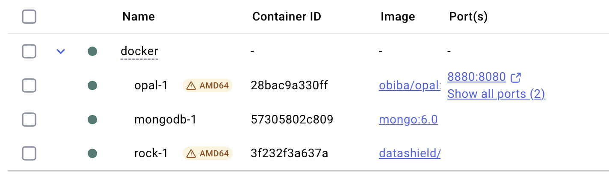

<!-- README.md is generated from README.Rmd. Please edit that file -->

# dsROCrate: ‘DataSHIELD’ RO-Crate Wrapper Functions

<!-- badges: start -->

[](https://lifecycle.r-lib.org/articles/stages.html#experimental)
[](https://CRAN.R-project.org/package=dsROCrate)
<!-- badges: end -->

The goal of dsROCrate is to provide functions to wrap elements from a
‘DataSHIELD’ analysis inside an RO-Crate.

## 0. Installation

You can install the development version of dsROCrate from
[GitHub](https://github.com/) with:

``` r
# install.packages("pak")
pak::pak("DataSHIELD-5S/dsROCrate")
```

## 1. First RO-Crate

### 1.1. Using OBiBa’s [Opal](https://opaldoc.obiba.org/en/latest/index.html) connection

Here we will spawn a local instance of
[DataSHIELD](https://datashield.org) with
[Docker](https://www.docker.com). We will assume you have installed and
configured Docker on your computer; however, if that’s not the case,
visit their [get started with
Docker](https://www.docker.com/get-started/) page.

#### 1.1.1. Set up

The easiest way to deploy DataSHIELD with docker is by cloning the
following repo:
[OllyButters/datashield_pcr](https://github.com/OllyButters/datashield_pcr).
Here, you will find a step by step guide, including a very useful
[`docker-compose.yml`](https://github.com/OllyButters/datashield_pcr/blob/main/docker/docker-compose.yml)
file, which you can use out of the box.

If you are running Linux or macOS, you can run the following commands:

``` sh
git clone https://github.com/OllyButters/datashield_pcr
cd datashield_pcr/docker
docker compose up -d
```

Then you can inspect the Docker GUI, where you should see something like
the following:



#### 1.1.2. Open connection

By default, the
[`docker-compose.yml`](https://github.com/OllyButters/datashield_pcr/blob/main/docker/docker-compose.yml)
file in the repo above defines a demo user, `demo_user`, with the
following password: `Demo_password1!` (edit the variables
`OPAL_DEMO_USER_NAME` and `OPAL_DEMO_USER_PASSWORD` accordingly). Here,
we will open a connection to our local server using these credentials:

``` r
# define global variables
USERNAME <- "demo_user"
USERPASS <- "Demo_password1!"
PROJECT <- "DEMO"
TABLES <- c("CNSIM1")
SERVER <- "https://localhost:8843"
PROFILE <- "demo"

# login to local server with `USERNAME` and `USERPASS`.
o <- opalr::opal.login(
  username = USERNAME,
  password = USERPASS,
  url = SERVER
)

print(o)
#> url: https://localhost:8843 
#> name: localhost 
#> version: 5.2.0 
#> username: demo_user
```

#### 1.1.3. Create new RO-Crate

To create a basic RO-Crate, we will use the
[`{rocrateR}`](https://github.com/ResearchObject/ro-crate-r) package.
This package can be installed with the following command:

``` r
# install.packages("pak")
pak::pak("ResearchObject/ro-crate-r@dev")
```

Then, a basic RO-Crate can be create with the following command:

``` r
basic_rocrate <- rocrateR::rocrate_5s()
```

Note that this RO-Crate uses the
[5s-crate](https://trefx.uk/5s-crate/0.4) profile.

``` r
print(basic_rocrate)
#> {
#>   "@context": "https://w3id.org/ro/crate/1.2/context",
#>   "@graph": [
#>     {
#>       "@id": "ro-crate-metadata.json",
#>       "@type": "CreativeWork",
#>       "about": {
#>         "@id": "./"
#>       },
#>       "conformsTo": {
#>         "@id": "https://w3id.org/ro/crate/1.2"
#>       }
#>     },
#>     {
#>       "@id": "./",
#>       "@type": "Dataset",
#>       "name": "",
#>       "description": "",
#>       "datePublished": "2025-10-24",
#>       "license": {
#>         "@id": "http://spdx.org/licenses/CC-BY-4.0"
#>       },
#>       "conformsTo": {
#>         "@id": "https://w3id.org/5s-crate/0.4"
#>       }
#>     },
#>     {
#>       "@id": "https://w3id.org/5s-crate/0.4",
#>       "@type": ["CreativeWork", "Profile"],
#>       "name": "Five Safes RO-Crate profile"
#>     }
#>   ]
#> }
```

#### 1.1.4. Safe Data

Here will add details for the safe data, using the function
`dsROCrate::safe_data`:

``` r
basic_rocrate <- o |>
  dsROCrate::safe_data(rocrate = basic_rocrate,
                       project = PROJECT,
                       tables = TABLES)

print(basic_rocrate)
#> {
#>   "@context": "https://w3id.org/ro/crate/1.2/context",
#>   "@graph": [
#>     {
#>       "@id": "ro-crate-metadata.json",
#>       "@type": "CreativeWork",
#>       "about": {
#>         "@id": "./"
#>       },
#>       "conformsTo": {
#>         "@id": "https://w3id.org/ro/crate/1.2"
#>       }
#>     },
#>     {
#>       "@id": "./",
#>       "@type": "Dataset",
#>       "name": "",
#>       "description": "",
#>       "datePublished": "2025-10-24",
#>       "license": {
#>         "@id": "http://spdx.org/licenses/CC-BY-4.0"
#>       },
#>       "conformsTo": {
#>         "@id": "https://w3id.org/5s-crate/0.4"
#>       }
#>     },
#>     {
#>       "@id": "https://w3id.org/5s-crate/0.4",
#>       "@type": ["CreativeWork", "Profile"],
#>       "name": "Five Safes RO-Crate profile"
#>     },
#>     {
#>       "@id": "#dataset:53faf531f99167c645ff5555921608af",
#>       "@type": "Dataset",
#>       "dateCreated": "2025-10-21T14:53:43.914Z",
#>       "dateModified": "2025-10-21T14:53:45.372Z",
#>       "path": "/datasource/DEMO/table/CNSIM1"
#>     }
#>   ]
#> }
```

#### 1.1.5. Safe Projects

Here will add details for the safe projects, using the function
`dsROCrate::safe_project`:

``` r
basic_rocrate <- o |>
  dsROCrate::safe_project(rocrate = basic_rocrate,
                          project = PROJECT)

print(basic_rocrate)
#> {
#>   "@context": "https://w3id.org/ro/crate/1.2/context",
#>   "@graph": [
#>     {
#>       "@id": "ro-crate-metadata.json",
#>       "@type": "CreativeWork",
#>       "about": {
#>         "@id": "./"
#>       },
#>       "conformsTo": {
#>         "@id": "https://w3id.org/ro/crate/1.2"
#>       }
#>     },
#>     {
#>       "@id": "./",
#>       "@type": "Dataset",
#>       "name": "",
#>       "description": "",
#>       "datePublished": "2025-10-24",
#>       "license": {
#>         "@id": "http://spdx.org/licenses/CC-BY-4.0"
#>       },
#>       "conformsTo": {
#>         "@id": "https://w3id.org/5s-crate/0.4"
#>       }
#>     },
#>     {
#>       "@id": "https://w3id.org/5s-crate/0.4",
#>       "@type": ["CreativeWork", "Profile"],
#>       "name": "Five Safes RO-Crate profile"
#>     },
#>     {
#>       "@id": "#dataset:53faf531f99167c645ff5555921608af",
#>       "@type": "Dataset",
#>       "dateCreated": "2025-10-21T14:53:43.914Z",
#>       "dateModified": "2025-10-21T14:53:45.372Z",
#>       "path": "/datasource/DEMO/table/CNSIM1"
#>     },
#>     {
#>       "@id": "#project:f9e884084b84794d762a535f3facec85",
#>       "@type": "Project",
#>       "name": "DEMO",
#>       "dateCreated": "2025-10-21T14:53:26.326Z",
#>       "dateModified": "2025-10-21T14:53:45.372Z",
#>       "hasPart": [
#>         {
#>           "@id": "#dataset:53faf531f99167c645ff5555921608af"
#>         }
#>       ]
#>     }
#>   ]
#> }
```

#### 1.1.6. Safe People

Here we will add details for the safe people/user, using the function
`dsROCrate::safe_people`:

``` r
basic_rocrate <- o |>
  dsROCrate::safe_people(rocrate = basic_rocrate)

print(basic_rocrate)
#> {
#>   "@context": "https://w3id.org/ro/crate/1.2/context",
#>   "@graph": [
#>     {
#>       "@id": "ro-crate-metadata.json",
#>       "@type": "CreativeWork",
#>       "about": {
#>         "@id": "./"
#>       },
#>       "conformsTo": {
#>         "@id": "https://w3id.org/ro/crate/1.2"
#>       }
#>     },
#>     {
#>       "@id": "./",
#>       "@type": "Dataset",
#>       "name": "",
#>       "description": "",
#>       "datePublished": "2025-10-24",
#>       "license": {
#>         "@id": "http://spdx.org/licenses/CC-BY-4.0"
#>       },
#>       "conformsTo": {
#>         "@id": "https://w3id.org/5s-crate/0.4"
#>       },
#>       "author": {
#>         "@id": "#person:f9eead85be18e5da26d73ade13e1b1b3"
#>       }
#>     },
#>     {
#>       "@id": "https://w3id.org/5s-crate/0.4",
#>       "@type": ["CreativeWork", "Profile"],
#>       "name": "Five Safes RO-Crate profile"
#>     },
#>     {
#>       "@id": "#dataset:53faf531f99167c645ff5555921608af",
#>       "@type": "Dataset",
#>       "dateCreated": "2025-10-21T14:53:43.914Z",
#>       "dateModified": "2025-10-21T14:53:45.372Z",
#>       "path": "/datasource/DEMO/table/CNSIM1"
#>     },
#>     {
#>       "@id": "#project:f9e884084b84794d762a535f3facec85",
#>       "@type": "Project",
#>       "name": "DEMO",
#>       "dateCreated": "2025-10-21T14:53:26.326Z",
#>       "dateModified": "2025-10-21T14:53:45.372Z",
#>       "hasPart": [
#>         {
#>           "@id": "#dataset:53faf531f99167c645ff5555921608af"
#>         }
#>       ]
#>     },
#>     {
#>       "@id": "#person:f9eead85be18e5da26d73ade13e1b1b3",
#>       "@type": "Person",
#>       "name": "demo_user",
#>       "memberOf": [
#>         {
#>           "@id": "#project:f9e884084b84794d762a535f3facec85"
#>         }
#>       ]
#>     }
#>   ]
#> }
```

#### 1.1.7. Safe Setting

Here we will add details for the safe setting, using the function
`dsROCrate::safe_setting`.

**⚠️NOTE:** The `dsROCrate::safe_setting` function requires of
administrator rights, so here, we will have to login with administrator
credentials:

``` r
# close previous connection
opalr::opal.logout(o)

# open new connection as administrator
o <- opalr::opal.login(
  username = "administrator",
  password = "password",
  url = SERVER
)
```

Then, we can proceed as per usual:

``` r
basic_rocrate <- o |>
  dsROCrate::safe_setting(rocrate = basic_rocrate)

print(basic_rocrate)
#> {
#>   "@context": "https://w3id.org/ro/crate/1.2/context",
#>   "@graph": [
#>     {
#>       "@id": "ro-crate-metadata.json",
#>       "@type": "CreativeWork",
#>       "about": {
#>         "@id": "./"
#>       },
#>       "conformsTo": {
#>         "@id": "https://w3id.org/ro/crate/1.2"
#>       }
#>     },
#>     {
#>       "@id": "./",
#>       "@type": "Dataset",
#>       "name": "",
#>       "description": "",
#>       "datePublished": "2025-10-24",
#>       "license": {
#>         "@id": "http://spdx.org/licenses/CC-BY-4.0"
#>       },
#>       "conformsTo": {
#>         "@id": "https://w3id.org/5s-crate/0.4"
#>       },
#>       "author": {
#>         "@id": "#person:f9eead85be18e5da26d73ade13e1b1b3"
#>       }
#>     },
#>     {
#>       "@id": "https://w3id.org/5s-crate/0.4",
#>       "@type": ["CreativeWork", "Profile"],
#>       "name": "Five Safes RO-Crate profile"
#>     },
#>     {
#>       "@id": "#dataset:53faf531f99167c645ff5555921608af",
#>       "@type": "Dataset",
#>       "dateCreated": "2025-10-21T14:53:43.914Z",
#>       "dateModified": "2025-10-21T14:53:45.372Z",
#>       "path": "/datasource/DEMO/table/CNSIM1"
#>     },
#>     {
#>       "@id": "#project:f9e884084b84794d762a535f3facec85",
#>       "@type": "Project",
#>       "name": "DEMO",
#>       "dateCreated": "2025-10-21T14:53:26.326Z",
#>       "dateModified": "2025-10-21T14:53:45.372Z",
#>       "hasPart": [
#>         {
#>           "@id": "#dataset:53faf531f99167c645ff5555921608af"
#>         }
#>       ]
#>     },
#>     {
#>       "@id": "#person:f9eead85be18e5da26d73ade13e1b1b3",
#>       "@type": "Person",
#>       "name": "demo_user",
#>       "memberOf": [
#>         {
#>           "@id": "#project:f9e884084b84794d762a535f3facec85"
#>         }
#>       ]
#>     },
#>     {
#>       "@id": "_:localid:datashield.privacyLevel:5",
#>       "@type": "PropertyValue",
#>       "name": "datashield.privacyLevel",
#>       "value": "5"
#>     },
#>     {
#>       "@id": "_:localid:default.datashield.privacyControlLevel:banana",
#>       "@type": "PropertyValue",
#>       "name": "default.datashield.privacyControlLevel",
#>       "value": "banana"
#>     },
#>     {
#>       "@id": "_:localid:default.nfilter.glm:0.33",
#>       "@type": "PropertyValue",
#>       "name": "default.nfilter.glm",
#>       "value": "0.33"
#>     },
#>     {
#>       "@id": "_:localid:default.nfilter.kNN:3",
#>       "@type": "PropertyValue",
#>       "name": "default.nfilter.kNN",
#>       "value": "3"
#>     },
#>     {
#>       "@id": "_:localid:default.nfilter.levels.density:0.33",
#>       "@type": "PropertyValue",
#>       "name": "default.nfilter.levels.density",
#>       "value": "0.33"
#>     },
#>     {
#>       "@id": "_:localid:default.nfilter.levels.max:40",
#>       "@type": "PropertyValue",
#>       "name": "default.nfilter.levels.max",
#>       "value": "40"
#>     },
#>     {
#>       "@id": "_:localid:default.nfilter.noise:0.25",
#>       "@type": "PropertyValue",
#>       "name": "default.nfilter.noise",
#>       "value": "0.25"
#>     },
#>     {
#>       "@id": "_:localid:default.nfilter.string:80",
#>       "@type": "PropertyValue",
#>       "name": "default.nfilter.string",
#>       "value": "80"
#>     },
#>     {
#>       "@id": "_:localid:default.nfilter.stringShort:20",
#>       "@type": "PropertyValue",
#>       "name": "default.nfilter.stringShort",
#>       "value": "20"
#>     },
#>     {
#>       "@id": "_:localid:default.nfilter.subset:3",
#>       "@type": "PropertyValue",
#>       "name": "default.nfilter.subset",
#>       "value": "3"
#>     },
#>     {
#>       "@id": "_:localid:default.nfilter.tab:3",
#>       "@type": "PropertyValue",
#>       "name": "default.nfilter.tab",
#>       "value": "3"
#>     },
#>     {
#>       "@id": "cb5ccdc930d110416079c6d5cbb81ed8",
#>       "@type": "SoftwareApplication",
#>       "name": "dsBase",
#>       "version": "6.3.4",
#>       "description": "Base 'DataSHIELD' functions for the server side. 'DataSHIELD' is a software package which allows\n    you to do non-disclosive federated analysis on sensitive data. 'DataSHIELD' analytic functions have\n    been designed to only share non disclosive summary statistics, with built in automated output\n    checking based on statistical disclosure control. With data sites setting the threshold values for\n    the automated output checks. For more details, see 'citation(\"dsBase\")'."
#>     },
#>     {
#>       "@id": "457a08b576ab34be6f239dfed9fc8a2e",
#>       "@type": "SoftwareApplication",
#>       "name": "dsTidyverse",
#>       "version": "1.0.3",
#>       "description": "Implementation of selected 'Tidyverse' functions within 'DataSHIELD', an open-source federated analysis solution in R. Currently, DataSHIELD contains very limited tools for data manipulation, so the aim of this package is to improve the researcher experience by implementing essential functions for data manipulation, including subsetting, filtering, grouping, and renaming variables. This is the serverside package which should be installed on the server holding the data, and is used in conjuncture with the clientside package 'dsTidyverseClient' which is installed in the local R environment of the analyst. For more information, see <https://www.tidyverse.org/> and <https://datashield.org/>."
#>     },
#>     {
#>       "@id": "cb799d87d85ee53fa4b23de013c8c8ad",
#>       "@type": "SoftwareApplication",
#>       "name": "resourcer",
#>       "version": "1.4.0",
#>       "description": "A resource represents some data or a computation unit. It is \n    described by a URL and credentials. This package proposes a Resource model\n    with \"resolver\" and \"client\" classes to facilitate the access and the usage of the \n    resources."
#>     }
#>   ]
#> }
```

#### 1.1.8. Safe Outputs

Here we will add details for the safe outputs, currently only log files
from the operations executed by the user within a specific period. Set
the period using `logs_from` and `logs_to`. Here we will be using the
function `dsROCrate::safe_output`.

**⚠️NOTE:** Similar to `dsROCrate::safe_setting`, the
`dsROCrate::safe_output` function requires of administrator rights, so
here, we will have to login with administrator credentials:

``` r
# close previous connection
opalr::opal.logout(o)

# open new connection as administrator
o <- opalr::opal.login(
  username = "administrator",
  password = "password",
  url = SERVER
)
```

Then, we can proceed as per usual:

``` r
basic_rocrate <- o |>
  dsROCrate::safe_output(rocrate = basic_rocrate,
                         logs_to = as.POSIXct("2025-10-16"))
#> opening file input connection.
#>  Found 95 records... Imported 95 records. Simplifying...
#> closing file input connection.
#> Warning: A `path` wasn't provided! The logs will be included in the RO-Crate
#> object, under the `content` tag!

print(basic_rocrate)
#> {
#>   "@context": "https://w3id.org/ro/crate/1.2/context",
#>   "@graph": [
#>     {
#>       "@id": "ro-crate-metadata.json",
#>       "@type": "CreativeWork",
#>       "about": {
#>         "@id": "./"
#>       },
#>       "conformsTo": {
#>         "@id": "https://w3id.org/ro/crate/1.2"
#>       }
#>     },
#>     {
#>       "@id": "./",
#>       "@type": "Dataset",
#>       "name": "",
#>       "description": "",
#>       "datePublished": "2025-10-24",
#>       "license": {
#>         "@id": "http://spdx.org/licenses/CC-BY-4.0"
#>       },
#>       "conformsTo": {
#>         "@id": "https://w3id.org/5s-crate/0.4"
#>       },
#>       "author": {
#>         "@id": "#person:f9eead85be18e5da26d73ade13e1b1b3"
#>       },
#>       "hasPart": {
#>         "@id": "2025-10-24-dslogs-demo_user.log"
#>       }
#>     },
#>     {
#>       "@id": "https://w3id.org/5s-crate/0.4",
#>       "@type": ["CreativeWork", "Profile"],
#>       "name": "Five Safes RO-Crate profile"
#>     },
#>     {
#>       "@id": "#dataset:53faf531f99167c645ff5555921608af",
#>       "@type": "Dataset",
#>       "dateCreated": "2025-10-21T14:53:43.914Z",
#>       "dateModified": "2025-10-21T14:53:45.372Z",
#>       "path": "/datasource/DEMO/table/CNSIM1"
#>     },
#>     {
#>       "@id": "#project:f9e884084b84794d762a535f3facec85",
#>       "@type": "Project",
#>       "name": "DEMO",
#>       "dateCreated": "2025-10-21T14:53:26.326Z",
#>       "dateModified": "2025-10-21T14:53:45.372Z",
#>       "hasPart": [
#>         {
#>           "@id": "#dataset:53faf531f99167c645ff5555921608af"
#>         }
#>       ]
#>     },
#>     {
#>       "@id": "#person:f9eead85be18e5da26d73ade13e1b1b3",
#>       "@type": "Person",
#>       "name": "demo_user",
#>       "memberOf": [
#>         {
#>           "@id": "#project:f9e884084b84794d762a535f3facec85"
#>         }
#>       ]
#>     },
#>     {
#>       "@id": "_:localid:datashield.privacyLevel:5",
#>       "@type": "PropertyValue",
#>       "name": "datashield.privacyLevel",
#>       "value": "5"
#>     },
#>     {
#>       "@id": "_:localid:default.datashield.privacyControlLevel:banana",
#>       "@type": "PropertyValue",
#>       "name": "default.datashield.privacyControlLevel",
#>       "value": "banana"
#>     },
#>     {
#>       "@id": "_:localid:default.nfilter.glm:0.33",
#>       "@type": "PropertyValue",
#>       "name": "default.nfilter.glm",
#>       "value": "0.33"
#>     },
#>     {
#>       "@id": "_:localid:default.nfilter.kNN:3",
#>       "@type": "PropertyValue",
#>       "name": "default.nfilter.kNN",
#>       "value": "3"
#>     },
#>     {
#>       "@id": "_:localid:default.nfilter.levels.density:0.33",
#>       "@type": "PropertyValue",
#>       "name": "default.nfilter.levels.density",
#>       "value": "0.33"
#>     },
#>     {
#>       "@id": "_:localid:default.nfilter.levels.max:40",
#>       "@type": "PropertyValue",
#>       "name": "default.nfilter.levels.max",
#>       "value": "40"
#>     },
#>     {
#>       "@id": "_:localid:default.nfilter.noise:0.25",
#>       "@type": "PropertyValue",
#>       "name": "default.nfilter.noise",
#>       "value": "0.25"
#>     },
#>     {
#>       "@id": "_:localid:default.nfilter.string:80",
#>       "@type": "PropertyValue",
#>       "name": "default.nfilter.string",
#>       "value": "80"
#>     },
#>     {
#>       "@id": "_:localid:default.nfilter.stringShort:20",
#>       "@type": "PropertyValue",
#>       "name": "default.nfilter.stringShort",
#>       "value": "20"
#>     },
#>     {
#>       "@id": "_:localid:default.nfilter.subset:3",
#>       "@type": "PropertyValue",
#>       "name": "default.nfilter.subset",
#>       "value": "3"
#>     },
#>     {
#>       "@id": "_:localid:default.nfilter.tab:3",
#>       "@type": "PropertyValue",
#>       "name": "default.nfilter.tab",
#>       "value": "3"
#>     },
#>     {
#>       "@id": "cb5ccdc930d110416079c6d5cbb81ed8",
#>       "@type": "SoftwareApplication",
#>       "name": "dsBase",
#>       "version": "6.3.4",
#>       "description": "Base 'DataSHIELD' functions for the server side. 'DataSHIELD' is a software package which allows\n    you to do non-disclosive federated analysis on sensitive data. 'DataSHIELD' analytic functions have\n    been designed to only share non disclosive summary statistics, with built in automated output\n    checking based on statistical disclosure control. With data sites setting the threshold values for\n    the automated output checks. For more details, see 'citation(\"dsBase\")'."
#>     },
#>     {
#>       "@id": "457a08b576ab34be6f239dfed9fc8a2e",
#>       "@type": "SoftwareApplication",
#>       "name": "dsTidyverse",
#>       "version": "1.0.3",
#>       "description": "Implementation of selected 'Tidyverse' functions within 'DataSHIELD', an open-source federated analysis solution in R. Currently, DataSHIELD contains very limited tools for data manipulation, so the aim of this package is to improve the researcher experience by implementing essential functions for data manipulation, including subsetting, filtering, grouping, and renaming variables. This is the serverside package which should be installed on the server holding the data, and is used in conjuncture with the clientside package 'dsTidyverseClient' which is installed in the local R environment of the analyst. For more information, see <https://www.tidyverse.org/> and <https://datashield.org/>."
#>     },
#>     {
#>       "@id": "cb799d87d85ee53fa4b23de013c8c8ad",
#>       "@type": "SoftwareApplication",
#>       "name": "resourcer",
#>       "version": "1.4.0",
#>       "description": "A resource represents some data or a computation unit. It is \n    described by a URL and credentials. This package proposes a Resource model\n    with \"resolver\" and \"client\" classes to facilitate the access and the usage of the \n    resources."
#>     },
#>     {
#>       "@id": "2025-10-24-dslogs-demo_user.log",
#>       "@type": "File",
#>       "dateModified": "2025-10-24 17:23:31",
#>       "name": "2025-10-24-dslogs-demo_user.log",
#>       "encodingFormat": "text/plain",
#>       "content": [
#>         ["[INFO][2025-10-15T14:38:23][OPEN]      created a datashield session f8be5822-3101-4f3d-832d-99154369bee7", "[INFO][2025-10-15T14:38:23][ASSIGN]    created symbol 'cnsim' from: 'cnsim <- opal[DEMO.CNSIM1]'", "[ERROR][2025-10-15T14:38:30][ASSIGN]    assignment failure from 'acnh_achievements <- opal[ACNH.achievements]': No datasource exists with the specified name 'ACNH'", "[INFO][2025-10-15T14:38:42][PARSE]     parsed 'dsBase::lsDS(search.filter = NULL, 1L)'", "[INFO][2025-10-15T14:38:43][AGGREGATE] evaluated 'dsBase::lsDS(search.filter = NULL, 1L)'", "[INFO][2025-10-15T14:39:32][PARSE]     parsed 'dsBase::lsDS(search.filter = NULL, 1L)'", "[INFO][2025-10-15T14:39:33][AGGREGATE] evaluated 'dsBase::lsDS(search.filter = NULL, 1L)'", "[INFO][2025-10-15T14:39:38][WS_SAVE]   workspace saved: study1:datashield_workspace", "[INFO][2025-10-15T14:42:02][PARSE]     parsed 'base::exists(\"cnsim\")'", "[INFO][2025-10-15T14:42:02][AGGREGATE] evaluated 'base::exists(\"cnsim\")'", "[INFO][2025-10-15T14:42:02][PARSE]     parsed 'dsBase::classDS(\"cnsim\")'", "[INFO][2025-10-15T14:42:02][AGGREGATE] evaluated 'dsBase::classDS(\"cnsim\")'", "[INFO][2025-10-15T14:42:02][PARSE]     parsed 'dsBase::isValidDS(cnsim)'", "[INFO][2025-10-15T14:42:02][AGGREGATE] evaluated 'dsBase::isValidDS(cnsim)'", "[INFO][2025-10-15T14:42:02][PARSE]     parsed 'dsBase::dimDS(\"cnsim\")'", "[INFO][2025-10-15T14:42:02][AGGREGATE] evaluated 'dsBase::dimDS(\"cnsim\")'", "[INFO][2025-10-15T14:42:03][PARSE]     parsed 'dsBase::colnamesDS(\"cnsim\")'", "[INFO][2025-10-15T14:42:03][AGGREGATE] evaluated 'dsBase::colnamesDS(\"cnsim\")'", "[INFO][2025-10-15T14:43:20][PARSE]     parsed 'base::exists(\"DIS_DIAB\", cnsim)'", "[INFO][2025-10-15T14:43:20][AGGREGATE] evaluated 'base::exists(\"DIS_DIAB\", cnsim)'", "[INFO][2025-10-15T14:43:20][PARSE]     parsed 'dsBase::asFactorDS1(\"cnsim$DIS_DIAB\")'", "[INFO][2025-10-15T14:43:20][AGGREGATE] evaluated 'dsBase::asFactorDS1(\"cnsim$DIS_DIAB\")'", "[INFO][2025-10-15T14:43:20][PARSE]     parsed 'dsBase::tableDS(rvar.transmit = \"cnsim$DIS_DIAB\", cvar.transmit = NULL, stvar.transmit = NULL, rvar.all.unique.levels.transmit = \"0,1\", cvar.all.unique.levels.transmit = NULL, stvar.all.unique.levels.transmit = NULL, exclude.transmit = NULL, useNA.transmit = \"always\", force.nfilter.transmit = NULL)'", "[INFO][2025-10-15T14:43:21][AGGREGATE] evaluated 'dsBase::tableDS(rvar.transmit = \"cnsim$DIS_DIAB\", cvar.transmit = NULL, stvar.transmit = NULL, rvar.all.unique.levels.transmit = \"0,1\", cvar.all.unique.levels.transmit = NULL, stvar.all.unique.levels.transmit = NULL, exclude.transmit = NULL, useNA.transmit = \"always\", force.nfilter.transmit = NULL)'"]
#>       ]
#>     }
#>   ]
#> }
```

#### 1.1.(n-1). Close connection

``` r
opalr::opal.logout(o)
```

#### 1.1.n. Bag RO-Crate

The resulting RO-Crate can be stored into an RO-Crate bag/archive with
the function `rocrateR::bag_rocrate`:

``` r
# create temp directory
dir.create("./rocrates", showWarnings = FALSE)
```

NOTE: In the above example, a `path` to store the logs wasn’t provided
when calling `dsROCrate::safe_output`, before creating an RO-Crate bag,
we should save the contents of this file first

``` r
logs_entity <- basic_rocrate |>
  rocrateR::get_entity(type = "File")
# write file using the path given by `@id`
writeLines(
  logs_entity[[1]]$content[[1]], 
  file.path("./rocrates", logs_entity[[1]]$`@id`)
)
# remove the section `content`
logs_entity[[1]]$content <- NULL
# update the RO-Crate
basic_rocrate <- basic_rocrate |>
  rocrateR::add_entity(logs_entity[[1]], overwrite = TRUE)
#> Warning in rocrateR::add_entity(basic_rocrate, logs_entity[[1]], overwrite =
#> TRUE): Overwritting the entity with @id = '2025-10-24-dslogs-demo_user.log'
```

``` r
# create RO-Crate bag
path_to_rocrate_bag <- basic_rocrate |>
  rocrateR::bag_rocrate(path = "./rocrates")
#> RO-Crate successfully 'bagged'!
#> For details, see: ./rocrates/rocrate-0d6acc51d534d4340d5d4a152a160edd.zip
```

We can explore the contents with the following commands:

``` r
# extract files in temporary directory
path_to_rocrate_bag |>
  # extract contents in the same directory where the bag was stored
  rocrateR::unbag_rocrate(quiet = TRUE) |>
  # create tree with the files
  fs::dir_tree()
#> ./rocrates/rocrate-0d6acc51d534d4340d5d4a152a160edd
#> ├── bagit.txt
#> ├── data
#> │   ├── 2025-10-24-dslogs-demo_user.log
#> │   └── ro-crate-metadata.json
#> ├── manifest-sha512.txt
#> └── tagmanifest-sha512.txt
```

#### 1.1.(n+1). Clean working directory

``` r
unlink("./rocrates", recursive = TRUE, force = TRUE)
```
