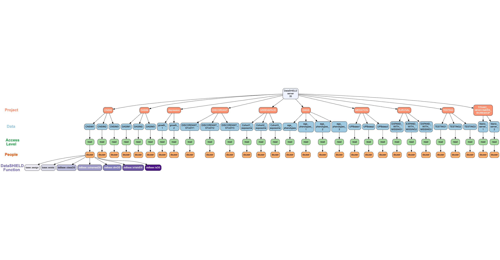

<!-- README.md is generated from README.Rmd. Please edit that file -->

# dsROCrate: ‘DataSHIELD’ RO-Crate Wrapper Functions 

<!-- badges: start -->

[](https://lifecycle.r-lib.org/articles/stages.html#experimental)
[](https://CRAN.R-project.org/package=dsROCrate)
[](https://app.codecov.io/gh/DataSHIELD-5S/dsROCrate)
<!-- badges: end -->

The goal of dsROCrate is to provide functions to wrap elements from a
‘DataSHIELD’ analysis into an RO-Crate.

## 1. Installation

You can install the development version of dsROCrate from
[GitHub](https://github.com/DataSHIELD-5S/dsROCrate) with:

``` r
# install.packages("pak")
pak::pak("DataSHIELD-5S/dsROCrate")
```

## 2. Creating your first RO-Crate

In this example, we will be using OBiBa’s
[Opal](https://opaldoc.obiba.org/en/latest/index.html) as the *back-end*
for DataSHIELD. Another option would be MOLGENIS’
[Armadillo](https://github.com/molgenis/molgenis-service-armadillo/).

### 2.1. Connect to an Opal Server

#### Setup

For instructions on how to set up a local server for DataSHIELD, see the
following vignette:

``` r
vignette("deploy-local-datashield-server-with-opal")
```

Here we will use OBiBa’s Opal demo server:
<https://opal-demo.obiba.org/> which can be accessed with the following
login credentials:

``` r
# define global variables
## Opal server access
USERNAME <- "administrator"
USERPASS <- "password"
SERVER <- "https://opal-demo.obiba.org"
## Credentials for `dsuser`
### NOTE: this is only used to simulate an analysis and generate logs
DSUSERPASS <- "P@ssw0rd"
```

Next, define global variables used in generating the RO-Crate, such as
project name, table references (within the project) and user
identifiers.

``` r
## Five safes variables
PEOPLE <- "dsuser"
PROJECT <- "CNSIM"
TABLES <- c("CNSIM1")
```

#### Open connection

Once the credentials and Five Safes variables are configured,we can
start a new session on the opal server with the following command:

``` r
# login to local server with `USERNAME` and `USERPASS`.
o <- opalr::opal.login(
  username = USERNAME,
  password = USERPASS,
  url = SERVER
)

print(o)
#> url: https://opal-demo.obiba.org 
#> name: opal-demo.obiba.org 
#> version: 5.5.1 
#> username: administrator
```

### 2.2. Create a basic RO-Crate

To create a basic RO-Crate, we will use the
[`{rocrateR}`](https://github.com/ResearchObject/ro-crate-r) package.
This package can be installed with the following command:

``` r
# install.packages("pak")
pak::pak("rocrateR")
```

Then, a basic RO-Crate can be created with the following command:

``` r
basic_rocrate <- rocrateR::rocrate_5s()
```

Note that this RO-Crate uses the
[5s-crate](https://trefx.uk/5s-crate/0.4/) profile.

``` r
print(basic_rocrate)
#> {
#>   "@context": "https://w3id.org/ro/crate/1.2/context",
#>   "@graph": [
#>     {
#>       "@id": "ro-crate-metadata.json",
#>       "@type": "CreativeWork",
#>       "about": {
#>         "@id": "./"
#>       },
#>       "conformsTo": {
#>         "@id": "https://w3id.org/ro/crate/1.2"
#>       }
#>     },
#>     {
#>       "@id": "./",
#>       "@type": "Dataset",
#>       "name": "",
#>       "description": "",
#>       "datePublished": "2026-01-30",
#>       "license": {
#>         "@id": "http://spdx.org/licenses/CC-BY-4.0"
#>       },
#>       "conformsTo": {
#>         "@id": "https://w3id.org/5s-crate/0.4"
#>       }
#>     },
#>     {
#>       "@id": "https://w3id.org/5s-crate/0.4",
#>       "@type": ["CreativeWork", "Profile"],
#>       "name": "Five Safes RO-Crate profile"
#>     }
#>   ]
#> }
```

### 2.3. Add the *Five Safes* Elements

#### Safe Data

To add details for Safe Data, use the function `dsROCrate::safe_data()`.

``` r
basic_rocrate <- o |>
  dsROCrate::safe_data(rocrate = basic_rocrate,
                       project = PROJECT,
                       tables = TABLES)

print(basic_rocrate) # note that the output will be truncated
...
#>     {
#>       "@id": "#dataset:67adf2d8e106aca9b11de773758bd241",
#>       "@type": "Dataset",
#>       "name": "CNSIM1",
#>       "dateCreated": "2026-01-30T06:29:53.247Z",
#>       "dateModified": "2026-01-30T06:29:54.379Z",
#>       "path": "/datasource/CNSIM/table/CNSIM1"
#>     }
#>   ]
#> }
```

#### Safe Project

To add details for Safe Project, use the function
`dsROCrate::safe_project()`.

``` r
basic_rocrate <- o |>
  dsROCrate::safe_project(rocrate = basic_rocrate,
                          project = PROJECT)

print(basic_rocrate) # note that the output will be truncated
...
#>     {
#>       "@id": "#project:7ba189863f9f641196596cb28e04aa14",
#>       "@type": "Project",
#>       "name": "CNSIM",
#>       "dateCreated": "2026-01-30T06:29:51.947Z",
#>       "dateModified": "2026-01-30T06:29:56.714Z",
#>       "hasPart": [
#>         {
#>           "@id": "#dataset:67adf2d8e106aca9b11de773758bd241"
#>         }
#>       ]
#>     }
#>   ]
#> }
```

#### Safe People

To add details for Safe People, use the function
`dsROCrate::safe_people()`.

``` r
basic_rocrate <- o |>
  dsROCrate::safe_people(rocrate = basic_rocrate, user = PEOPLE)

print(basic_rocrate) # note that the output will be truncated
...
#>     {
#>       "@id": "#person:a0af2a94926db1b49ad7a812eef509d2",
#>       "@type": "Person",
#>       "name": "dsuser",
#>       "memberOf": [
#>         {
#>           "@id": "#project:7ba189863f9f641196596cb28e04aa14"
#>         }
#>       ]
#>     }
#>   ]
#> }
```

#### Safe Setting

To add details for Safe Setting, use the function
`dsROCrate::safe_setting()`.

**⚠️NOTE:** The `dsROCrate::safe_setting` function requires
administrator privileges, so here, we will have to log in with
administrator credentials (if you used a non-administrator account
previously).

``` r
# close previous connection
opalr::opal.logout(o)

# open new connection as administrator
o <- opalr::opal.login(
  username = "administrator",
  password = "password",
  url = SERVER
)
```

Then, we can proceed as per usual:

``` r
basic_rocrate <- o |>
  dsROCrate::safe_setting(rocrate = basic_rocrate)

print(basic_rocrate) # note that the output will be truncated
...
#>     {
#>       "@id": "_:localid:datashield.privacyLevel:5",
#>       "@type": "PropertyValue",
#>       "name": "datashield.privacyLevel",
#>       "value": "5"
#>     },
#>     {
#>       "@id": "_:localid:default.datashield.privacyControlLevel:banana",
#>       "@type": "PropertyValue",
#>       "name": "default.datashield.privacyControlLevel",
#>       "value": "banana"
#>     },
#>     {
#>       "@id": "_:localid:default.nfilter.glm:0.33",
#>       "@type": "PropertyValue",
#>       "name": "default.nfilter.glm",
#>       "value": "0.33"
#>     },
#>     {
#>       "@id": "_:localid:default.nfilter.kNN:3",
#>       "@type": "PropertyValue",
#>       "name": "default.nfilter.kNN",
#>       "value": "3"
#>     },
#>     {
#>       "@id": "_:localid:default.nfilter.levels.density:0.33",
#>       "@type": "PropertyValue",
#>       "name": "default.nfilter.levels.density",
#>       "value": "0.33"
#>     },
#>     {
#>       "@id": "_:localid:default.nfilter.levels.max:40",
#>       "@type": "PropertyValue",
#>       "name": "default.nfilter.levels.max",
#>       "value": "40"
#>     },
#>     {
#>       "@id": "_:localid:default.nfilter.noise:0.25",
#>       "@type": "PropertyValue",
#>       "name": "default.nfilter.noise",
#>       "value": "0.25"
#>     },
#>     {
#>       "@id": "_:localid:default.nfilter.string:80",
#>       "@type": "PropertyValue",
#>       "name": "default.nfilter.string",
#>       "value": "80"
#>     },
#>     {
#>       "@id": "_:localid:default.nfilter.stringShort:20",
#>       "@type": "PropertyValue",
#>       "name": "default.nfilter.stringShort",
#>       "value": "20"
#>     },
#>     {
#>       "@id": "_:localid:default.nfilter.subset:3",
#>       "@type": "PropertyValue",
#>       "name": "default.nfilter.subset",
#>       "value": "3"
#>     },
#>     {
#>       "@id": "_:localid:default.nfilter.tab:3",
#>       "@type": "PropertyValue",
#>       "name": "default.nfilter.tab",
#>       "value": "3"
#>     },
#>     {
#>       "@id": "cb5ccdc930d110416079c6d5cbb81ed8",
#>       "@type": "SoftwareApplication",
#>       "name": "dsBase",
#>       "version": "6.3.4",
#>       "description": "Base 'DataSHIELD' functions for the server side. 'DataSHIELD' is a software package which allows\n    you to do non-disclosive federated analysis on sensitive data. 'DataSHIELD' analytic functions have\n    been designed to only share non disclosive summary statistics, with built in automated output\n    checking based on statistical disclosure control. With data sites setting the threshold values for\n    the automated output checks. For more details, see 'citation(\"dsBase\")'."
#>     },
#>     {
#>       "@id": "e2f7c43973c40d7a6a6731da5a0aa564",
#>       "@type": "SoftwareApplication",
#>       "name": "dsTidyverse",
#>       "version": "1.1.0",
#>       "description": "Implementation of selected 'Tidyverse' functions within 'DataSHIELD', an open-source federated analysis solution in R. Currently, DataSHIELD contains very limited tools for data manipulation, so the aim of this package is to improve the researcher experience by implementing essential functions for data manipulation, including subsetting, filtering, grouping, and renaming variables. This is the serverside package which should be installed on the server holding the data, and is used in conjuncture with the clientside package 'dsTidyverseClient' which is installed in the local R environment of the analyst. For more information, see <https://tidyverse.org/> and <https://datashield.org/>."
#>     },
#>     {
#>       "@id": "cb799d87d85ee53fa4b23de013c8c8ad",
#>       "@type": "SoftwareApplication",
#>       "name": "resourcer",
#>       "version": "1.4.0",
#>       "description": "A resource represents some data or a computation unit. It is \n    described by a URL and credentials. This package proposes a Resource model\n    with \"resolver\" and \"client\" classes to facilitate the access and the usage of the \n    resources."
#>     }
#>   ]
#> }
```

#### Safe Outputs

To add details for Safe Outputs, use the function
`dsROCrate::safe_output()`. Currently, only log files from the
operations executed by the user within a specific period. Set the period
using `logs_from` and `logs_to`. Additionally, a list of functions
executed by the user are extracted in a separate file/entity.

**⚠️NOTE:** Similar to `dsROCrate::safe_setting`, the
`dsROCrate::safe_output` function requires of administrator rights, so
here, we will have to log in with administrator credentials:

``` r
# close previous connection
opalr::opal.logout(o)

# open new connection as administrator
o <- opalr::opal.login(
  username = "administrator",
  password = "password",
  url = SERVER
)
```

------------------------------------------------------------------------

##### DataSHIELD operations

**⚠️NOTE:** Before extracting logs, ensure there is recent activity on
the server for testing purposes. This can be done using the following
commands:

###### Setup

You will need the following packages:

``` r
pak::pak("DSI")
pak::pak("DSOpal")
pak::pak("dsBaseClient")
```

###### Open connection

``` r
# run some test commands with dsBaseClient
## needed to defined the OpalDriver class in the current environment
DSOpal::Opal()
#> An object of class "OpalDriver"
#> <S4 Type Object>
## create new login object, note that here we use the `dsuser`
builder <- DSI::newDSLoginBuilder()
builder$append(server = "study1",
               url = SERVER,
               user = "dsuser",
               password = DSUSERPASS,
               driver = "OpalDriver")
logindata <- builder$build()
conns <- DSI::datashield.login(logins = logindata)
#> 
#> Logging into the collaborating servers
```

###### Simulate some operations

``` r
## assign data
DSI::datashield.assign.table(conns["study1"], 
                             symbol = "dsROCrate_test",
                             table = paste0(PROJECT, ".", TABLES[1]),
                             errors.print = TRUE)

dsBaseClient::ds.ls(datasources = conns["study1"])
#> $study1
#> $study1$environment.searched
#> [1] "R_GlobalEnv"
#> 
#> $study1$objects.found
#> [1] "dsROCrate_test"
dsBaseClient::ds.summary("dsROCrate_test")
#> $study1
#> $study1$class
#> [1] "data.frame"
#> 
#> $study1$`number of rows`
#> [1] 2163
#> 
#> $study1$`number of columns`
#> [1] 11
#> 
#> $study1$`variables held`
#>  [1] "LAB_TSC"            "LAB_TRIG"           "LAB_HDL"           
#>  [4] "LAB_GLUC_ADJUSTED"  "PM_BMI_CONTINUOUS"  "DIS_CVA"           
#>  [7] "MEDI_LPD"           "DIS_DIAB"           "DIS_AMI"           
#> [10] "GENDER"             "PM_BMI_CATEGORICAL"
```

------------------------------------------------------------------------

Then, we can proceed as per usual:

``` r
basic_rocrate <- o |>
  dsROCrate::safe_output(rocrate = basic_rocrate,
                         logs_from = Sys.time() - 60, # capture the last minute
                         logs_to = Sys.time())
#> opening file input connection.
#>  Found 96 records... Imported 96 records. Simplifying...
#> closing file input connection.
#> Warning: A `path` wasn't provided! The logs will be included in the RO-Crate
#> object, under the `content` tag!
```

``` r
print(basic_rocrate) # note that the output will be truncated
...
#>       "@type": "SoftwareApplication",
#>       "name": "resourcer",
#>       "version": "1.4.0",
#>       "description": "A resource represents some data or a computation unit. It is \n    described by a URL and credentials. This package proposes a Resource model\n    with \"resolver\" and \"client\" classes to facilitate the access and the usage of the \n    resources."
#>     },
#>     {
#>       "@id": "2026-01-30-dslogs-dsuser.log",
#>       "@type": "File",
#>       "dateModified": "2026-01-30 14:06:44",
#>       "name": "2026-01-30-dslogs-dsuser.log",
#>       "description": "This file contains the raw logs for the user: `dsuser` , between: 2026-01-30 14:05:44 and 2026-01-30 14:06:44",
#>       "encodingFormat": "text/plain",
#>       "content": [
#>         ["[INFO][2026-01-30T14:06:41][OPEN]      created a datashield session ab0bad83-ffec-49f5-9cd6-080614913fba", "[INFO][2026-01-30T14:06:42][ASSIGN]    created symbol 'dsROCrate_test' from: 'dsROCrate_test <- opal[CNSIM.CNSIM1]'", "[INFO][2026-01-30T14:06:42][PARSE]     parsed 'dsBase::lsDS(search.filter = NULL, 1L)'", "[INFO][2026-01-30T14:06:43][AGGREGATE] evaluated 'dsBase::lsDS(search.filter = NULL, 1L)'", "[INFO][2026-01-30T14:06:43][PARSE]     parsed 'base::exists(\"dsROCrate_test\")'", "[INFO][2026-01-30T14:06:43][AGGREGATE] evaluated 'base::exists(\"dsROCrate_test\")'", "[INFO][2026-01-30T14:06:43][PARSE]     parsed 'dsBase::classDS(\"dsROCrate_test\")'", "[INFO][2026-01-30T14:06:43][AGGREGATE] evaluated 'dsBase::classDS(\"dsROCrate_test\")'", "[INFO][2026-01-30T14:06:43][PARSE]     parsed 'dsBase::isValidDS(dsROCrate_test)'", "[INFO][2026-01-30T14:06:43][AGGREGATE] evaluated 'dsBase::isValidDS(dsROCrate_test)'", "[INFO][2026-01-30T14:06:43][PARSE]     parsed 'dsBase::dimDS(\"dsROCrate_test\")'", "[INFO][2026-01-30T14:06:43][AGGREGATE] evaluated 'dsBase::dimDS(\"dsROCrate_test\")'", "[INFO][2026-01-30T14:06:44][PARSE]     parsed 'dsBase::colnamesDS(\"dsROCrate_test\")'", "[INFO][2026-01-30T14:06:44][AGGREGATE] evaluated 'dsBase::colnamesDS(\"dsROCrate_test\")'"]
#>       ]
#>     },
#>     {
#>       "@id": "2026-01-30-dslogs-dsuser_mappings.csv",
#>       "@type": "File",
#>       "dateModified": "2026-01-30 14:06:44",
#>       "name": "2026-01-30-dslogs-dsuser_mappings.csv",
#>       "description": "This file contains mappings and evaluated functions",
#>       "encodingFormat": "text/csv",
#>       "content": [
#>         [
#>           {
#>             "timestamp": "2026-01-30T14:06:42",
#>             "ds_action": "ASSIGN",
#>             "username": "dsuser",
#>             "ds_eval": "dsROCrate_test <- opal[CNSIM.CNSIM1]",
#>             "ds_function": "base::assign",
#>             "ds_table": "CNSIM.CNSIM1"
#>           },
#>           {
#>             "timestamp": "2026-01-30T14:06:43",
#>             "ds_action": "AGGREGATE",
#>             "username": "dsuser",
#>             "ds_eval": "dsBase::lsDS(search.filter = NULL, 1L)",
#>             "ds_function": "dsBase::lsDS",
#>             "ds_symbol": "search.filter = NULL, 1L",
#>             "ds_table": "CNSIM.CNSIM1"
#>           },
#>           {
#>             "timestamp": "2026-01-30T14:06:43",
#>             "ds_action": "AGGREGATE",
#>             "username": "dsuser",
#>             "ds_eval": "base::exists(\"dsROCrate_test\")",
#>             "ds_function": "base::exists",
#>             "ds_symbol": "dsROCrate_test",
#>             "ds_table": "CNSIM.CNSIM1"
#>           },
#>           {
#>             "timestamp": "2026-01-30T14:06:43",
#>             "ds_action": "AGGREGATE",
#>             "username": "dsuser",
#>             "ds_eval": "dsBase::classDS(\"dsROCrate_test\")",
#>             "ds_function": "dsBase::classDS",
#>             "ds_symbol": "dsROCrate_test",
#>             "ds_table": "CNSIM.CNSIM1"
#>           },
#>           {
#>             "timestamp": "2026-01-30T14:06:43",
#>             "ds_action": "AGGREGATE",
#>             "username": "dsuser",
#>             "ds_eval": "dsBase::isValidDS(dsROCrate_test)",
#>             "ds_function": "dsBase::isValidDS",
#>             "ds_symbol": "dsROCrate_test",
#>             "ds_table": "CNSIM.CNSIM1"
#>           },
#>           {
#>             "timestamp": "2026-01-30T14:06:43",
#>             "ds_action": "AGGREGATE",
#>             "username": "dsuser",
#>             "ds_eval": "dsBase::dimDS(\"dsROCrate_test\")",
#>             "ds_function": "dsBase::dimDS",
#>             "ds_symbol": "dsROCrate_test",
#>             "ds_table": "CNSIM.CNSIM1"
#>           },
#>           {
#>             "timestamp": "2026-01-30T14:06:44",
#>             "ds_action": "AGGREGATE",
#>             "username": "dsuser",
#>             "ds_eval": "dsBase::colnamesDS(\"dsROCrate_test\")",
#>             "ds_function": "dsBase::colnamesDS",
#>             "ds_symbol": "dsROCrate_test",
#>             "ds_table": "CNSIM.CNSIM1"
#>           }
#>         ]
#>       ]
#>     }
#>   ]
#> }
```

### 2.4. Close connection

``` r
opalr::opal.logout(o)
```

### 2.5. Bag/Save RO-Crate

The resulting RO-Crate can be stored into an RO-Crate bag/archive with
the function `rocrateR::bag_rocrate`:

``` r
# create temp directory
dir.create("./rocrates", showWarnings = FALSE)
```

NOTE: In the above example, a `path` to store the logs wasn’t provided
when calling `dsROCrate::safe_output`, before creating an RO-Crate bag,
we should save the contents of this file first. In addition, the
contents for the entity with the list of functions executed:

``` r
logs_entity <- basic_rocrate |>
  rocrateR::get_entity(type = "File")
# write file using the path given by `@id`
## write raw logs
writeLines(
  logs_entity[[1]]$content[[1]], 
  file.path("./rocrates", logs_entity[[1]]$`@id`)
)
## write CSV with mappings and executed functions
write.csv(
  logs_entity[[2]]$content[[1]], 
  file.path("./rocrates", logs_entity[[2]]$`@id`),
  row.names = FALSE
)

# remove the section `content`
logs_entity[[1]]$content <- NULL
logs_entity[[2]]$content <- NULL
# update the RO-Crate
basic_rocrate <- basic_rocrate |>
  rocrateR::add_entity(logs_entity[[1]], overwrite = TRUE) |>
  rocrateR::add_entity(logs_entity[[2]], overwrite = TRUE)
```

``` r
# create RO-Crate bag
path_to_rocrate_bag <- basic_rocrate |>
  rocrateR::bag_rocrate(path = "./rocrates", overwrite = TRUE)
#> RO-Crate successfully 'bagged'!
#> For details, see: ./rocrates/rocrate-07586f335b80e1fceaf0335992675a26.zip
```

We can explore the contents with the following commands:

``` r
# extract files in temporary directory
path_to_rocrate_bag |>
  # extract contents inside ./rocrates/ROC
  rocrateR::unbag_rocrate(output = "./rocrates/ROC", quiet = TRUE) |>
  # create tree with the files
  fs::dir_tree()
#> ./rocrates/ROC/
#> ├── bagit.txt
#> ├── data
#> │   ├── 2026-01-30-dslogs-dsuser.log
#> │   ├── 2026-01-30-dslogs-dsuser_mappings.csv
#> │   └── ro-crate-metadata.json
#> ├── manifest-sha512.txt
#> └── tagmanifest-sha512.txt
```

### 2.6. Clean working directory

``` r
unlink("./rocrates", recursive = TRUE, force = TRUE)
```

<br />

## 3. Auditing RO-Crates and servers

### 3.1. Audit People

##### List accessible tables within a project for an user

``` r
safe_people_crate_v1 <- opalr::opal.login(
  username = USERNAME,
  password = USERPASS,
  url = SERVER
) |>
  dsROCrate::audit_safe_people(user = "dsuser", project = "CNSIM")
#> opening file input connection.
#>  Found 96 records... Imported 96 records. Simplifying...
#> closing file input connection.

print(safe_people_crate_v1)
#> {
#>   "@context": "https://w3id.org/ro/crate/1.2/context",
#>   "@graph": [
#>     {
#>       "@id": "ro-crate-metadata.json",
#>       "@type": "CreativeWork",
#>       "about": {
#>         "@id": "./"
#>       },
#>       "conformsTo": {
#>         "@id": "https://w3id.org/ro/crate/1.2"
#>       }
#>     },
#>     {
#>       "@id": "./",
#>       "@type": "Dataset",
#>       "name": "",
#>       "description": "",
#>       "datePublished": "2026-01-30",
#>       "license": {
#>         "@id": "http://spdx.org/licenses/CC-BY-4.0"
#>       },
#>       "conformsTo": {
#>         "@id": "https://w3id.org/5s-crate/0.4"
#>       },
#>       "hasPart": [
#>         {
#>           "@id": "2026-01-30-dslogs-dsuser.log"
#>         },
#>         {
#>           "@id": "2026-01-30-dslogs-dsuser_mappings.csv"
#>         }
#>       ]
#>     },
#>     {
#>       "@id": "https://w3id.org/5s-crate/0.4",
#>       "@type": ["CreativeWork", "Profile"],
#>       "name": "Five Safes RO-Crate profile"
#>     },
#>     {
#>       "@id": "#dataset:67adf2d8e106aca9b11de773758bd241",
#>       "@type": "Dataset",
#>       "name": "CNSIM1",
#>       "dateCreated": "2026-01-30T06:29:53.247Z",
#>       "dateModified": "2026-01-30T06:29:54.379Z",
#>       "path": "/datasource/CNSIM/table/CNSIM1"
#>     },
#>     {
#>       "@id": "#dataset:ffb1b1adcafc024743be1b0c252787c9",
#>       "@type": "Dataset",
#>       "name": "CNSIM2",
#>       "dateCreated": "2026-01-30T06:29:54.390Z",
#>       "dateModified": "2026-01-30T06:29:55.520Z",
#>       "path": "/datasource/CNSIM/table/CNSIM2"
#>     },
#>     {
#>       "@id": "#dataset:cc3061aef69ce457358815fb9d8c6492",
#>       "@type": "Dataset",
#>       "name": "CNSIM3",
#>       "dateCreated": "2026-01-30T06:29:55.532Z",
#>       "dateModified": "2026-01-30T06:29:56.714Z",
#>       "path": "/datasource/CNSIM/table/CNSIM3"
#>     },
#>     {
#>       "@id": "#project:7ba189863f9f641196596cb28e04aa14",
#>       "@type": "Project",
#>       "name": "CNSIM",
#>       "dateCreated": "2026-01-30T06:29:51.947Z",
#>       "dateModified": "2026-01-30T06:29:56.714Z",
#>       "hasPart": [
#>         {
#>           "@id": "#dataset:67adf2d8e106aca9b11de773758bd241"
#>         },
#>         {
#>           "@id": "#dataset:ffb1b1adcafc024743be1b0c252787c9"
#>         },
#>         {
#>           "@id": "#dataset:cc3061aef69ce457358815fb9d8c6492"
#>         }
#>       ]
#>     },
#>     {
#>       "@id": "#person:a0af2a94926db1b49ad7a812eef509d2",
#>       "@type": "Person",
#>       "name": "dsuser"
#>     },
#>     {
#>       "@id": "#perm:9bf7f75b6c5b07d02830b95652cd39a0-dict-summary-read",
#>       "@type": "ReadAction",
#>       "agent": {
#>         "@id": "#person:a0af2a94926db1b49ad7a812eef509d2"
#>       },
#>       "object": {
#>         "@id": "#dataset:67adf2d8e106aca9b11de773758bd241"
#>       },
#>       "actionStatus": "PotentialActionStatus",
#>       "description": "User may view table dictionary and summary statistics only; access to individual values is restricted."
#>     },
#>     {
#>       "@id": "#perm:363eb627d1e49c08933f2e26142e6d56-dict-summary-read",
#>       "@type": "ReadAction",
#>       "agent": {
#>         "@id": "#person:a0af2a94926db1b49ad7a812eef509d2"
#>       },
#>       "object": {
#>         "@id": "#dataset:ffb1b1adcafc024743be1b0c252787c9"
#>       },
#>       "actionStatus": "PotentialActionStatus",
#>       "description": "User may view table dictionary and summary statistics only; access to individual values is restricted."
#>     },
#>     {
#>       "@id": "#perm:63b8097908f682bff1760e48d28c5855-dict-summary-read",
#>       "@type": "ReadAction",
#>       "agent": {
#>         "@id": "#person:a0af2a94926db1b49ad7a812eef509d2"
#>       },
#>       "object": {
#>         "@id": "#dataset:cc3061aef69ce457358815fb9d8c6492"
#>       },
#>       "actionStatus": "PotentialActionStatus",
#>       "description": "User may view table dictionary and summary statistics only; access to individual values is restricted."
#>     },
#>     {
#>       "@id": "_:localid:datashield.privacyLevel:5",
#>       "@type": "PropertyValue",
#>       "name": "datashield.privacyLevel",
#>       "value": "5"
#>     },
#>     {
#>       "@id": "_:localid:default.datashield.privacyControlLevel:banana",
#>       "@type": "PropertyValue",
#>       "name": "default.datashield.privacyControlLevel",
#>       "value": "banana"
#>     },
#>     {
#>       "@id": "_:localid:default.nfilter.glm:0.33",
#>       "@type": "PropertyValue",
#>       "name": "default.nfilter.glm",
#>       "value": "0.33"
#>     },
#>     {
#>       "@id": "_:localid:default.nfilter.kNN:3",
#>       "@type": "PropertyValue",
#>       "name": "default.nfilter.kNN",
#>       "value": "3"
#>     },
#>     {
#>       "@id": "_:localid:default.nfilter.levels.density:0.33",
#>       "@type": "PropertyValue",
#>       "name": "default.nfilter.levels.density",
#>       "value": "0.33"
#>     },
#>     {
#>       "@id": "_:localid:default.nfilter.levels.max:40",
#>       "@type": "PropertyValue",
#>       "name": "default.nfilter.levels.max",
#>       "value": "40"
#>     },
#>     {
#>       "@id": "_:localid:default.nfilter.noise:0.25",
#>       "@type": "PropertyValue",
#>       "name": "default.nfilter.noise",
#>       "value": "0.25"
#>     },
#>     {
#>       "@id": "_:localid:default.nfilter.string:80",
#>       "@type": "PropertyValue",
#>       "name": "default.nfilter.string",
#>       "value": "80"
#>     },
#>     {
#>       "@id": "_:localid:default.nfilter.stringShort:20",
#>       "@type": "PropertyValue",
#>       "name": "default.nfilter.stringShort",
#>       "value": "20"
#>     },
#>     {
#>       "@id": "_:localid:default.nfilter.subset:3",
#>       "@type": "PropertyValue",
#>       "name": "default.nfilter.subset",
#>       "value": "3"
#>     },
#>     {
#>       "@id": "_:localid:default.nfilter.tab:3",
#>       "@type": "PropertyValue",
#>       "name": "default.nfilter.tab",
#>       "value": "3"
#>     },
#>     {
#>       "@id": "cb5ccdc930d110416079c6d5cbb81ed8",
#>       "@type": "SoftwareApplication",
#>       "name": "dsBase",
#>       "version": "6.3.4",
#>       "description": "Base 'DataSHIELD' functions for the server side. 'DataSHIELD' is a software package which allows\n    you to do non-disclosive federated analysis on sensitive data. 'DataSHIELD' analytic functions have\n    been designed to only share non disclosive summary statistics, with built in automated output\n    checking based on statistical disclosure control. With data sites setting the threshold values for\n    the automated output checks. For more details, see 'citation(\"dsBase\")'."
#>     },
#>     {
#>       "@id": "e2f7c43973c40d7a6a6731da5a0aa564",
#>       "@type": "SoftwareApplication",
#>       "name": "dsTidyverse",
#>       "version": "1.1.0",
#>       "description": "Implementation of selected 'Tidyverse' functions within 'DataSHIELD', an open-source federated analysis solution in R. Currently, DataSHIELD contains very limited tools for data manipulation, so the aim of this package is to improve the researcher experience by implementing essential functions for data manipulation, including subsetting, filtering, grouping, and renaming variables. This is the serverside package which should be installed on the server holding the data, and is used in conjuncture with the clientside package 'dsTidyverseClient' which is installed in the local R environment of the analyst. For more information, see <https://tidyverse.org/> and <https://datashield.org/>."
#>     },
#>     {
#>       "@id": "cb799d87d85ee53fa4b23de013c8c8ad",
#>       "@type": "SoftwareApplication",
#>       "name": "resourcer",
#>       "version": "1.4.0",
#>       "description": "A resource represents some data or a computation unit. It is \n    described by a URL and credentials. This package proposes a Resource model\n    with \"resolver\" and \"client\" classes to facilitate the access and the usage of the \n    resources."
#>     },
#>     {
#>       "@id": "2026-01-30-dslogs-dsuser.log",
#>       "@type": "File",
#>       "dateModified": "2026-01-30 14:06:45",
#>       "name": "2026-01-30-dslogs-dsuser.log",
#>       "description": "This file contains the raw logs for the user: `dsuser` , between: ALL and ALL",
#>       "encodingFormat": "text/plain",
#>       "content": [
#>         ["[INFO][2026-01-30T09:06:26][OPEN]      created a datashield session be02c12d-0f75-4bcd-975b-4e1474dab08f", "[INFO][2026-01-30T09:06:28][ASSIGN]    created symbol 'dsROCrate_test' from: 'dsROCrate_test <- opal[CNSIM.CNSIM1]'", "[INFO][2026-01-30T09:06:28][PARSE]     parsed 'dsBase::lsDS(search.filter = NULL, 1L)'", "[INFO][2026-01-30T09:06:29][AGGREGATE] evaluated 'dsBase::lsDS(search.filter = NULL, 1L)'", "[INFO][2026-01-30T09:12:26][OPEN]      created a datashield session 23125cb2-f01d-45d7-8fae-a6672896ff2d", "[INFO][2026-01-30T09:12:27][ASSIGN]    created symbol 'dsROCrate_test' from: 'dsROCrate_test <- opal[CNSIM.CNSIM1]'", "[INFO][2026-01-30T09:12:27][PARSE]     parsed 'dsBase::lsDS(search.filter = NULL, 1L)'", "[INFO][2026-01-30T09:12:28][AGGREGATE] evaluated 'dsBase::lsDS(search.filter = NULL, 1L)'", "[INFO][2026-01-30T09:13:43][OPEN]      created a datashield session b3984563-3c30-4766-a068-365c28f78abf", "[INFO][2026-01-30T09:13:44][ASSIGN]    created symbol 'dsROCrate_test' from: 'dsROCrate_test <- opal[CNSIM.CNSIM1]'", "[INFO][2026-01-30T09:13:44][PARSE]     parsed 'dsBase::lsDS(search.filter = NULL, 1L)'", "[INFO][2026-01-30T09:13:45][AGGREGATE] evaluated 'dsBase::lsDS(search.filter = NULL, 1L)'", "[INFO][2026-01-30T09:24:47][OPEN]      created a datashield session 76d53b7e-4e64-4998-a916-2861cb2462ae", "[INFO][2026-01-30T09:24:47][ASSIGN]    created symbol 'dsROCrate_test' from: 'dsROCrate_test <- opal[CNSIM.CNSIM1]'", "[INFO][2026-01-30T09:24:47][PARSE]     parsed 'dsBase::lsDS(search.filter = NULL, 1L)'", "[INFO][2026-01-30T09:24:48][AGGREGATE] evaluated 'dsBase::lsDS(search.filter = NULL, 1L)'", "[INFO][2026-01-30T09:28:27][OPEN]      created a datashield session 847a3265-12f7-44e4-8850-91de359adc7e", "[INFO][2026-01-30T09:28:27][ASSIGN]    created symbol 'dsROCrate_test' from: 'dsROCrate_test <- opal[CNSIM.CNSIM1]'", "[INFO][2026-01-30T09:28:28][PARSE]     parsed 'dsBase::lsDS(search.filter = NULL, 1L)'", "[INFO][2026-01-30T09:28:28][AGGREGATE] evaluated 'dsBase::lsDS(search.filter = NULL, 1L)'", "[INFO][2026-01-30T10:59:51][OPEN]      created a datashield session b9931dfe-1794-41be-8049-dc1bc4f4b483", "[INFO][2026-01-30T10:59:51][ASSIGN]    created symbol 'dsROCrate_test' from: 'dsROCrate_test <- opal[CNSIM.CNSIM1]'", "[INFO][2026-01-30T10:59:52][PARSE]     parsed 'dsBase::lsDS(search.filter = NULL, 1L)'", "[INFO][2026-01-30T10:59:53][AGGREGATE] evaluated 'dsBase::lsDS(search.filter = NULL, 1L)'", "[INFO][2026-01-30T13:55:33][OPEN]      created a datashield session db73c5b2-8880-48c8-9267-7faea755ad51", "[INFO][2026-01-30T13:55:34][ASSIGN]    created symbol 'dsROCrate_test' from: 'dsROCrate_test <- opal[CNSIM.CNSIM1]'", "[INFO][2026-01-30T13:55:34][PARSE]     parsed 'dsBase::lsDS(search.filter = NULL, 1L)'", "[INFO][2026-01-30T13:55:35][AGGREGATE] evaluated 'dsBase::lsDS(search.filter = NULL, 1L)'", "[INFO][2026-01-30T13:58:41][OPEN]      created a datashield session 440c4ed6-edd4-4c55-922e-0c95578d26dc", "[INFO][2026-01-30T13:58:41][ASSIGN]    created symbol 'dsROCrate_test' from: 'dsROCrate_test <- opal[CNSIM.CNSIM1]'", "[INFO][2026-01-30T13:58:42][PARSE]     parsed 'dsBase::lsDS(search.filter = NULL, 1L)'", "[INFO][2026-01-30T13:58:42][AGGREGATE] evaluated 'dsBase::lsDS(search.filter = NULL, 1L)'", "[INFO][2026-01-30T14:03:55][OPEN]      created a datashield session 9ac379b6-2f8e-4ba4-b1dd-be2daf9112b7", "[INFO][2026-01-30T14:03:55][ASSIGN]    created symbol 'dsROCrate_test' from: 'dsROCrate_test <- opal[CNSIM.CNSIM1]'", "[INFO][2026-01-30T14:03:56][PARSE]     parsed 'dsBase::lsDS(search.filter = NULL, 1L)'", "[INFO][2026-01-30T14:03:56][AGGREGATE] evaluated 'dsBase::lsDS(search.filter = NULL, 1L)'", "[INFO][2026-01-30T14:03:57][PARSE]     parsed 'base::exists(\"dsROCrate_test\")'", "[INFO][2026-01-30T14:03:57][AGGREGATE] evaluated 'base::exists(\"dsROCrate_test\")'", "[INFO][2026-01-30T14:03:57][PARSE]     parsed 'dsBase::classDS(\"dsROCrate_test\")'", "[INFO][2026-01-30T14:03:57][AGGREGATE] evaluated 'dsBase::classDS(\"dsROCrate_test\")'", "[INFO][2026-01-30T14:03:57][PARSE]     parsed 'dsBase::isValidDS(dsROCrate_test)'", "[INFO][2026-01-30T14:03:57][AGGREGATE] evaluated 'dsBase::isValidDS(dsROCrate_test)'", "[INFO][2026-01-30T14:03:57][PARSE]     parsed 'dsBase::dimDS(\"dsROCrate_test\")'", "[INFO][2026-01-30T14:03:57][AGGREGATE] evaluated 'dsBase::dimDS(\"dsROCrate_test\")'", "[INFO][2026-01-30T14:03:57][PARSE]     parsed 'dsBase::colnamesDS(\"dsROCrate_test\")'", "[INFO][2026-01-30T14:03:57][AGGREGATE] evaluated 'dsBase::colnamesDS(\"dsROCrate_test\")'", "[INFO][2026-01-30T14:06:41][OPEN]      created a datashield session ab0bad83-ffec-49f5-9cd6-080614913fba", "[INFO][2026-01-30T14:06:42][ASSIGN]    created symbol 'dsROCrate_test' from: 'dsROCrate_test <- opal[CNSIM.CNSIM1]'", "[INFO][2026-01-30T14:06:42][PARSE]     parsed 'dsBase::lsDS(search.filter = NULL, 1L)'", "[INFO][2026-01-30T14:06:43][AGGREGATE] evaluated 'dsBase::lsDS(search.filter = NULL, 1L)'", "[INFO][2026-01-30T14:06:43][PARSE]     parsed 'base::exists(\"dsROCrate_test\")'", "[INFO][2026-01-30T14:06:43][AGGREGATE] evaluated 'base::exists(\"dsROCrate_test\")'", "[INFO][2026-01-30T14:06:43][PARSE]     parsed 'dsBase::classDS(\"dsROCrate_test\")'", "[INFO][2026-01-30T14:06:43][AGGREGATE] evaluated 'dsBase::classDS(\"dsROCrate_test\")'", "[INFO][2026-01-30T14:06:43][PARSE]     parsed 'dsBase::isValidDS(dsROCrate_test)'", "[INFO][2026-01-30T14:06:43][AGGREGATE] evaluated 'dsBase::isValidDS(dsROCrate_test)'", "[INFO][2026-01-30T14:06:43][PARSE]     parsed 'dsBase::dimDS(\"dsROCrate_test\")'", "[INFO][2026-01-30T14:06:43][AGGREGATE] evaluated 'dsBase::dimDS(\"dsROCrate_test\")'", "[INFO][2026-01-30T14:06:44][PARSE]     parsed 'dsBase::colnamesDS(\"dsROCrate_test\")'", "[INFO][2026-01-30T14:06:44][AGGREGATE] evaluated 'dsBase::colnamesDS(\"dsROCrate_test\")'"]
#>       ]
#>     },
#>     {
#>       "@id": "2026-01-30-dslogs-dsuser_mappings.csv",
#>       "@type": "File",
#>       "dateModified": "2026-01-30 14:06:45",
#>       "name": "2026-01-30-dslogs-dsuser_mappings.csv",
#>       "description": "This file contains mappings and evaluated functions",
#>       "encodingFormat": "text/csv",
#>       "content": [
#>         [
#>           {
#>             "timestamp": "2026-01-30T09:06:28",
#>             "ds_action": "ASSIGN",
#>             "username": "dsuser",
#>             "ds_eval": "dsROCrate_test <- opal[CNSIM.CNSIM1]",
#>             "ds_function": "base::assign",
#>             "ds_table": "CNSIM.CNSIM1"
#>           },
#>           {
#>             "timestamp": "2026-01-30T09:06:29",
#>             "ds_action": "AGGREGATE",
#>             "username": "dsuser",
#>             "ds_eval": "dsBase::lsDS(search.filter = NULL, 1L)",
#>             "ds_function": "dsBase::lsDS",
#>             "ds_symbol": "search.filter = NULL, 1L",
#>             "ds_table": "CNSIM.CNSIM1"
#>           },
#>           {
#>             "timestamp": "2026-01-30T09:12:27",
#>             "ds_action": "ASSIGN",
#>             "username": "dsuser",
#>             "ds_eval": "dsROCrate_test <- opal[CNSIM.CNSIM1]",
#>             "ds_function": "base::assign",
#>             "ds_table": "CNSIM.CNSIM1"
#>           },
#>           {
#>             "timestamp": "2026-01-30T09:12:28",
#>             "ds_action": "AGGREGATE",
#>             "username": "dsuser",
#>             "ds_eval": "dsBase::lsDS(search.filter = NULL, 1L)",
#>             "ds_function": "dsBase::lsDS",
#>             "ds_symbol": "search.filter = NULL, 1L",
#>             "ds_table": "CNSIM.CNSIM1"
#>           },
#>           {
#>             "timestamp": "2026-01-30T09:13:44",
#>             "ds_action": "ASSIGN",
#>             "username": "dsuser",
#>             "ds_eval": "dsROCrate_test <- opal[CNSIM.CNSIM1]",
#>             "ds_function": "base::assign",
#>             "ds_table": "CNSIM.CNSIM1"
#>           },
#>           {
#>             "timestamp": "2026-01-30T09:13:45",
#>             "ds_action": "AGGREGATE",
#>             "username": "dsuser",
#>             "ds_eval": "dsBase::lsDS(search.filter = NULL, 1L)",
#>             "ds_function": "dsBase::lsDS",
#>             "ds_symbol": "search.filter = NULL, 1L",
#>             "ds_table": "CNSIM.CNSIM1"
#>           },
#>           {
#>             "timestamp": "2026-01-30T09:24:47",
#>             "ds_action": "ASSIGN",
#>             "username": "dsuser",
#>             "ds_eval": "dsROCrate_test <- opal[CNSIM.CNSIM1]",
#>             "ds_function": "base::assign",
#>             "ds_table": "CNSIM.CNSIM1"
#>           },
#>           {
#>             "timestamp": "2026-01-30T09:24:48",
#>             "ds_action": "AGGREGATE",
#>             "username": "dsuser",
#>             "ds_eval": "dsBase::lsDS(search.filter = NULL, 1L)",
#>             "ds_function": "dsBase::lsDS",
#>             "ds_symbol": "search.filter = NULL, 1L",
#>             "ds_table": "CNSIM.CNSIM1"
#>           },
#>           {
#>             "timestamp": "2026-01-30T09:28:27",
#>             "ds_action": "ASSIGN",
#>             "username": "dsuser",
#>             "ds_eval": "dsROCrate_test <- opal[CNSIM.CNSIM1]",
#>             "ds_function": "base::assign",
#>             "ds_table": "CNSIM.CNSIM1"
#>           },
#>           {
#>             "timestamp": "2026-01-30T09:28:28",
#>             "ds_action": "AGGREGATE",
#>             "username": "dsuser",
#>             "ds_eval": "dsBase::lsDS(search.filter = NULL, 1L)",
#>             "ds_function": "dsBase::lsDS",
#>             "ds_symbol": "search.filter = NULL, 1L",
#>             "ds_table": "CNSIM.CNSIM1"
#>           },
#>           {
#>             "timestamp": "2026-01-30T10:59:51",
#>             "ds_action": "ASSIGN",
#>             "username": "dsuser",
#>             "ds_eval": "dsROCrate_test <- opal[CNSIM.CNSIM1]",
#>             "ds_function": "base::assign",
#>             "ds_table": "CNSIM.CNSIM1"
#>           },
#>           {
#>             "timestamp": "2026-01-30T10:59:53",
#>             "ds_action": "AGGREGATE",
#>             "username": "dsuser",
#>             "ds_eval": "dsBase::lsDS(search.filter = NULL, 1L)",
#>             "ds_function": "dsBase::lsDS",
#>             "ds_symbol": "search.filter = NULL, 1L",
#>             "ds_table": "CNSIM.CNSIM1"
#>           },
#>           {
#>             "timestamp": "2026-01-30T13:55:34",
#>             "ds_action": "ASSIGN",
#>             "username": "dsuser",
#>             "ds_eval": "dsROCrate_test <- opal[CNSIM.CNSIM1]",
#>             "ds_function": "base::assign",
#>             "ds_table": "CNSIM.CNSIM1"
#>           },
#>           {
#>             "timestamp": "2026-01-30T13:55:35",
#>             "ds_action": "AGGREGATE",
#>             "username": "dsuser",
#>             "ds_eval": "dsBase::lsDS(search.filter = NULL, 1L)",
#>             "ds_function": "dsBase::lsDS",
#>             "ds_symbol": "search.filter = NULL, 1L",
#>             "ds_table": "CNSIM.CNSIM1"
#>           },
#>           {
#>             "timestamp": "2026-01-30T13:58:41",
#>             "ds_action": "ASSIGN",
#>             "username": "dsuser",
#>             "ds_eval": "dsROCrate_test <- opal[CNSIM.CNSIM1]",
#>             "ds_function": "base::assign",
#>             "ds_table": "CNSIM.CNSIM1"
#>           },
#>           {
#>             "timestamp": "2026-01-30T13:58:42",
#>             "ds_action": "AGGREGATE",
#>             "username": "dsuser",
#>             "ds_eval": "dsBase::lsDS(search.filter = NULL, 1L)",
#>             "ds_function": "dsBase::lsDS",
#>             "ds_symbol": "search.filter = NULL, 1L",
#>             "ds_table": "CNSIM.CNSIM1"
#>           },
#>           {
#>             "timestamp": "2026-01-30T14:03:55",
#>             "ds_action": "ASSIGN",
#>             "username": "dsuser",
#>             "ds_eval": "dsROCrate_test <- opal[CNSIM.CNSIM1]",
#>             "ds_function": "base::assign",
#>             "ds_table": "CNSIM.CNSIM1"
#>           },
#>           {
#>             "timestamp": "2026-01-30T14:03:56",
#>             "ds_action": "AGGREGATE",
#>             "username": "dsuser",
#>             "ds_eval": "dsBase::lsDS(search.filter = NULL, 1L)",
#>             "ds_function": "dsBase::lsDS",
#>             "ds_symbol": "search.filter = NULL, 1L",
#>             "ds_table": "CNSIM.CNSIM1"
#>           },
#>           {
#>             "timestamp": "2026-01-30T14:03:57",
#>             "ds_action": "AGGREGATE",
#>             "username": "dsuser",
#>             "ds_eval": "base::exists(\"dsROCrate_test\")",
#>             "ds_function": "base::exists",
#>             "ds_symbol": "dsROCrate_test",
#>             "ds_table": "CNSIM.CNSIM1"
#>           },
#>           {
#>             "timestamp": "2026-01-30T14:03:57",
#>             "ds_action": "AGGREGATE",
#>             "username": "dsuser",
#>             "ds_eval": "dsBase::classDS(\"dsROCrate_test\")",
#>             "ds_function": "dsBase::classDS",
#>             "ds_symbol": "dsROCrate_test",
#>             "ds_table": "CNSIM.CNSIM1"
#>           },
#>           {
#>             "timestamp": "2026-01-30T14:03:57",
#>             "ds_action": "AGGREGATE",
#>             "username": "dsuser",
#>             "ds_eval": "dsBase::isValidDS(dsROCrate_test)",
#>             "ds_function": "dsBase::isValidDS",
#>             "ds_symbol": "dsROCrate_test",
#>             "ds_table": "CNSIM.CNSIM1"
#>           },
#>           {
#>             "timestamp": "2026-01-30T14:03:57",
#>             "ds_action": "AGGREGATE",
#>             "username": "dsuser",
#>             "ds_eval": "dsBase::dimDS(\"dsROCrate_test\")",
#>             "ds_function": "dsBase::dimDS",
#>             "ds_symbol": "dsROCrate_test",
#>             "ds_table": "CNSIM.CNSIM1"
#>           },
#>           {
#>             "timestamp": "2026-01-30T14:03:57",
#>             "ds_action": "AGGREGATE",
#>             "username": "dsuser",
#>             "ds_eval": "dsBase::colnamesDS(\"dsROCrate_test\")",
#>             "ds_function": "dsBase::colnamesDS",
#>             "ds_symbol": "dsROCrate_test",
#>             "ds_table": "CNSIM.CNSIM1"
#>           },
#>           {
#>             "timestamp": "2026-01-30T14:06:42",
#>             "ds_action": "ASSIGN",
#>             "username": "dsuser",
#>             "ds_eval": "dsROCrate_test <- opal[CNSIM.CNSIM1]",
#>             "ds_function": "base::assign",
#>             "ds_table": "CNSIM.CNSIM1"
#>           },
#>           {
#>             "timestamp": "2026-01-30T14:06:43",
#>             "ds_action": "AGGREGATE",
#>             "username": "dsuser",
#>             "ds_eval": "dsBase::lsDS(search.filter = NULL, 1L)",
#>             "ds_function": "dsBase::lsDS",
#>             "ds_symbol": "search.filter = NULL, 1L",
#>             "ds_table": "CNSIM.CNSIM1"
#>           },
#>           {
#>             "timestamp": "2026-01-30T14:06:43",
#>             "ds_action": "AGGREGATE",
#>             "username": "dsuser",
#>             "ds_eval": "base::exists(\"dsROCrate_test\")",
#>             "ds_function": "base::exists",
#>             "ds_symbol": "dsROCrate_test",
#>             "ds_table": "CNSIM.CNSIM1"
#>           },
#>           {
#>             "timestamp": "2026-01-30T14:06:43",
#>             "ds_action": "AGGREGATE",
#>             "username": "dsuser",
#>             "ds_eval": "dsBase::classDS(\"dsROCrate_test\")",
#>             "ds_function": "dsBase::classDS",
#>             "ds_symbol": "dsROCrate_test",
#>             "ds_table": "CNSIM.CNSIM1"
#>           },
#>           {
#>             "timestamp": "2026-01-30T14:06:43",
#>             "ds_action": "AGGREGATE",
#>             "username": "dsuser",
#>             "ds_eval": "dsBase::isValidDS(dsROCrate_test)",
#>             "ds_function": "dsBase::isValidDS",
#>             "ds_symbol": "dsROCrate_test",
#>             "ds_table": "CNSIM.CNSIM1"
#>           },
#>           {
#>             "timestamp": "2026-01-30T14:06:43",
#>             "ds_action": "AGGREGATE",
#>             "username": "dsuser",
#>             "ds_eval": "dsBase::dimDS(\"dsROCrate_test\")",
#>             "ds_function": "dsBase::dimDS",
#>             "ds_symbol": "dsROCrate_test",
#>             "ds_table": "CNSIM.CNSIM1"
#>           },
#>           {
#>             "timestamp": "2026-01-30T14:06:44",
#>             "ds_action": "AGGREGATE",
#>             "username": "dsuser",
#>             "ds_eval": "dsBase::colnamesDS(\"dsROCrate_test\")",
#>             "ds_function": "dsBase::colnamesDS",
#>             "ds_symbol": "dsROCrate_test",
#>             "ds_table": "CNSIM.CNSIM1"
#>           }
#>         ]
#>       ]
#>     }
#>   ]
#> }
```

###### Markdown report

A markdown report can be created with an overview and details for an
RO-Crate, using the `dsROCrate::rocrate_report`:

**Only generate .Rmd file**

``` r
safe_people_crate_v1_rmd <- tempfile(fileext = ".Rmd") # temporary file

safe_people_crate_contents <- safe_people_crate_v1 |>
  dsROCrate::rocrate_report(filepath = safe_people_crate_v1_rmd, render = FALSE)
#> 1 'Author' entity was found!
#> 3 'Dataset' entities were found!
#> Warning: No entities were found with @type = 'WriteAction'!
#> Warning: No entities were found with @type = 'ControlAction'!
#> 1 'Project' entity was found!
#> 14 'PropertyValue' OR 'SoftwareApplication' entities were found!
#> 2 'File' entities were found!

# display Overview diagram
safe_people_crate_contents$overview_diagram
```


``` r

# display Overview data (Safe People, Safe Projects and Safe Data)
safe_people_crate_contents$overview_data |>
  knitr::kable()
```

| Project | Data   | Access Level | People | DataSHIELD Function | Timestamp           |
|:--------|:-------|:-------------|:-------|:--------------------|:--------------------|
| CNSIM   | CNSIM1 | read         | dsuser | base::assign        | 2026-01-30T09:06:28 |
| CNSIM   | CNSIM1 | read         | dsuser | dsBase::lsDS        | 2026-01-30T09:06:29 |
| CNSIM   | CNSIM1 | read         | dsuser | base::assign        | 2026-01-30T09:12:27 |
| CNSIM   | CNSIM1 | read         | dsuser | dsBase::lsDS        | 2026-01-30T09:12:28 |
| CNSIM   | CNSIM1 | read         | dsuser | base::assign        | 2026-01-30T09:13:44 |
| CNSIM   | CNSIM1 | read         | dsuser | dsBase::lsDS        | 2026-01-30T09:13:45 |
| CNSIM   | CNSIM1 | read         | dsuser | base::assign        | 2026-01-30T09:24:47 |
| CNSIM   | CNSIM1 | read         | dsuser | dsBase::lsDS        | 2026-01-30T09:24:48 |
| CNSIM   | CNSIM1 | read         | dsuser | base::assign        | 2026-01-30T09:28:27 |
| CNSIM   | CNSIM1 | read         | dsuser | dsBase::lsDS        | 2026-01-30T09:28:28 |
| CNSIM   | CNSIM1 | read         | dsuser | base::assign        | 2026-01-30T10:59:51 |
| CNSIM   | CNSIM1 | read         | dsuser | dsBase::lsDS        | 2026-01-30T10:59:53 |
| CNSIM   | CNSIM1 | read         | dsuser | base::assign        | 2026-01-30T13:55:34 |
| CNSIM   | CNSIM1 | read         | dsuser | dsBase::lsDS        | 2026-01-30T13:55:35 |
| CNSIM   | CNSIM1 | read         | dsuser | base::assign        | 2026-01-30T13:58:41 |
| CNSIM   | CNSIM1 | read         | dsuser | dsBase::lsDS        | 2026-01-30T13:58:42 |
| CNSIM   | CNSIM1 | read         | dsuser | base::assign        | 2026-01-30T14:03:55 |
| CNSIM   | CNSIM1 | read         | dsuser | dsBase::lsDS        | 2026-01-30T14:03:56 |
| CNSIM   | CNSIM1 | read         | dsuser | base::exists        | 2026-01-30T14:03:57 |
| CNSIM   | CNSIM1 | read         | dsuser | dsBase::classDS     | 2026-01-30T14:03:57 |
| CNSIM   | CNSIM1 | read         | dsuser | dsBase::isValidDS   | 2026-01-30T14:03:57 |
| CNSIM   | CNSIM1 | read         | dsuser | dsBase::dimDS       | 2026-01-30T14:03:57 |
| CNSIM   | CNSIM1 | read         | dsuser | dsBase::colnamesDS  | 2026-01-30T14:03:57 |
| CNSIM   | CNSIM1 | read         | dsuser | base::assign        | 2026-01-30T14:06:42 |
| CNSIM   | CNSIM1 | read         | dsuser | dsBase::lsDS        | 2026-01-30T14:06:43 |
| CNSIM   | CNSIM1 | read         | dsuser | base::exists        | 2026-01-30T14:06:43 |
| CNSIM   | CNSIM1 | read         | dsuser | dsBase::classDS     | 2026-01-30T14:06:43 |
| CNSIM   | CNSIM1 | read         | dsuser | dsBase::isValidDS   | 2026-01-30T14:06:43 |
| CNSIM   | CNSIM1 | read         | dsuser | dsBase::dimDS       | 2026-01-30T14:06:43 |
| CNSIM   | CNSIM1 | read         | dsuser | dsBase::colnamesDS  | 2026-01-30T14:06:44 |
| CNSIM   | CNSIM2 | read         | dsuser |                     |                     |
| CNSIM   | CNSIM3 | read         | dsuser |                     |                     |

**Render and display report (HTML)**

``` r
safe_people_crate_v1 |>
  dsROCrate::rocrate_report(filepath = safe_people_crate_v1_rmd,
                            title = "DataSHIELD Safe People - Audit Report",
                            render = TRUE, 
                            overwrite = TRUE)
```

##### List all accessible projects & tables for an user

``` r
safe_people_crate_v2 <- opalr::opal.login(
  username = USERNAME,
  password = USERPASS,
  url = SERVER
) |>
  dsROCrate::audit_safe_people(user = "dsuser")
#> opening file input connection.
#>  Found 96 records... Imported 96 records. Simplifying...
#> closing file input connection.

safe_people_crate_v2_rmd <- tempfile(fileext = ".Rmd") # temporary file

safe_people_crate_contents_v2 <- safe_people_crate_v2 |>
  dsROCrate::rocrate_report(filepath = safe_people_crate_v2_rmd, render = FALSE)
#> 1 'Author' entity was found!
#> 29 'Dataset' entities were found!
#> 10 'Project' entities were found!
#> 14 'PropertyValue' OR 'SoftwareApplication' entities were found!
#> 2 'File' entities were found!

# display Overview diagram
safe_people_crate_contents_v2$overview_diagram
```



``` r

# display Overview data (Safe People, Safe Projects and Safe Data)
safe_people_crate_contents_v2$overview_data |>
  knitr::kable()
```

| Project | Data | Access Level | People | DataSHIELD Function | Timestamp |
|:---|:---|:---|:---|:---|:---|
| CNSIM | CNSIM1 | read | dsuser | base::assign | 2026-01-30T09:06:28 |
| CNSIM | CNSIM1 | read | dsuser | dsBase::lsDS | 2026-01-30T09:06:29 |
| CNSIM | CNSIM1 | read | dsuser | base::assign | 2026-01-30T09:12:27 |
| CNSIM | CNSIM1 | read | dsuser | dsBase::lsDS | 2026-01-30T09:12:28 |
| CNSIM | CNSIM1 | read | dsuser | base::assign | 2026-01-30T09:13:44 |
| CNSIM | CNSIM1 | read | dsuser | dsBase::lsDS | 2026-01-30T09:13:45 |
| CNSIM | CNSIM1 | read | dsuser | base::assign | 2026-01-30T09:24:47 |
| CNSIM | CNSIM1 | read | dsuser | dsBase::lsDS | 2026-01-30T09:24:48 |
| CNSIM | CNSIM1 | read | dsuser | base::assign | 2026-01-30T09:28:27 |
| CNSIM | CNSIM1 | read | dsuser | dsBase::lsDS | 2026-01-30T09:28:28 |
| CNSIM | CNSIM1 | read | dsuser | base::assign | 2026-01-30T10:59:51 |
| CNSIM | CNSIM1 | read | dsuser | dsBase::lsDS | 2026-01-30T10:59:53 |
| CNSIM | CNSIM1 | read | dsuser | base::assign | 2026-01-30T13:55:34 |
| CNSIM | CNSIM1 | read | dsuser | dsBase::lsDS | 2026-01-30T13:55:35 |
| CNSIM | CNSIM1 | read | dsuser | base::assign | 2026-01-30T13:58:41 |
| CNSIM | CNSIM1 | read | dsuser | dsBase::lsDS | 2026-01-30T13:58:42 |
| CNSIM | CNSIM1 | read | dsuser | base::assign | 2026-01-30T14:03:55 |
| CNSIM | CNSIM1 | read | dsuser | dsBase::lsDS | 2026-01-30T14:03:56 |
| CNSIM | CNSIM1 | read | dsuser | base::exists | 2026-01-30T14:03:57 |
| CNSIM | CNSIM1 | read | dsuser | dsBase::classDS | 2026-01-30T14:03:57 |
| CNSIM | CNSIM1 | read | dsuser | dsBase::isValidDS | 2026-01-30T14:03:57 |
| CNSIM | CNSIM1 | read | dsuser | dsBase::dimDS | 2026-01-30T14:03:57 |
| CNSIM | CNSIM1 | read | dsuser | dsBase::colnamesDS | 2026-01-30T14:03:57 |
| CNSIM | CNSIM1 | read | dsuser | base::assign | 2026-01-30T14:06:42 |
| CNSIM | CNSIM1 | read | dsuser | dsBase::lsDS | 2026-01-30T14:06:43 |
| CNSIM | CNSIM1 | read | dsuser | base::exists | 2026-01-30T14:06:43 |
| CNSIM | CNSIM1 | read | dsuser | dsBase::classDS | 2026-01-30T14:06:43 |
| CNSIM | CNSIM1 | read | dsuser | dsBase::isValidDS | 2026-01-30T14:06:43 |
| CNSIM | CNSIM1 | read | dsuser | dsBase::dimDS | 2026-01-30T14:06:43 |
| CNSIM | CNSIM1 | read | dsuser | dsBase::colnamesDS | 2026-01-30T14:06:44 |
| CNSIM | CNSIM2 | read | dsuser |  |  |
| CNSIM | CNSIM3 | read | dsuser |  |  |
| DASIM | DASIM1 | read | dsuser |  |  |
| DASIM | DASIM2 | read | dsuser |  |  |
| DASIM | DASIM3 | read | dsuser |  |  |
| DISCORDANT | DISCORDANT_STUDY1 | read | dsuser |  |  |
| DISCORDANT | DISCORDANT_STUDY2 | read | dsuser |  |  |
| DISCORDANT | DISCORDANT_STUDY3 | read | dsuser |  |  |
| GREENSPACE | Cohort1_exposome | read | dsuser |  |  |
| GREENSPACE | Cohort2_exposome | read | dsuser |  |  |
| GREENSPACE | Cohort3_exposome | read | dsuser |  |  |
| GWAS | ega_phenotypes | read | dsuser |  |  |
| GWAS | ega_phenotypes_1 | read | dsuser |  |  |
| GWAS | ega_phenotypes_2 | read | dsuser |  |  |
| GWAS | ega_phenotypes_3 | read | dsuser |  |  |
| MEDIATION | UPBdata1 | read | dsuser |  |  |
| MEDIATION | UPBdata2 | read | dsuser |  |  |
| MEDIATION | UPBdata3 | read | dsuser |  |  |
| SURVIVAL | EXPAND_WITH_MISSING1 | read | dsuser |  |  |
| SURVIVAL | EXPAND_WITH_MISSING2 | read | dsuser |  |  |
| SURVIVAL | EXPAND_WITH_MISSING3 | read | dsuser |  |  |
| TESTING | TESTING1 | read | dsuser |  |  |
| TESTING | TESTING2 | read | dsuser |  |  |
| TESTING | TESTING3 | read | dsuser |  |  |
| TITANIC_NEWCOMERS_WORKSHOP | titanic_server_1 | read | dsuser |  |  |
| TITANIC_NEWCOMERS_WORKSHOP | titanic_server_2 | read | dsuser |  |  |
| depression | growth_1 | read | dsuser |  |  |
| depression | growth_2 | read | dsuser |  |  |

### 3.2. Audit Project

##### List users and dataset/table level permissions within a project

``` r
safe_project_crate_v1 <- opalr::opal.login(
  username = USERNAME,
  password = USERPASS,
  url = SERVER
) |>
  dsROCrate::audit_safe_project(project = "CNSIM")
#> opening file input connection.
#>  Found 96 records... Imported 96 records. Simplifying...
#> closing file input connection.

print(safe_project_crate_v1)
#> {
#>   "@context": "https://w3id.org/ro/crate/1.2/context",
#>   "@graph": [
#>     {
#>       "@id": "ro-crate-metadata.json",
#>       "@type": "CreativeWork",
#>       "about": {
#>         "@id": "./"
#>       },
#>       "conformsTo": {
#>         "@id": "https://w3id.org/ro/crate/1.2"
#>       }
#>     },
#>     {
#>       "@id": "./",
#>       "@type": "Dataset",
#>       "name": "",
#>       "description": "",
#>       "datePublished": "2026-01-30",
#>       "license": {
#>         "@id": "http://spdx.org/licenses/CC-BY-4.0"
#>       },
#>       "conformsTo": {
#>         "@id": "https://w3id.org/5s-crate/0.4"
#>       },
#>       "hasPart": [
#>         {
#>           "@id": "2026-01-30-dslogs-dsuser.log"
#>         },
#>         {
#>           "@id": "2026-01-30-dslogs-dsuser_mappings.csv"
#>         }
#>       ]
#>     },
#>     {
#>       "@id": "https://w3id.org/5s-crate/0.4",
#>       "@type": ["CreativeWork", "Profile"],
#>       "name": "Five Safes RO-Crate profile"
#>     },
#>     {
#>       "@id": "#dataset:67adf2d8e106aca9b11de773758bd241",
#>       "@type": "Dataset",
#>       "name": "CNSIM1",
#>       "dateCreated": "2026-01-30T06:29:53.247Z",
#>       "dateModified": "2026-01-30T06:29:54.379Z",
#>       "path": "/datasource/CNSIM/table/CNSIM1"
#>     },
#>     {
#>       "@id": "#dataset:ffb1b1adcafc024743be1b0c252787c9",
#>       "@type": "Dataset",
#>       "name": "CNSIM2",
#>       "dateCreated": "2026-01-30T06:29:54.390Z",
#>       "dateModified": "2026-01-30T06:29:55.520Z",
#>       "path": "/datasource/CNSIM/table/CNSIM2"
#>     },
#>     {
#>       "@id": "#dataset:cc3061aef69ce457358815fb9d8c6492",
#>       "@type": "Dataset",
#>       "name": "CNSIM3",
#>       "dateCreated": "2026-01-30T06:29:55.532Z",
#>       "dateModified": "2026-01-30T06:29:56.714Z",
#>       "path": "/datasource/CNSIM/table/CNSIM3"
#>     },
#>     {
#>       "@id": "#project:7ba189863f9f641196596cb28e04aa14",
#>       "@type": "Project",
#>       "name": "CNSIM",
#>       "dateCreated": "2026-01-30T06:29:51.947Z",
#>       "dateModified": "2026-01-30T06:29:56.714Z",
#>       "hasPart": [
#>         {
#>           "@id": "#dataset:67adf2d8e106aca9b11de773758bd241"
#>         },
#>         {
#>           "@id": "#dataset:ffb1b1adcafc024743be1b0c252787c9"
#>         },
#>         {
#>           "@id": "#dataset:cc3061aef69ce457358815fb9d8c6492"
#>         }
#>       ]
#>     },
#>     {
#>       "@id": "#person:a0af2a94926db1b49ad7a812eef509d2",
#>       "@type": "Person",
#>       "name": "dsuser"
#>     },
#>     {
#>       "@id": "#perm:9bf7f75b6c5b07d02830b95652cd39a0-dict-summary-read",
#>       "@type": "ReadAction",
#>       "agent": {
#>         "@id": "#person:a0af2a94926db1b49ad7a812eef509d2"
#>       },
#>       "object": {
#>         "@id": "#dataset:67adf2d8e106aca9b11de773758bd241"
#>       },
#>       "actionStatus": "PotentialActionStatus",
#>       "description": "User may view table dictionary and summary statistics only; access to individual values is restricted."
#>     },
#>     {
#>       "@id": "#perm:363eb627d1e49c08933f2e26142e6d56-dict-summary-read",
#>       "@type": "ReadAction",
#>       "agent": {
#>         "@id": "#person:a0af2a94926db1b49ad7a812eef509d2"
#>       },
#>       "object": {
#>         "@id": "#dataset:ffb1b1adcafc024743be1b0c252787c9"
#>       },
#>       "actionStatus": "PotentialActionStatus",
#>       "description": "User may view table dictionary and summary statistics only; access to individual values is restricted."
#>     },
#>     {
#>       "@id": "#perm:63b8097908f682bff1760e48d28c5855-dict-summary-read",
#>       "@type": "ReadAction",
#>       "agent": {
#>         "@id": "#person:a0af2a94926db1b49ad7a812eef509d2"
#>       },
#>       "object": {
#>         "@id": "#dataset:cc3061aef69ce457358815fb9d8c6492"
#>       },
#>       "actionStatus": "PotentialActionStatus",
#>       "description": "User may view table dictionary and summary statistics only; access to individual values is restricted."
#>     },
#>     {
#>       "@id": "_:localid:datashield.privacyLevel:5",
#>       "@type": "PropertyValue",
#>       "name": "datashield.privacyLevel",
#>       "value": "5"
#>     },
#>     {
#>       "@id": "_:localid:default.datashield.privacyControlLevel:banana",
#>       "@type": "PropertyValue",
#>       "name": "default.datashield.privacyControlLevel",
#>       "value": "banana"
#>     },
#>     {
#>       "@id": "_:localid:default.nfilter.glm:0.33",
#>       "@type": "PropertyValue",
#>       "name": "default.nfilter.glm",
#>       "value": "0.33"
#>     },
#>     {
#>       "@id": "_:localid:default.nfilter.kNN:3",
#>       "@type": "PropertyValue",
#>       "name": "default.nfilter.kNN",
#>       "value": "3"
#>     },
#>     {
#>       "@id": "_:localid:default.nfilter.levels.density:0.33",
#>       "@type": "PropertyValue",
#>       "name": "default.nfilter.levels.density",
#>       "value": "0.33"
#>     },
#>     {
#>       "@id": "_:localid:default.nfilter.levels.max:40",
#>       "@type": "PropertyValue",
#>       "name": "default.nfilter.levels.max",
#>       "value": "40"
#>     },
#>     {
#>       "@id": "_:localid:default.nfilter.noise:0.25",
#>       "@type": "PropertyValue",
#>       "name": "default.nfilter.noise",
#>       "value": "0.25"
#>     },
#>     {
#>       "@id": "_:localid:default.nfilter.string:80",
#>       "@type": "PropertyValue",
#>       "name": "default.nfilter.string",
#>       "value": "80"
#>     },
#>     {
#>       "@id": "_:localid:default.nfilter.stringShort:20",
#>       "@type": "PropertyValue",
#>       "name": "default.nfilter.stringShort",
#>       "value": "20"
#>     },
#>     {
#>       "@id": "_:localid:default.nfilter.subset:3",
#>       "@type": "PropertyValue",
#>       "name": "default.nfilter.subset",
#>       "value": "3"
#>     },
#>     {
#>       "@id": "_:localid:default.nfilter.tab:3",
#>       "@type": "PropertyValue",
#>       "name": "default.nfilter.tab",
#>       "value": "3"
#>     },
#>     {
#>       "@id": "cb5ccdc930d110416079c6d5cbb81ed8",
#>       "@type": "SoftwareApplication",
#>       "name": "dsBase",
#>       "version": "6.3.4",
#>       "description": "Base 'DataSHIELD' functions for the server side. 'DataSHIELD' is a software package which allows\n    you to do non-disclosive federated analysis on sensitive data. 'DataSHIELD' analytic functions have\n    been designed to only share non disclosive summary statistics, with built in automated output\n    checking based on statistical disclosure control. With data sites setting the threshold values for\n    the automated output checks. For more details, see 'citation(\"dsBase\")'."
#>     },
#>     {
#>       "@id": "e2f7c43973c40d7a6a6731da5a0aa564",
#>       "@type": "SoftwareApplication",
#>       "name": "dsTidyverse",
#>       "version": "1.1.0",
#>       "description": "Implementation of selected 'Tidyverse' functions within 'DataSHIELD', an open-source federated analysis solution in R. Currently, DataSHIELD contains very limited tools for data manipulation, so the aim of this package is to improve the researcher experience by implementing essential functions for data manipulation, including subsetting, filtering, grouping, and renaming variables. This is the serverside package which should be installed on the server holding the data, and is used in conjuncture with the clientside package 'dsTidyverseClient' which is installed in the local R environment of the analyst. For more information, see <https://tidyverse.org/> and <https://datashield.org/>."
#>     },
#>     {
#>       "@id": "cb799d87d85ee53fa4b23de013c8c8ad",
#>       "@type": "SoftwareApplication",
#>       "name": "resourcer",
#>       "version": "1.4.0",
#>       "description": "A resource represents some data or a computation unit. It is \n    described by a URL and credentials. This package proposes a Resource model\n    with \"resolver\" and \"client\" classes to facilitate the access and the usage of the \n    resources."
#>     },
#>     {
#>       "@id": "2026-01-30-dslogs-dsuser.log",
#>       "@type": "File",
#>       "dateModified": "2026-01-30 14:07:08",
#>       "name": "2026-01-30-dslogs-dsuser.log",
#>       "description": "This file contains the raw logs for the user: `dsuser` , between: ALL and ALL",
#>       "encodingFormat": "text/plain",
#>       "content": [
#>         ["[INFO][2026-01-30T09:06:26][OPEN]      created a datashield session be02c12d-0f75-4bcd-975b-4e1474dab08f", "[INFO][2026-01-30T09:06:28][ASSIGN]    created symbol 'dsROCrate_test' from: 'dsROCrate_test <- opal[CNSIM.CNSIM1]'", "[INFO][2026-01-30T09:06:28][PARSE]     parsed 'dsBase::lsDS(search.filter = NULL, 1L)'", "[INFO][2026-01-30T09:06:29][AGGREGATE] evaluated 'dsBase::lsDS(search.filter = NULL, 1L)'", "[INFO][2026-01-30T09:12:26][OPEN]      created a datashield session 23125cb2-f01d-45d7-8fae-a6672896ff2d", "[INFO][2026-01-30T09:12:27][ASSIGN]    created symbol 'dsROCrate_test' from: 'dsROCrate_test <- opal[CNSIM.CNSIM1]'", "[INFO][2026-01-30T09:12:27][PARSE]     parsed 'dsBase::lsDS(search.filter = NULL, 1L)'", "[INFO][2026-01-30T09:12:28][AGGREGATE] evaluated 'dsBase::lsDS(search.filter = NULL, 1L)'", "[INFO][2026-01-30T09:13:43][OPEN]      created a datashield session b3984563-3c30-4766-a068-365c28f78abf", "[INFO][2026-01-30T09:13:44][ASSIGN]    created symbol 'dsROCrate_test' from: 'dsROCrate_test <- opal[CNSIM.CNSIM1]'", "[INFO][2026-01-30T09:13:44][PARSE]     parsed 'dsBase::lsDS(search.filter = NULL, 1L)'", "[INFO][2026-01-30T09:13:45][AGGREGATE] evaluated 'dsBase::lsDS(search.filter = NULL, 1L)'", "[INFO][2026-01-30T09:24:47][OPEN]      created a datashield session 76d53b7e-4e64-4998-a916-2861cb2462ae", "[INFO][2026-01-30T09:24:47][ASSIGN]    created symbol 'dsROCrate_test' from: 'dsROCrate_test <- opal[CNSIM.CNSIM1]'", "[INFO][2026-01-30T09:24:47][PARSE]     parsed 'dsBase::lsDS(search.filter = NULL, 1L)'", "[INFO][2026-01-30T09:24:48][AGGREGATE] evaluated 'dsBase::lsDS(search.filter = NULL, 1L)'", "[INFO][2026-01-30T09:28:27][OPEN]      created a datashield session 847a3265-12f7-44e4-8850-91de359adc7e", "[INFO][2026-01-30T09:28:27][ASSIGN]    created symbol 'dsROCrate_test' from: 'dsROCrate_test <- opal[CNSIM.CNSIM1]'", "[INFO][2026-01-30T09:28:28][PARSE]     parsed 'dsBase::lsDS(search.filter = NULL, 1L)'", "[INFO][2026-01-30T09:28:28][AGGREGATE] evaluated 'dsBase::lsDS(search.filter = NULL, 1L)'", "[INFO][2026-01-30T10:59:51][OPEN]      created a datashield session b9931dfe-1794-41be-8049-dc1bc4f4b483", "[INFO][2026-01-30T10:59:51][ASSIGN]    created symbol 'dsROCrate_test' from: 'dsROCrate_test <- opal[CNSIM.CNSIM1]'", "[INFO][2026-01-30T10:59:52][PARSE]     parsed 'dsBase::lsDS(search.filter = NULL, 1L)'", "[INFO][2026-01-30T10:59:53][AGGREGATE] evaluated 'dsBase::lsDS(search.filter = NULL, 1L)'", "[INFO][2026-01-30T13:55:33][OPEN]      created a datashield session db73c5b2-8880-48c8-9267-7faea755ad51", "[INFO][2026-01-30T13:55:34][ASSIGN]    created symbol 'dsROCrate_test' from: 'dsROCrate_test <- opal[CNSIM.CNSIM1]'", "[INFO][2026-01-30T13:55:34][PARSE]     parsed 'dsBase::lsDS(search.filter = NULL, 1L)'", "[INFO][2026-01-30T13:55:35][AGGREGATE] evaluated 'dsBase::lsDS(search.filter = NULL, 1L)'", "[INFO][2026-01-30T13:58:41][OPEN]      created a datashield session 440c4ed6-edd4-4c55-922e-0c95578d26dc", "[INFO][2026-01-30T13:58:41][ASSIGN]    created symbol 'dsROCrate_test' from: 'dsROCrate_test <- opal[CNSIM.CNSIM1]'", "[INFO][2026-01-30T13:58:42][PARSE]     parsed 'dsBase::lsDS(search.filter = NULL, 1L)'", "[INFO][2026-01-30T13:58:42][AGGREGATE] evaluated 'dsBase::lsDS(search.filter = NULL, 1L)'", "[INFO][2026-01-30T14:03:55][OPEN]      created a datashield session 9ac379b6-2f8e-4ba4-b1dd-be2daf9112b7", "[INFO][2026-01-30T14:03:55][ASSIGN]    created symbol 'dsROCrate_test' from: 'dsROCrate_test <- opal[CNSIM.CNSIM1]'", "[INFO][2026-01-30T14:03:56][PARSE]     parsed 'dsBase::lsDS(search.filter = NULL, 1L)'", "[INFO][2026-01-30T14:03:56][AGGREGATE] evaluated 'dsBase::lsDS(search.filter = NULL, 1L)'", "[INFO][2026-01-30T14:03:57][PARSE]     parsed 'base::exists(\"dsROCrate_test\")'", "[INFO][2026-01-30T14:03:57][AGGREGATE] evaluated 'base::exists(\"dsROCrate_test\")'", "[INFO][2026-01-30T14:03:57][PARSE]     parsed 'dsBase::classDS(\"dsROCrate_test\")'", "[INFO][2026-01-30T14:03:57][AGGREGATE] evaluated 'dsBase::classDS(\"dsROCrate_test\")'", "[INFO][2026-01-30T14:03:57][PARSE]     parsed 'dsBase::isValidDS(dsROCrate_test)'", "[INFO][2026-01-30T14:03:57][AGGREGATE] evaluated 'dsBase::isValidDS(dsROCrate_test)'", "[INFO][2026-01-30T14:03:57][PARSE]     parsed 'dsBase::dimDS(\"dsROCrate_test\")'", "[INFO][2026-01-30T14:03:57][AGGREGATE] evaluated 'dsBase::dimDS(\"dsROCrate_test\")'", "[INFO][2026-01-30T14:03:57][PARSE]     parsed 'dsBase::colnamesDS(\"dsROCrate_test\")'", "[INFO][2026-01-30T14:03:57][AGGREGATE] evaluated 'dsBase::colnamesDS(\"dsROCrate_test\")'", "[INFO][2026-01-30T14:06:41][OPEN]      created a datashield session ab0bad83-ffec-49f5-9cd6-080614913fba", "[INFO][2026-01-30T14:06:42][ASSIGN]    created symbol 'dsROCrate_test' from: 'dsROCrate_test <- opal[CNSIM.CNSIM1]'", "[INFO][2026-01-30T14:06:42][PARSE]     parsed 'dsBase::lsDS(search.filter = NULL, 1L)'", "[INFO][2026-01-30T14:06:43][AGGREGATE] evaluated 'dsBase::lsDS(search.filter = NULL, 1L)'", "[INFO][2026-01-30T14:06:43][PARSE]     parsed 'base::exists(\"dsROCrate_test\")'", "[INFO][2026-01-30T14:06:43][AGGREGATE] evaluated 'base::exists(\"dsROCrate_test\")'", "[INFO][2026-01-30T14:06:43][PARSE]     parsed 'dsBase::classDS(\"dsROCrate_test\")'", "[INFO][2026-01-30T14:06:43][AGGREGATE] evaluated 'dsBase::classDS(\"dsROCrate_test\")'", "[INFO][2026-01-30T14:06:43][PARSE]     parsed 'dsBase::isValidDS(dsROCrate_test)'", "[INFO][2026-01-30T14:06:43][AGGREGATE] evaluated 'dsBase::isValidDS(dsROCrate_test)'", "[INFO][2026-01-30T14:06:43][PARSE]     parsed 'dsBase::dimDS(\"dsROCrate_test\")'", "[INFO][2026-01-30T14:06:43][AGGREGATE] evaluated 'dsBase::dimDS(\"dsROCrate_test\")'", "[INFO][2026-01-30T14:06:44][PARSE]     parsed 'dsBase::colnamesDS(\"dsROCrate_test\")'", "[INFO][2026-01-30T14:06:44][AGGREGATE] evaluated 'dsBase::colnamesDS(\"dsROCrate_test\")'"]
#>       ]
#>     },
#>     {
#>       "@id": "2026-01-30-dslogs-dsuser_mappings.csv",
#>       "@type": "File",
#>       "dateModified": "2026-01-30 14:07:08",
#>       "name": "2026-01-30-dslogs-dsuser_mappings.csv",
#>       "description": "This file contains mappings and evaluated functions",
#>       "encodingFormat": "text/csv",
#>       "content": [
#>         [
#>           {
#>             "timestamp": "2026-01-30T09:06:28",
#>             "ds_action": "ASSIGN",
#>             "username": "dsuser",
#>             "ds_eval": "dsROCrate_test <- opal[CNSIM.CNSIM1]",
#>             "ds_function": "base::assign",
#>             "ds_table": "CNSIM.CNSIM1"
#>           },
#>           {
#>             "timestamp": "2026-01-30T09:06:29",
#>             "ds_action": "AGGREGATE",
#>             "username": "dsuser",
#>             "ds_eval": "dsBase::lsDS(search.filter = NULL, 1L)",
#>             "ds_function": "dsBase::lsDS",
#>             "ds_symbol": "search.filter = NULL, 1L",
#>             "ds_table": "CNSIM.CNSIM1"
#>           },
#>           {
#>             "timestamp": "2026-01-30T09:12:27",
#>             "ds_action": "ASSIGN",
#>             "username": "dsuser",
#>             "ds_eval": "dsROCrate_test <- opal[CNSIM.CNSIM1]",
#>             "ds_function": "base::assign",
#>             "ds_table": "CNSIM.CNSIM1"
#>           },
#>           {
#>             "timestamp": "2026-01-30T09:12:28",
#>             "ds_action": "AGGREGATE",
#>             "username": "dsuser",
#>             "ds_eval": "dsBase::lsDS(search.filter = NULL, 1L)",
#>             "ds_function": "dsBase::lsDS",
#>             "ds_symbol": "search.filter = NULL, 1L",
#>             "ds_table": "CNSIM.CNSIM1"
#>           },
#>           {
#>             "timestamp": "2026-01-30T09:13:44",
#>             "ds_action": "ASSIGN",
#>             "username": "dsuser",
#>             "ds_eval": "dsROCrate_test <- opal[CNSIM.CNSIM1]",
#>             "ds_function": "base::assign",
#>             "ds_table": "CNSIM.CNSIM1"
#>           },
#>           {
#>             "timestamp": "2026-01-30T09:13:45",
#>             "ds_action": "AGGREGATE",
#>             "username": "dsuser",
#>             "ds_eval": "dsBase::lsDS(search.filter = NULL, 1L)",
#>             "ds_function": "dsBase::lsDS",
#>             "ds_symbol": "search.filter = NULL, 1L",
#>             "ds_table": "CNSIM.CNSIM1"
#>           },
#>           {
#>             "timestamp": "2026-01-30T09:24:47",
#>             "ds_action": "ASSIGN",
#>             "username": "dsuser",
#>             "ds_eval": "dsROCrate_test <- opal[CNSIM.CNSIM1]",
#>             "ds_function": "base::assign",
#>             "ds_table": "CNSIM.CNSIM1"
#>           },
#>           {
#>             "timestamp": "2026-01-30T09:24:48",
#>             "ds_action": "AGGREGATE",
#>             "username": "dsuser",
#>             "ds_eval": "dsBase::lsDS(search.filter = NULL, 1L)",
#>             "ds_function": "dsBase::lsDS",
#>             "ds_symbol": "search.filter = NULL, 1L",
#>             "ds_table": "CNSIM.CNSIM1"
#>           },
#>           {
#>             "timestamp": "2026-01-30T09:28:27",
#>             "ds_action": "ASSIGN",
#>             "username": "dsuser",
#>             "ds_eval": "dsROCrate_test <- opal[CNSIM.CNSIM1]",
#>             "ds_function": "base::assign",
#>             "ds_table": "CNSIM.CNSIM1"
#>           },
#>           {
#>             "timestamp": "2026-01-30T09:28:28",
#>             "ds_action": "AGGREGATE",
#>             "username": "dsuser",
#>             "ds_eval": "dsBase::lsDS(search.filter = NULL, 1L)",
#>             "ds_function": "dsBase::lsDS",
#>             "ds_symbol": "search.filter = NULL, 1L",
#>             "ds_table": "CNSIM.CNSIM1"
#>           },
#>           {
#>             "timestamp": "2026-01-30T10:59:51",
#>             "ds_action": "ASSIGN",
#>             "username": "dsuser",
#>             "ds_eval": "dsROCrate_test <- opal[CNSIM.CNSIM1]",
#>             "ds_function": "base::assign",
#>             "ds_table": "CNSIM.CNSIM1"
#>           },
#>           {
#>             "timestamp": "2026-01-30T10:59:53",
#>             "ds_action": "AGGREGATE",
#>             "username": "dsuser",
#>             "ds_eval": "dsBase::lsDS(search.filter = NULL, 1L)",
#>             "ds_function": "dsBase::lsDS",
#>             "ds_symbol": "search.filter = NULL, 1L",
#>             "ds_table": "CNSIM.CNSIM1"
#>           },
#>           {
#>             "timestamp": "2026-01-30T13:55:34",
#>             "ds_action": "ASSIGN",
#>             "username": "dsuser",
#>             "ds_eval": "dsROCrate_test <- opal[CNSIM.CNSIM1]",
#>             "ds_function": "base::assign",
#>             "ds_table": "CNSIM.CNSIM1"
#>           },
#>           {
#>             "timestamp": "2026-01-30T13:55:35",
#>             "ds_action": "AGGREGATE",
#>             "username": "dsuser",
#>             "ds_eval": "dsBase::lsDS(search.filter = NULL, 1L)",
#>             "ds_function": "dsBase::lsDS",
#>             "ds_symbol": "search.filter = NULL, 1L",
#>             "ds_table": "CNSIM.CNSIM1"
#>           },
#>           {
#>             "timestamp": "2026-01-30T13:58:41",
#>             "ds_action": "ASSIGN",
#>             "username": "dsuser",
#>             "ds_eval": "dsROCrate_test <- opal[CNSIM.CNSIM1]",
#>             "ds_function": "base::assign",
#>             "ds_table": "CNSIM.CNSIM1"
#>           },
#>           {
#>             "timestamp": "2026-01-30T13:58:42",
#>             "ds_action": "AGGREGATE",
#>             "username": "dsuser",
#>             "ds_eval": "dsBase::lsDS(search.filter = NULL, 1L)",
#>             "ds_function": "dsBase::lsDS",
#>             "ds_symbol": "search.filter = NULL, 1L",
#>             "ds_table": "CNSIM.CNSIM1"
#>           },
#>           {
#>             "timestamp": "2026-01-30T14:03:55",
#>             "ds_action": "ASSIGN",
#>             "username": "dsuser",
#>             "ds_eval": "dsROCrate_test <- opal[CNSIM.CNSIM1]",
#>             "ds_function": "base::assign",
#>             "ds_table": "CNSIM.CNSIM1"
#>           },
#>           {
#>             "timestamp": "2026-01-30T14:03:56",
#>             "ds_action": "AGGREGATE",
#>             "username": "dsuser",
#>             "ds_eval": "dsBase::lsDS(search.filter = NULL, 1L)",
#>             "ds_function": "dsBase::lsDS",
#>             "ds_symbol": "search.filter = NULL, 1L",
#>             "ds_table": "CNSIM.CNSIM1"
#>           },
#>           {
#>             "timestamp": "2026-01-30T14:03:57",
#>             "ds_action": "AGGREGATE",
#>             "username": "dsuser",
#>             "ds_eval": "base::exists(\"dsROCrate_test\")",
#>             "ds_function": "base::exists",
#>             "ds_symbol": "dsROCrate_test",
#>             "ds_table": "CNSIM.CNSIM1"
#>           },
#>           {
#>             "timestamp": "2026-01-30T14:03:57",
#>             "ds_action": "AGGREGATE",
#>             "username": "dsuser",
#>             "ds_eval": "dsBase::classDS(\"dsROCrate_test\")",
#>             "ds_function": "dsBase::classDS",
#>             "ds_symbol": "dsROCrate_test",
#>             "ds_table": "CNSIM.CNSIM1"
#>           },
#>           {
#>             "timestamp": "2026-01-30T14:03:57",
#>             "ds_action": "AGGREGATE",
#>             "username": "dsuser",
#>             "ds_eval": "dsBase::isValidDS(dsROCrate_test)",
#>             "ds_function": "dsBase::isValidDS",
#>             "ds_symbol": "dsROCrate_test",
#>             "ds_table": "CNSIM.CNSIM1"
#>           },
#>           {
#>             "timestamp": "2026-01-30T14:03:57",
#>             "ds_action": "AGGREGATE",
#>             "username": "dsuser",
#>             "ds_eval": "dsBase::dimDS(\"dsROCrate_test\")",
#>             "ds_function": "dsBase::dimDS",
#>             "ds_symbol": "dsROCrate_test",
#>             "ds_table": "CNSIM.CNSIM1"
#>           },
#>           {
#>             "timestamp": "2026-01-30T14:03:57",
#>             "ds_action": "AGGREGATE",
#>             "username": "dsuser",
#>             "ds_eval": "dsBase::colnamesDS(\"dsROCrate_test\")",
#>             "ds_function": "dsBase::colnamesDS",
#>             "ds_symbol": "dsROCrate_test",
#>             "ds_table": "CNSIM.CNSIM1"
#>           },
#>           {
#>             "timestamp": "2026-01-30T14:06:42",
#>             "ds_action": "ASSIGN",
#>             "username": "dsuser",
#>             "ds_eval": "dsROCrate_test <- opal[CNSIM.CNSIM1]",
#>             "ds_function": "base::assign",
#>             "ds_table": "CNSIM.CNSIM1"
#>           },
#>           {
#>             "timestamp": "2026-01-30T14:06:43",
#>             "ds_action": "AGGREGATE",
#>             "username": "dsuser",
#>             "ds_eval": "dsBase::lsDS(search.filter = NULL, 1L)",
#>             "ds_function": "dsBase::lsDS",
#>             "ds_symbol": "search.filter = NULL, 1L",
#>             "ds_table": "CNSIM.CNSIM1"
#>           },
#>           {
#>             "timestamp": "2026-01-30T14:06:43",
#>             "ds_action": "AGGREGATE",
#>             "username": "dsuser",
#>             "ds_eval": "base::exists(\"dsROCrate_test\")",
#>             "ds_function": "base::exists",
#>             "ds_symbol": "dsROCrate_test",
#>             "ds_table": "CNSIM.CNSIM1"
#>           },
#>           {
#>             "timestamp": "2026-01-30T14:06:43",
#>             "ds_action": "AGGREGATE",
#>             "username": "dsuser",
#>             "ds_eval": "dsBase::classDS(\"dsROCrate_test\")",
#>             "ds_function": "dsBase::classDS",
#>             "ds_symbol": "dsROCrate_test",
#>             "ds_table": "CNSIM.CNSIM1"
#>           },
#>           {
#>             "timestamp": "2026-01-30T14:06:43",
#>             "ds_action": "AGGREGATE",
#>             "username": "dsuser",
#>             "ds_eval": "dsBase::isValidDS(dsROCrate_test)",
#>             "ds_function": "dsBase::isValidDS",
#>             "ds_symbol": "dsROCrate_test",
#>             "ds_table": "CNSIM.CNSIM1"
#>           },
#>           {
#>             "timestamp": "2026-01-30T14:06:43",
#>             "ds_action": "AGGREGATE",
#>             "username": "dsuser",
#>             "ds_eval": "dsBase::dimDS(\"dsROCrate_test\")",
#>             "ds_function": "dsBase::dimDS",
#>             "ds_symbol": "dsROCrate_test",
#>             "ds_table": "CNSIM.CNSIM1"
#>           },
#>           {
#>             "timestamp": "2026-01-30T14:06:44",
#>             "ds_action": "AGGREGATE",
#>             "username": "dsuser",
#>             "ds_eval": "dsBase::colnamesDS(\"dsROCrate_test\")",
#>             "ds_function": "dsBase::colnamesDS",
#>             "ds_symbol": "dsROCrate_test",
#>             "ds_table": "CNSIM.CNSIM1"
#>           }
#>         ]
#>       ]
#>     }
#>   ]
#> }
```

###### Markdown report

A markdown report can be created with an overview and details for an
RO-Crate, using the `dsROCrate::rocrate_report`:

**Only generate .Rmd file**

``` r
safe_project_crate_v1_rmd <- tempfile(fileext = ".Rmd") # temporary file

safe_project_crate_contents <- safe_project_crate_v1 |>
  dsROCrate::rocrate_report(filepath = safe_project_crate_v1_rmd, render = FALSE)
#> 1 'Author' entity was found!
#> 3 'Dataset' entities were found!
#> Warning: No entities were found with @type = 'WriteAction'!
#> Warning: No entities were found with @type = 'ControlAction'!
#> 1 'Project' entity was found!
#> 14 'PropertyValue' OR 'SoftwareApplication' entities were found!
#> 2 'File' entities were found!

# display Overview diagram
safe_project_crate_contents$overview_diagram
```


``` r

# display Overview data (Safe People, Safe Projects and Safe Data)
safe_project_crate_contents$overview_data |>
  knitr::kable()
```

| Project | Data   | Access Level | People | DataSHIELD Function | Timestamp           |
|:--------|:-------|:-------------|:-------|:--------------------|:--------------------|
| CNSIM   | CNSIM1 | read         | dsuser | base::assign        | 2026-01-30T09:06:28 |
| CNSIM   | CNSIM1 | read         | dsuser | dsBase::lsDS        | 2026-01-30T09:06:29 |
| CNSIM   | CNSIM1 | read         | dsuser | base::assign        | 2026-01-30T09:12:27 |
| CNSIM   | CNSIM1 | read         | dsuser | dsBase::lsDS        | 2026-01-30T09:12:28 |
| CNSIM   | CNSIM1 | read         | dsuser | base::assign        | 2026-01-30T09:13:44 |
| CNSIM   | CNSIM1 | read         | dsuser | dsBase::lsDS        | 2026-01-30T09:13:45 |
| CNSIM   | CNSIM1 | read         | dsuser | base::assign        | 2026-01-30T09:24:47 |
| CNSIM   | CNSIM1 | read         | dsuser | dsBase::lsDS        | 2026-01-30T09:24:48 |
| CNSIM   | CNSIM1 | read         | dsuser | base::assign        | 2026-01-30T09:28:27 |
| CNSIM   | CNSIM1 | read         | dsuser | dsBase::lsDS        | 2026-01-30T09:28:28 |
| CNSIM   | CNSIM1 | read         | dsuser | base::assign        | 2026-01-30T10:59:51 |
| CNSIM   | CNSIM1 | read         | dsuser | dsBase::lsDS        | 2026-01-30T10:59:53 |
| CNSIM   | CNSIM1 | read         | dsuser | base::assign        | 2026-01-30T13:55:34 |
| CNSIM   | CNSIM1 | read         | dsuser | dsBase::lsDS        | 2026-01-30T13:55:35 |
| CNSIM   | CNSIM1 | read         | dsuser | base::assign        | 2026-01-30T13:58:41 |
| CNSIM   | CNSIM1 | read         | dsuser | dsBase::lsDS        | 2026-01-30T13:58:42 |
| CNSIM   | CNSIM1 | read         | dsuser | base::assign        | 2026-01-30T14:03:55 |
| CNSIM   | CNSIM1 | read         | dsuser | dsBase::lsDS        | 2026-01-30T14:03:56 |
| CNSIM   | CNSIM1 | read         | dsuser | base::exists        | 2026-01-30T14:03:57 |
| CNSIM   | CNSIM1 | read         | dsuser | dsBase::classDS     | 2026-01-30T14:03:57 |
| CNSIM   | CNSIM1 | read         | dsuser | dsBase::isValidDS   | 2026-01-30T14:03:57 |
| CNSIM   | CNSIM1 | read         | dsuser | dsBase::dimDS       | 2026-01-30T14:03:57 |
| CNSIM   | CNSIM1 | read         | dsuser | dsBase::colnamesDS  | 2026-01-30T14:03:57 |
| CNSIM   | CNSIM1 | read         | dsuser | base::assign        | 2026-01-30T14:06:42 |
| CNSIM   | CNSIM1 | read         | dsuser | dsBase::lsDS        | 2026-01-30T14:06:43 |
| CNSIM   | CNSIM1 | read         | dsuser | base::exists        | 2026-01-30T14:06:43 |
| CNSIM   | CNSIM1 | read         | dsuser | dsBase::classDS     | 2026-01-30T14:06:43 |
| CNSIM   | CNSIM1 | read         | dsuser | dsBase::isValidDS   | 2026-01-30T14:06:43 |
| CNSIM   | CNSIM1 | read         | dsuser | dsBase::dimDS       | 2026-01-30T14:06:43 |
| CNSIM   | CNSIM1 | read         | dsuser | dsBase::colnamesDS  | 2026-01-30T14:06:44 |
| CNSIM   | CNSIM2 | read         | dsuser |                     |                     |
| CNSIM   | CNSIM3 | read         | dsuser |                     |                     |

**Render and display report (HTML)**

``` r
safe_project_crate_v1 |>
  dsROCrate::rocrate_report(filepath = safe_project_crate_v1_rmd, 
                            title = "DataSHIELD Safe Project - Audit Report",
                            render = TRUE, 
                            overwrite = TRUE)
```

<br />

### 3.3. Audit Study

##### List users and dataset/table level permissions within a study (i.e., multiple servers)

``` r
study_crate_v1 <- 
  list(
    "opal_test" = opalr::opal.login(
      username = USERNAME,
      password = USERPASS,
      url = "https://opal-test.obiba.org"
    ),
    "opal_demo" = opalr::opal.login(
      username = USERNAME,
      password = USERPASS,
      url = "https://opal-demo.obiba.org"
    )
  ) |>
  dsROCrate::audit_study(project = "CNSIM")

print(study_crate_v1)
#> $opal_test
#> {
#>   "@context": "https://w3id.org/ro/crate/1.2/context",
#>   "@graph": [
#>     {
#>       "@id": "ro-crate-metadata.json",
#>       "@type": "CreativeWork",
#>       "about": {
#>         "@id": "./"
#>       },
#>       "conformsTo": {
#>         "@id": "https://w3id.org/ro/crate/1.2"
#>       }
#>     },
#>     {
#>       "@id": "./",
#>       "@type": "Dataset",
#>       "name": "",
#>       "description": "",
#>       "datePublished": "2026-01-30",
#>       "license": {
#>         "@id": "http://spdx.org/licenses/CC-BY-4.0"
#>       },
#>       "conformsTo": {
#>         "@id": "https://w3id.org/5s-crate/0.4"
#>       }
#>     },
#>     {
#>       "@id": "https://w3id.org/5s-crate/0.4",
#>       "@type": ["CreativeWork", "Profile"],
#>       "name": "Five Safes RO-Crate profile"
#>     },
#>     {
#>       "@id": "#dataset:67adf2d8e106aca9b11de773758bd241",
#>       "@type": "Dataset",
#>       "name": "CNSIM1",
#>       "dateCreated": "2026-01-17T10:53:48.925Z",
#>       "dateModified": "2026-01-17T10:53:50.189Z",
#>       "path": "/datasource/CNSIM/table/CNSIM1"
#>     },
#>     {
#>       "@id": "#dataset:ffb1b1adcafc024743be1b0c252787c9",
#>       "@type": "Dataset",
#>       "name": "CNSIM2",
#>       "dateCreated": "2026-01-17T10:53:50.194Z",
#>       "dateModified": "2026-01-17T10:53:51.417Z",
#>       "path": "/datasource/CNSIM/table/CNSIM2"
#>     },
#>     {
#>       "@id": "#dataset:cc3061aef69ce457358815fb9d8c6492",
#>       "@type": "Dataset",
#>       "name": "CNSIM3",
#>       "dateCreated": "2026-01-17T10:53:51.422Z",
#>       "dateModified": "2026-01-17T10:53:52.663Z",
#>       "path": "/datasource/CNSIM/table/CNSIM3"
#>     },
#>     {
#>       "@id": "#project:7ba189863f9f641196596cb28e04aa14",
#>       "@type": "Project",
#>       "name": "CNSIM",
#>       "dateCreated": "2026-01-08T17:40:46.773Z",
#>       "dateModified": "2026-01-17T10:53:52.663Z",
#>       "hasPart": [
#>         {
#>           "@id": "#dataset:67adf2d8e106aca9b11de773758bd241"
#>         },
#>         {
#>           "@id": "#dataset:ffb1b1adcafc024743be1b0c252787c9"
#>         },
#>         {
#>           "@id": "#dataset:cc3061aef69ce457358815fb9d8c6492"
#>         }
#>       ]
#>     },
#>     {
#>       "@id": "#person:a0af2a94926db1b49ad7a812eef509d2",
#>       "@type": "Person",
#>       "name": "dsuser"
#>     },
#>     {
#>       "@id": "#perm:9bf7f75b6c5b07d02830b95652cd39a0-dict-summary-read",
#>       "@type": "ReadAction",
#>       "agent": {
#>         "@id": "#person:a0af2a94926db1b49ad7a812eef509d2"
#>       },
#>       "object": {
#>         "@id": "#dataset:67adf2d8e106aca9b11de773758bd241"
#>       },
#>       "actionStatus": "PotentialActionStatus",
#>       "description": "User may view table dictionary and summary statistics only; access to individual values is restricted."
#>     },
#>     {
#>       "@id": "_:localid:datashield.privacyLevel:5",
#>       "@type": "PropertyValue",
#>       "name": "datashield.privacyLevel",
#>       "value": "5"
#>     },
#>     {
#>       "@id": "_:localid:default.datashield.privacyControlLevel:banana",
#>       "@type": "PropertyValue",
#>       "name": "default.datashield.privacyControlLevel",
#>       "value": "banana"
#>     },
#>     {
#>       "@id": "_:localid:default.nfilter.glm:0.33",
#>       "@type": "PropertyValue",
#>       "name": "default.nfilter.glm",
#>       "value": "0.33"
#>     },
#>     {
#>       "@id": "_:localid:default.nfilter.kNN:3",
#>       "@type": "PropertyValue",
#>       "name": "default.nfilter.kNN",
#>       "value": "3"
#>     },
#>     {
#>       "@id": "_:localid:default.nfilter.levels.density:0.33",
#>       "@type": "PropertyValue",
#>       "name": "default.nfilter.levels.density",
#>       "value": "0.33"
#>     },
#>     {
#>       "@id": "_:localid:default.nfilter.levels.max:40",
#>       "@type": "PropertyValue",
#>       "name": "default.nfilter.levels.max",
#>       "value": "40"
#>     },
#>     {
#>       "@id": "_:localid:default.nfilter.noise:0.25",
#>       "@type": "PropertyValue",
#>       "name": "default.nfilter.noise",
#>       "value": "0.25"
#>     },
#>     {
#>       "@id": "_:localid:default.nfilter.string:80",
#>       "@type": "PropertyValue",
#>       "name": "default.nfilter.string",
#>       "value": "80"
#>     },
#>     {
#>       "@id": "_:localid:default.nfilter.stringShort:20",
#>       "@type": "PropertyValue",
#>       "name": "default.nfilter.stringShort",
#>       "value": "20"
#>     },
#>     {
#>       "@id": "_:localid:default.nfilter.subset:3",
#>       "@type": "PropertyValue",
#>       "name": "default.nfilter.subset",
#>       "value": "3"
#>     },
#>     {
#>       "@id": "_:localid:default.nfilter.tab:3",
#>       "@type": "PropertyValue",
#>       "name": "default.nfilter.tab",
#>       "value": "3"
#>     },
#>     {
#>       "@id": "cb5ccdc930d110416079c6d5cbb81ed8",
#>       "@type": "SoftwareApplication",
#>       "name": "dsBase",
#>       "version": "6.3.4",
#>       "description": "Base 'DataSHIELD' functions for the server side. 'DataSHIELD' is a software package which allows\n    you to do non-disclosive federated analysis on sensitive data. 'DataSHIELD' analytic functions have\n    been designed to only share non disclosive summary statistics, with built in automated output\n    checking based on statistical disclosure control. With data sites setting the threshold values for\n    the automated output checks. For more details, see 'citation(\"dsBase\")'."
#>     },
#>     {
#>       "@id": "e2f7c43973c40d7a6a6731da5a0aa564",
#>       "@type": "SoftwareApplication",
#>       "name": "dsTidyverse",
#>       "version": "1.1.0",
#>       "description": "Implementation of selected 'Tidyverse' functions within 'DataSHIELD', an open-source federated analysis solution in R. Currently, DataSHIELD contains very limited tools for data manipulation, so the aim of this package is to improve the researcher experience by implementing essential functions for data manipulation, including subsetting, filtering, grouping, and renaming variables. This is the serverside package which should be installed on the server holding the data, and is used in conjuncture with the clientside package 'dsTidyverseClient' which is installed in the local R environment of the analyst. For more information, see <https://tidyverse.org/> and <https://datashield.org/>."
#>     },
#>     {
#>       "@id": "cb799d87d85ee53fa4b23de013c8c8ad",
#>       "@type": "SoftwareApplication",
#>       "name": "resourcer",
#>       "version": "1.4.0",
#>       "description": "A resource represents some data or a computation unit. It is \n    described by a URL and credentials. This package proposes a Resource model\n    with \"resolver\" and \"client\" classes to facilitate the access and the usage of the \n    resources."
#>     }
#>   ]
#> }
#> 
#> $opal_demo
#> {
#>   "@context": "https://w3id.org/ro/crate/1.2/context",
#>   "@graph": [
#>     {
#>       "@id": "ro-crate-metadata.json",
#>       "@type": "CreativeWork",
#>       "about": {
#>         "@id": "./"
#>       },
#>       "conformsTo": {
#>         "@id": "https://w3id.org/ro/crate/1.2"
#>       }
#>     },
#>     {
#>       "@id": "./",
#>       "@type": "Dataset",
#>       "name": "",
#>       "description": "",
#>       "datePublished": "2026-01-30",
#>       "license": {
#>         "@id": "http://spdx.org/licenses/CC-BY-4.0"
#>       },
#>       "conformsTo": {
#>         "@id": "https://w3id.org/5s-crate/0.4"
#>       },
#>       "hasPart": [
#>         {
#>           "@id": "2026-01-30-dslogs-dsuser.log"
#>         },
#>         {
#>           "@id": "2026-01-30-dslogs-dsuser_mappings.csv"
#>         }
#>       ]
#>     },
#>     {
#>       "@id": "https://w3id.org/5s-crate/0.4",
#>       "@type": ["CreativeWork", "Profile"],
#>       "name": "Five Safes RO-Crate profile"
#>     },
#>     {
#>       "@id": "#dataset:67adf2d8e106aca9b11de773758bd241",
#>       "@type": "Dataset",
#>       "name": "CNSIM1",
#>       "dateCreated": "2026-01-30T06:29:53.247Z",
#>       "dateModified": "2026-01-30T06:29:54.379Z",
#>       "path": "/datasource/CNSIM/table/CNSIM1"
#>     },
#>     {
#>       "@id": "#dataset:ffb1b1adcafc024743be1b0c252787c9",
#>       "@type": "Dataset",
#>       "name": "CNSIM2",
#>       "dateCreated": "2026-01-30T06:29:54.390Z",
#>       "dateModified": "2026-01-30T06:29:55.520Z",
#>       "path": "/datasource/CNSIM/table/CNSIM2"
#>     },
#>     {
#>       "@id": "#dataset:cc3061aef69ce457358815fb9d8c6492",
#>       "@type": "Dataset",
#>       "name": "CNSIM3",
#>       "dateCreated": "2026-01-30T06:29:55.532Z",
#>       "dateModified": "2026-01-30T06:29:56.714Z",
#>       "path": "/datasource/CNSIM/table/CNSIM3"
#>     },
#>     {
#>       "@id": "#project:7ba189863f9f641196596cb28e04aa14",
#>       "@type": "Project",
#>       "name": "CNSIM",
#>       "dateCreated": "2026-01-30T06:29:51.947Z",
#>       "dateModified": "2026-01-30T06:29:56.714Z",
#>       "hasPart": [
#>         {
#>           "@id": "#dataset:67adf2d8e106aca9b11de773758bd241"
#>         },
#>         {
#>           "@id": "#dataset:ffb1b1adcafc024743be1b0c252787c9"
#>         },
#>         {
#>           "@id": "#dataset:cc3061aef69ce457358815fb9d8c6492"
#>         }
#>       ]
#>     },
#>     {
#>       "@id": "#person:a0af2a94926db1b49ad7a812eef509d2",
#>       "@type": "Person",
#>       "name": "dsuser"
#>     },
#>     {
#>       "@id": "#perm:9bf7f75b6c5b07d02830b95652cd39a0-dict-summary-read",
#>       "@type": "ReadAction",
#>       "agent": {
#>         "@id": "#person:a0af2a94926db1b49ad7a812eef509d2"
#>       },
#>       "object": {
#>         "@id": "#dataset:67adf2d8e106aca9b11de773758bd241"
#>       },
#>       "actionStatus": "PotentialActionStatus",
#>       "description": "User may view table dictionary and summary statistics only; access to individual values is restricted."
#>     },
#>     {
#>       "@id": "#perm:363eb627d1e49c08933f2e26142e6d56-dict-summary-read",
#>       "@type": "ReadAction",
#>       "agent": {
#>         "@id": "#person:a0af2a94926db1b49ad7a812eef509d2"
#>       },
#>       "object": {
#>         "@id": "#dataset:ffb1b1adcafc024743be1b0c252787c9"
#>       },
#>       "actionStatus": "PotentialActionStatus",
#>       "description": "User may view table dictionary and summary statistics only; access to individual values is restricted."
#>     },
#>     {
#>       "@id": "#perm:63b8097908f682bff1760e48d28c5855-dict-summary-read",
#>       "@type": "ReadAction",
#>       "agent": {
#>         "@id": "#person:a0af2a94926db1b49ad7a812eef509d2"
#>       },
#>       "object": {
#>         "@id": "#dataset:cc3061aef69ce457358815fb9d8c6492"
#>       },
#>       "actionStatus": "PotentialActionStatus",
#>       "description": "User may view table dictionary and summary statistics only; access to individual values is restricted."
#>     },
#>     {
#>       "@id": "_:localid:datashield.privacyLevel:5",
#>       "@type": "PropertyValue",
#>       "name": "datashield.privacyLevel",
#>       "value": "5"
#>     },
#>     {
#>       "@id": "_:localid:default.datashield.privacyControlLevel:banana",
#>       "@type": "PropertyValue",
#>       "name": "default.datashield.privacyControlLevel",
#>       "value": "banana"
#>     },
#>     {
#>       "@id": "_:localid:default.nfilter.glm:0.33",
#>       "@type": "PropertyValue",
#>       "name": "default.nfilter.glm",
#>       "value": "0.33"
#>     },
#>     {
#>       "@id": "_:localid:default.nfilter.kNN:3",
#>       "@type": "PropertyValue",
#>       "name": "default.nfilter.kNN",
#>       "value": "3"
#>     },
#>     {
#>       "@id": "_:localid:default.nfilter.levels.density:0.33",
#>       "@type": "PropertyValue",
#>       "name": "default.nfilter.levels.density",
#>       "value": "0.33"
#>     },
#>     {
#>       "@id": "_:localid:default.nfilter.levels.max:40",
#>       "@type": "PropertyValue",
#>       "name": "default.nfilter.levels.max",
#>       "value": "40"
#>     },
#>     {
#>       "@id": "_:localid:default.nfilter.noise:0.25",
#>       "@type": "PropertyValue",
#>       "name": "default.nfilter.noise",
#>       "value": "0.25"
#>     },
#>     {
#>       "@id": "_:localid:default.nfilter.string:80",
#>       "@type": "PropertyValue",
#>       "name": "default.nfilter.string",
#>       "value": "80"
#>     },
#>     {
#>       "@id": "_:localid:default.nfilter.stringShort:20",
#>       "@type": "PropertyValue",
#>       "name": "default.nfilter.stringShort",
#>       "value": "20"
#>     },
#>     {
#>       "@id": "_:localid:default.nfilter.subset:3",
#>       "@type": "PropertyValue",
#>       "name": "default.nfilter.subset",
#>       "value": "3"
#>     },
#>     {
#>       "@id": "_:localid:default.nfilter.tab:3",
#>       "@type": "PropertyValue",
#>       "name": "default.nfilter.tab",
#>       "value": "3"
#>     },
#>     {
#>       "@id": "cb5ccdc930d110416079c6d5cbb81ed8",
#>       "@type": "SoftwareApplication",
#>       "name": "dsBase",
#>       "version": "6.3.4",
#>       "description": "Base 'DataSHIELD' functions for the server side. 'DataSHIELD' is a software package which allows\n    you to do non-disclosive federated analysis on sensitive data. 'DataSHIELD' analytic functions have\n    been designed to only share non disclosive summary statistics, with built in automated output\n    checking based on statistical disclosure control. With data sites setting the threshold values for\n    the automated output checks. For more details, see 'citation(\"dsBase\")'."
#>     },
#>     {
#>       "@id": "e2f7c43973c40d7a6a6731da5a0aa564",
#>       "@type": "SoftwareApplication",
#>       "name": "dsTidyverse",
#>       "version": "1.1.0",
#>       "description": "Implementation of selected 'Tidyverse' functions within 'DataSHIELD', an open-source federated analysis solution in R. Currently, DataSHIELD contains very limited tools for data manipulation, so the aim of this package is to improve the researcher experience by implementing essential functions for data manipulation, including subsetting, filtering, grouping, and renaming variables. This is the serverside package which should be installed on the server holding the data, and is used in conjuncture with the clientside package 'dsTidyverseClient' which is installed in the local R environment of the analyst. For more information, see <https://tidyverse.org/> and <https://datashield.org/>."
#>     },
#>     {
#>       "@id": "cb799d87d85ee53fa4b23de013c8c8ad",
#>       "@type": "SoftwareApplication",
#>       "name": "resourcer",
#>       "version": "1.4.0",
#>       "description": "A resource represents some data or a computation unit. It is \n    described by a URL and credentials. This package proposes a Resource model\n    with \"resolver\" and \"client\" classes to facilitate the access and the usage of the \n    resources."
#>     },
#>     {
#>       "@id": "2026-01-30-dslogs-dsuser.log",
#>       "@type": "File",
#>       "dateModified": "2026-01-30 14:07:12",
#>       "name": "2026-01-30-dslogs-dsuser.log",
#>       "description": "This file contains the raw logs for the user: `dsuser` , between: ALL and ALL",
#>       "encodingFormat": "text/plain",
#>       "content": [
#>         ["[INFO][2026-01-30T09:06:26][OPEN]      created a datashield session be02c12d-0f75-4bcd-975b-4e1474dab08f", "[INFO][2026-01-30T09:06:28][ASSIGN]    created symbol 'dsROCrate_test' from: 'dsROCrate_test <- opal[CNSIM.CNSIM1]'", "[INFO][2026-01-30T09:06:28][PARSE]     parsed 'dsBase::lsDS(search.filter = NULL, 1L)'", "[INFO][2026-01-30T09:06:29][AGGREGATE] evaluated 'dsBase::lsDS(search.filter = NULL, 1L)'", "[INFO][2026-01-30T09:12:26][OPEN]      created a datashield session 23125cb2-f01d-45d7-8fae-a6672896ff2d", "[INFO][2026-01-30T09:12:27][ASSIGN]    created symbol 'dsROCrate_test' from: 'dsROCrate_test <- opal[CNSIM.CNSIM1]'", "[INFO][2026-01-30T09:12:27][PARSE]     parsed 'dsBase::lsDS(search.filter = NULL, 1L)'", "[INFO][2026-01-30T09:12:28][AGGREGATE] evaluated 'dsBase::lsDS(search.filter = NULL, 1L)'", "[INFO][2026-01-30T09:13:43][OPEN]      created a datashield session b3984563-3c30-4766-a068-365c28f78abf", "[INFO][2026-01-30T09:13:44][ASSIGN]    created symbol 'dsROCrate_test' from: 'dsROCrate_test <- opal[CNSIM.CNSIM1]'", "[INFO][2026-01-30T09:13:44][PARSE]     parsed 'dsBase::lsDS(search.filter = NULL, 1L)'", "[INFO][2026-01-30T09:13:45][AGGREGATE] evaluated 'dsBase::lsDS(search.filter = NULL, 1L)'", "[INFO][2026-01-30T09:24:47][OPEN]      created a datashield session 76d53b7e-4e64-4998-a916-2861cb2462ae", "[INFO][2026-01-30T09:24:47][ASSIGN]    created symbol 'dsROCrate_test' from: 'dsROCrate_test <- opal[CNSIM.CNSIM1]'", "[INFO][2026-01-30T09:24:47][PARSE]     parsed 'dsBase::lsDS(search.filter = NULL, 1L)'", "[INFO][2026-01-30T09:24:48][AGGREGATE] evaluated 'dsBase::lsDS(search.filter = NULL, 1L)'", "[INFO][2026-01-30T09:28:27][OPEN]      created a datashield session 847a3265-12f7-44e4-8850-91de359adc7e", "[INFO][2026-01-30T09:28:27][ASSIGN]    created symbol 'dsROCrate_test' from: 'dsROCrate_test <- opal[CNSIM.CNSIM1]'", "[INFO][2026-01-30T09:28:28][PARSE]     parsed 'dsBase::lsDS(search.filter = NULL, 1L)'", "[INFO][2026-01-30T09:28:28][AGGREGATE] evaluated 'dsBase::lsDS(search.filter = NULL, 1L)'", "[INFO][2026-01-30T10:59:51][OPEN]      created a datashield session b9931dfe-1794-41be-8049-dc1bc4f4b483", "[INFO][2026-01-30T10:59:51][ASSIGN]    created symbol 'dsROCrate_test' from: 'dsROCrate_test <- opal[CNSIM.CNSIM1]'", "[INFO][2026-01-30T10:59:52][PARSE]     parsed 'dsBase::lsDS(search.filter = NULL, 1L)'", "[INFO][2026-01-30T10:59:53][AGGREGATE] evaluated 'dsBase::lsDS(search.filter = NULL, 1L)'", "[INFO][2026-01-30T13:55:33][OPEN]      created a datashield session db73c5b2-8880-48c8-9267-7faea755ad51", "[INFO][2026-01-30T13:55:34][ASSIGN]    created symbol 'dsROCrate_test' from: 'dsROCrate_test <- opal[CNSIM.CNSIM1]'", "[INFO][2026-01-30T13:55:34][PARSE]     parsed 'dsBase::lsDS(search.filter = NULL, 1L)'", "[INFO][2026-01-30T13:55:35][AGGREGATE] evaluated 'dsBase::lsDS(search.filter = NULL, 1L)'", "[INFO][2026-01-30T13:58:41][OPEN]      created a datashield session 440c4ed6-edd4-4c55-922e-0c95578d26dc", "[INFO][2026-01-30T13:58:41][ASSIGN]    created symbol 'dsROCrate_test' from: 'dsROCrate_test <- opal[CNSIM.CNSIM1]'", "[INFO][2026-01-30T13:58:42][PARSE]     parsed 'dsBase::lsDS(search.filter = NULL, 1L)'", "[INFO][2026-01-30T13:58:42][AGGREGATE] evaluated 'dsBase::lsDS(search.filter = NULL, 1L)'", "[INFO][2026-01-30T14:03:55][OPEN]      created a datashield session 9ac379b6-2f8e-4ba4-b1dd-be2daf9112b7", "[INFO][2026-01-30T14:03:55][ASSIGN]    created symbol 'dsROCrate_test' from: 'dsROCrate_test <- opal[CNSIM.CNSIM1]'", "[INFO][2026-01-30T14:03:56][PARSE]     parsed 'dsBase::lsDS(search.filter = NULL, 1L)'", "[INFO][2026-01-30T14:03:56][AGGREGATE] evaluated 'dsBase::lsDS(search.filter = NULL, 1L)'", "[INFO][2026-01-30T14:03:57][PARSE]     parsed 'base::exists(\"dsROCrate_test\")'", "[INFO][2026-01-30T14:03:57][AGGREGATE] evaluated 'base::exists(\"dsROCrate_test\")'", "[INFO][2026-01-30T14:03:57][PARSE]     parsed 'dsBase::classDS(\"dsROCrate_test\")'", "[INFO][2026-01-30T14:03:57][AGGREGATE] evaluated 'dsBase::classDS(\"dsROCrate_test\")'", "[INFO][2026-01-30T14:03:57][PARSE]     parsed 'dsBase::isValidDS(dsROCrate_test)'", "[INFO][2026-01-30T14:03:57][AGGREGATE] evaluated 'dsBase::isValidDS(dsROCrate_test)'", "[INFO][2026-01-30T14:03:57][PARSE]     parsed 'dsBase::dimDS(\"dsROCrate_test\")'", "[INFO][2026-01-30T14:03:57][AGGREGATE] evaluated 'dsBase::dimDS(\"dsROCrate_test\")'", "[INFO][2026-01-30T14:03:57][PARSE]     parsed 'dsBase::colnamesDS(\"dsROCrate_test\")'", "[INFO][2026-01-30T14:03:57][AGGREGATE] evaluated 'dsBase::colnamesDS(\"dsROCrate_test\")'", "[INFO][2026-01-30T14:06:41][OPEN]      created a datashield session ab0bad83-ffec-49f5-9cd6-080614913fba", "[INFO][2026-01-30T14:06:42][ASSIGN]    created symbol 'dsROCrate_test' from: 'dsROCrate_test <- opal[CNSIM.CNSIM1]'", "[INFO][2026-01-30T14:06:42][PARSE]     parsed 'dsBase::lsDS(search.filter = NULL, 1L)'", "[INFO][2026-01-30T14:06:43][AGGREGATE] evaluated 'dsBase::lsDS(search.filter = NULL, 1L)'", "[INFO][2026-01-30T14:06:43][PARSE]     parsed 'base::exists(\"dsROCrate_test\")'", "[INFO][2026-01-30T14:06:43][AGGREGATE] evaluated 'base::exists(\"dsROCrate_test\")'", "[INFO][2026-01-30T14:06:43][PARSE]     parsed 'dsBase::classDS(\"dsROCrate_test\")'", "[INFO][2026-01-30T14:06:43][AGGREGATE] evaluated 'dsBase::classDS(\"dsROCrate_test\")'", "[INFO][2026-01-30T14:06:43][PARSE]     parsed 'dsBase::isValidDS(dsROCrate_test)'", "[INFO][2026-01-30T14:06:43][AGGREGATE] evaluated 'dsBase::isValidDS(dsROCrate_test)'", "[INFO][2026-01-30T14:06:43][PARSE]     parsed 'dsBase::dimDS(\"dsROCrate_test\")'", "[INFO][2026-01-30T14:06:43][AGGREGATE] evaluated 'dsBase::dimDS(\"dsROCrate_test\")'", "[INFO][2026-01-30T14:06:44][PARSE]     parsed 'dsBase::colnamesDS(\"dsROCrate_test\")'", "[INFO][2026-01-30T14:06:44][AGGREGATE] evaluated 'dsBase::colnamesDS(\"dsROCrate_test\")'"]
#>       ]
#>     },
#>     {
#>       "@id": "2026-01-30-dslogs-dsuser_mappings.csv",
#>       "@type": "File",
#>       "dateModified": "2026-01-30 14:07:12",
#>       "name": "2026-01-30-dslogs-dsuser_mappings.csv",
#>       "description": "This file contains mappings and evaluated functions",
#>       "encodingFormat": "text/csv",
#>       "content": [
#>         [
#>           {
#>             "timestamp": "2026-01-30T09:06:28",
#>             "ds_action": "ASSIGN",
#>             "username": "dsuser",
#>             "ds_eval": "dsROCrate_test <- opal[CNSIM.CNSIM1]",
#>             "ds_function": "base::assign",
#>             "ds_table": "CNSIM.CNSIM1"
#>           },
#>           {
#>             "timestamp": "2026-01-30T09:06:29",
#>             "ds_action": "AGGREGATE",
#>             "username": "dsuser",
#>             "ds_eval": "dsBase::lsDS(search.filter = NULL, 1L)",
#>             "ds_function": "dsBase::lsDS",
#>             "ds_symbol": "search.filter = NULL, 1L",
#>             "ds_table": "CNSIM.CNSIM1"
#>           },
#>           {
#>             "timestamp": "2026-01-30T09:12:27",
#>             "ds_action": "ASSIGN",
#>             "username": "dsuser",
#>             "ds_eval": "dsROCrate_test <- opal[CNSIM.CNSIM1]",
#>             "ds_function": "base::assign",
#>             "ds_table": "CNSIM.CNSIM1"
#>           },
#>           {
#>             "timestamp": "2026-01-30T09:12:28",
#>             "ds_action": "AGGREGATE",
#>             "username": "dsuser",
#>             "ds_eval": "dsBase::lsDS(search.filter = NULL, 1L)",
#>             "ds_function": "dsBase::lsDS",
#>             "ds_symbol": "search.filter = NULL, 1L",
#>             "ds_table": "CNSIM.CNSIM1"
#>           },
#>           {
#>             "timestamp": "2026-01-30T09:13:44",
#>             "ds_action": "ASSIGN",
#>             "username": "dsuser",
#>             "ds_eval": "dsROCrate_test <- opal[CNSIM.CNSIM1]",
#>             "ds_function": "base::assign",
#>             "ds_table": "CNSIM.CNSIM1"
#>           },
#>           {
#>             "timestamp": "2026-01-30T09:13:45",
#>             "ds_action": "AGGREGATE",
#>             "username": "dsuser",
#>             "ds_eval": "dsBase::lsDS(search.filter = NULL, 1L)",
#>             "ds_function": "dsBase::lsDS",
#>             "ds_symbol": "search.filter = NULL, 1L",
#>             "ds_table": "CNSIM.CNSIM1"
#>           },
#>           {
#>             "timestamp": "2026-01-30T09:24:47",
#>             "ds_action": "ASSIGN",
#>             "username": "dsuser",
#>             "ds_eval": "dsROCrate_test <- opal[CNSIM.CNSIM1]",
#>             "ds_function": "base::assign",
#>             "ds_table": "CNSIM.CNSIM1"
#>           },
#>           {
#>             "timestamp": "2026-01-30T09:24:48",
#>             "ds_action": "AGGREGATE",
#>             "username": "dsuser",
#>             "ds_eval": "dsBase::lsDS(search.filter = NULL, 1L)",
#>             "ds_function": "dsBase::lsDS",
#>             "ds_symbol": "search.filter = NULL, 1L",
#>             "ds_table": "CNSIM.CNSIM1"
#>           },
#>           {
#>             "timestamp": "2026-01-30T09:28:27",
#>             "ds_action": "ASSIGN",
#>             "username": "dsuser",
#>             "ds_eval": "dsROCrate_test <- opal[CNSIM.CNSIM1]",
#>             "ds_function": "base::assign",
#>             "ds_table": "CNSIM.CNSIM1"
#>           },
#>           {
#>             "timestamp": "2026-01-30T09:28:28",
#>             "ds_action": "AGGREGATE",
#>             "username": "dsuser",
#>             "ds_eval": "dsBase::lsDS(search.filter = NULL, 1L)",
#>             "ds_function": "dsBase::lsDS",
#>             "ds_symbol": "search.filter = NULL, 1L",
#>             "ds_table": "CNSIM.CNSIM1"
#>           },
#>           {
#>             "timestamp": "2026-01-30T10:59:51",
#>             "ds_action": "ASSIGN",
#>             "username": "dsuser",
#>             "ds_eval": "dsROCrate_test <- opal[CNSIM.CNSIM1]",
#>             "ds_function": "base::assign",
#>             "ds_table": "CNSIM.CNSIM1"
#>           },
#>           {
#>             "timestamp": "2026-01-30T10:59:53",
#>             "ds_action": "AGGREGATE",
#>             "username": "dsuser",
#>             "ds_eval": "dsBase::lsDS(search.filter = NULL, 1L)",
#>             "ds_function": "dsBase::lsDS",
#>             "ds_symbol": "search.filter = NULL, 1L",
#>             "ds_table": "CNSIM.CNSIM1"
#>           },
#>           {
#>             "timestamp": "2026-01-30T13:55:34",
#>             "ds_action": "ASSIGN",
#>             "username": "dsuser",
#>             "ds_eval": "dsROCrate_test <- opal[CNSIM.CNSIM1]",
#>             "ds_function": "base::assign",
#>             "ds_table": "CNSIM.CNSIM1"
#>           },
#>           {
#>             "timestamp": "2026-01-30T13:55:35",
#>             "ds_action": "AGGREGATE",
#>             "username": "dsuser",
#>             "ds_eval": "dsBase::lsDS(search.filter = NULL, 1L)",
#>             "ds_function": "dsBase::lsDS",
#>             "ds_symbol": "search.filter = NULL, 1L",
#>             "ds_table": "CNSIM.CNSIM1"
#>           },
#>           {
#>             "timestamp": "2026-01-30T13:58:41",
#>             "ds_action": "ASSIGN",
#>             "username": "dsuser",
#>             "ds_eval": "dsROCrate_test <- opal[CNSIM.CNSIM1]",
#>             "ds_function": "base::assign",
#>             "ds_table": "CNSIM.CNSIM1"
#>           },
#>           {
#>             "timestamp": "2026-01-30T13:58:42",
#>             "ds_action": "AGGREGATE",
#>             "username": "dsuser",
#>             "ds_eval": "dsBase::lsDS(search.filter = NULL, 1L)",
#>             "ds_function": "dsBase::lsDS",
#>             "ds_symbol": "search.filter = NULL, 1L",
#>             "ds_table": "CNSIM.CNSIM1"
#>           },
#>           {
#>             "timestamp": "2026-01-30T14:03:55",
#>             "ds_action": "ASSIGN",
#>             "username": "dsuser",
#>             "ds_eval": "dsROCrate_test <- opal[CNSIM.CNSIM1]",
#>             "ds_function": "base::assign",
#>             "ds_table": "CNSIM.CNSIM1"
#>           },
#>           {
#>             "timestamp": "2026-01-30T14:03:56",
#>             "ds_action": "AGGREGATE",
#>             "username": "dsuser",
#>             "ds_eval": "dsBase::lsDS(search.filter = NULL, 1L)",
#>             "ds_function": "dsBase::lsDS",
#>             "ds_symbol": "search.filter = NULL, 1L",
#>             "ds_table": "CNSIM.CNSIM1"
#>           },
#>           {
#>             "timestamp": "2026-01-30T14:03:57",
#>             "ds_action": "AGGREGATE",
#>             "username": "dsuser",
#>             "ds_eval": "base::exists(\"dsROCrate_test\")",
#>             "ds_function": "base::exists",
#>             "ds_symbol": "dsROCrate_test",
#>             "ds_table": "CNSIM.CNSIM1"
#>           },
#>           {
#>             "timestamp": "2026-01-30T14:03:57",
#>             "ds_action": "AGGREGATE",
#>             "username": "dsuser",
#>             "ds_eval": "dsBase::classDS(\"dsROCrate_test\")",
#>             "ds_function": "dsBase::classDS",
#>             "ds_symbol": "dsROCrate_test",
#>             "ds_table": "CNSIM.CNSIM1"
#>           },
#>           {
#>             "timestamp": "2026-01-30T14:03:57",
#>             "ds_action": "AGGREGATE",
#>             "username": "dsuser",
#>             "ds_eval": "dsBase::isValidDS(dsROCrate_test)",
#>             "ds_function": "dsBase::isValidDS",
#>             "ds_symbol": "dsROCrate_test",
#>             "ds_table": "CNSIM.CNSIM1"
#>           },
#>           {
#>             "timestamp": "2026-01-30T14:03:57",
#>             "ds_action": "AGGREGATE",
#>             "username": "dsuser",
#>             "ds_eval": "dsBase::dimDS(\"dsROCrate_test\")",
#>             "ds_function": "dsBase::dimDS",
#>             "ds_symbol": "dsROCrate_test",
#>             "ds_table": "CNSIM.CNSIM1"
#>           },
#>           {
#>             "timestamp": "2026-01-30T14:03:57",
#>             "ds_action": "AGGREGATE",
#>             "username": "dsuser",
#>             "ds_eval": "dsBase::colnamesDS(\"dsROCrate_test\")",
#>             "ds_function": "dsBase::colnamesDS",
#>             "ds_symbol": "dsROCrate_test",
#>             "ds_table": "CNSIM.CNSIM1"
#>           },
#>           {
#>             "timestamp": "2026-01-30T14:06:42",
#>             "ds_action": "ASSIGN",
#>             "username": "dsuser",
#>             "ds_eval": "dsROCrate_test <- opal[CNSIM.CNSIM1]",
#>             "ds_function": "base::assign",
#>             "ds_table": "CNSIM.CNSIM1"
#>           },
#>           {
#>             "timestamp": "2026-01-30T14:06:43",
#>             "ds_action": "AGGREGATE",
#>             "username": "dsuser",
#>             "ds_eval": "dsBase::lsDS(search.filter = NULL, 1L)",
#>             "ds_function": "dsBase::lsDS",
#>             "ds_symbol": "search.filter = NULL, 1L",
#>             "ds_table": "CNSIM.CNSIM1"
#>           },
#>           {
#>             "timestamp": "2026-01-30T14:06:43",
#>             "ds_action": "AGGREGATE",
#>             "username": "dsuser",
#>             "ds_eval": "base::exists(\"dsROCrate_test\")",
#>             "ds_function": "base::exists",
#>             "ds_symbol": "dsROCrate_test",
#>             "ds_table": "CNSIM.CNSIM1"
#>           },
#>           {
#>             "timestamp": "2026-01-30T14:06:43",
#>             "ds_action": "AGGREGATE",
#>             "username": "dsuser",
#>             "ds_eval": "dsBase::classDS(\"dsROCrate_test\")",
#>             "ds_function": "dsBase::classDS",
#>             "ds_symbol": "dsROCrate_test",
#>             "ds_table": "CNSIM.CNSIM1"
#>           },
#>           {
#>             "timestamp": "2026-01-30T14:06:43",
#>             "ds_action": "AGGREGATE",
#>             "username": "dsuser",
#>             "ds_eval": "dsBase::isValidDS(dsROCrate_test)",
#>             "ds_function": "dsBase::isValidDS",
#>             "ds_symbol": "dsROCrate_test",
#>             "ds_table": "CNSIM.CNSIM1"
#>           },
#>           {
#>             "timestamp": "2026-01-30T14:06:43",
#>             "ds_action": "AGGREGATE",
#>             "username": "dsuser",
#>             "ds_eval": "dsBase::dimDS(\"dsROCrate_test\")",
#>             "ds_function": "dsBase::dimDS",
#>             "ds_symbol": "dsROCrate_test",
#>             "ds_table": "CNSIM.CNSIM1"
#>           },
#>           {
#>             "timestamp": "2026-01-30T14:06:44",
#>             "ds_action": "AGGREGATE",
#>             "username": "dsuser",
#>             "ds_eval": "dsBase::colnamesDS(\"dsROCrate_test\")",
#>             "ds_function": "dsBase::colnamesDS",
#>             "ds_symbol": "dsROCrate_test",
#>             "ds_table": "CNSIM.CNSIM1"
#>           }
#>         ]
#>       ]
#>     }
#>   ]
#> }
```

###### Markdown report

A markdown report can be created with an overview and details for an
RO-Crate, using the `dsROCrate::rocrate_report`:

**Only generate .Rmd file**

``` r
study_crate_v1_rmd <- tempfile(fileext = ".Rmd") # temporary file

safe_project_crate_contents <- study_crate_v1 |>
  dsROCrate::rocrate_report(filepath = study_crate_v1_rmd, render = FALSE)
#> 1 'Author' entity was found!
#> 3 'Dataset' entities were found!
#> Warning: No entities were found with @type = 'WriteAction'!
#> Warning: No entities were found with @type = 'ControlAction'!
#> 1 'Project' entity was found!
#> 14 'PropertyValue' OR 'SoftwareApplication' entities were found!
#> Warning: No entities were found with @type = 'File'!
#> 1 'Author' entity was found!
#> 3 'Dataset' entities were found!
#> Warning: No entities were found with @type = 'WriteAction'!
#> Warning: No entities were found with @type = 'ControlAction'!
#> 1 'Project' entity was found!
#> 14 'PropertyValue' OR 'SoftwareApplication' entities were found!
#> 2 'File' entities were found!

# display Overview diagram
safe_project_crate_contents$overview_diagram
```


``` r

# display Overview data (Safe People, Safe Projects and Safe Data)
safe_project_crate_contents$overview_data |>
  knitr::kable()
```

| Server | Project | Data | Access Level | People | DataSHIELD Function | Timestamp |
|:---|:---|:---|:---|:---|:---|:---|
| opal_demo | CNSIM | CNSIM1 | read | dsuser | base::assign | 2026-01-30T09:06:28 |
| opal_demo | CNSIM | CNSIM1 | read | dsuser | dsBase::lsDS | 2026-01-30T09:06:29 |
| opal_demo | CNSIM | CNSIM1 | read | dsuser | base::assign | 2026-01-30T09:12:27 |
| opal_demo | CNSIM | CNSIM1 | read | dsuser | dsBase::lsDS | 2026-01-30T09:12:28 |
| opal_demo | CNSIM | CNSIM1 | read | dsuser | base::assign | 2026-01-30T09:13:44 |
| opal_demo | CNSIM | CNSIM1 | read | dsuser | dsBase::lsDS | 2026-01-30T09:13:45 |
| opal_demo | CNSIM | CNSIM1 | read | dsuser | base::assign | 2026-01-30T09:24:47 |
| opal_demo | CNSIM | CNSIM1 | read | dsuser | dsBase::lsDS | 2026-01-30T09:24:48 |
| opal_demo | CNSIM | CNSIM1 | read | dsuser | base::assign | 2026-01-30T09:28:27 |
| opal_demo | CNSIM | CNSIM1 | read | dsuser | dsBase::lsDS | 2026-01-30T09:28:28 |
| opal_demo | CNSIM | CNSIM1 | read | dsuser | base::assign | 2026-01-30T10:59:51 |
| opal_demo | CNSIM | CNSIM1 | read | dsuser | dsBase::lsDS | 2026-01-30T10:59:53 |
| opal_demo | CNSIM | CNSIM1 | read | dsuser | base::assign | 2026-01-30T13:55:34 |
| opal_demo | CNSIM | CNSIM1 | read | dsuser | dsBase::lsDS | 2026-01-30T13:55:35 |
| opal_demo | CNSIM | CNSIM1 | read | dsuser | base::assign | 2026-01-30T13:58:41 |
| opal_demo | CNSIM | CNSIM1 | read | dsuser | dsBase::lsDS | 2026-01-30T13:58:42 |
| opal_demo | CNSIM | CNSIM1 | read | dsuser | base::assign | 2026-01-30T14:03:55 |
| opal_demo | CNSIM | CNSIM1 | read | dsuser | dsBase::lsDS | 2026-01-30T14:03:56 |
| opal_demo | CNSIM | CNSIM1 | read | dsuser | base::exists | 2026-01-30T14:03:57 |
| opal_demo | CNSIM | CNSIM1 | read | dsuser | dsBase::classDS | 2026-01-30T14:03:57 |
| opal_demo | CNSIM | CNSIM1 | read | dsuser | dsBase::isValidDS | 2026-01-30T14:03:57 |
| opal_demo | CNSIM | CNSIM1 | read | dsuser | dsBase::dimDS | 2026-01-30T14:03:57 |
| opal_demo | CNSIM | CNSIM1 | read | dsuser | dsBase::colnamesDS | 2026-01-30T14:03:57 |
| opal_demo | CNSIM | CNSIM1 | read | dsuser | base::assign | 2026-01-30T14:06:42 |
| opal_demo | CNSIM | CNSIM1 | read | dsuser | dsBase::lsDS | 2026-01-30T14:06:43 |
| opal_demo | CNSIM | CNSIM1 | read | dsuser | base::exists | 2026-01-30T14:06:43 |
| opal_demo | CNSIM | CNSIM1 | read | dsuser | dsBase::classDS | 2026-01-30T14:06:43 |
| opal_demo | CNSIM | CNSIM1 | read | dsuser | dsBase::isValidDS | 2026-01-30T14:06:43 |
| opal_demo | CNSIM | CNSIM1 | read | dsuser | dsBase::dimDS | 2026-01-30T14:06:43 |
| opal_demo | CNSIM | CNSIM1 | read | dsuser | dsBase::colnamesDS | 2026-01-30T14:06:44 |
| opal_demo | CNSIM | CNSIM2 | read | dsuser |  |  |
| opal_demo | CNSIM | CNSIM3 | read | dsuser |  |  |
| opal_test | CNSIM | CNSIM1 | read | dsuser |  |  |

**Render and display report (HTML)**

``` r
study_crate_v1 |>
  dsROCrate::rocrate_report(filepath = study_crate_v1_rmd, 
                            title = "DataSHIELD Study audit",
                            render = TRUE, 
                            overwrite = TRUE)
```

<br />

## 4. Identity

You are welcome to use any of the following hex codes when referencing
`{dsROCrate}`:

[](man/figures/logo.png)
[](man/figures/logo_white.png)
[](man/figures/logo_black.png)
